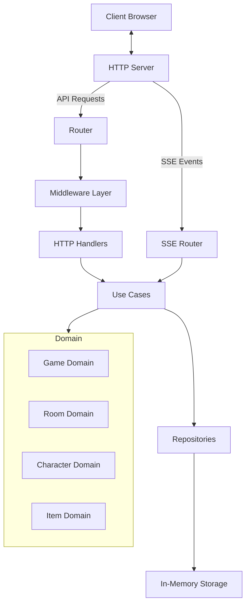

# 🎮 Text-Based Boss Raid Game 🎮

다음 레포지토리는 HTTP, SSE, JSON CRDT 기술 테스트를 위한 데모 용 게임입니다.
모든 코드는 AI 툴로 생성되었습니다. 모든 기능이 정상 동작하지 않을 수 있습니다.

A real-time multiplayer boss raid game with equipment system, room creation, and 3-player battles against various boss types.

## 🎯 Game Description

This is a text-based boss raid game where players can:

- Create and join game rooms
- Team up with up to 3 players
- Battle against different boss types (Dragon, Ogre, Demon, Undead)
- Equip weapons and armor to enhance character stats
- Earn rewards upon defeating bosses
- Experience real-time combat with automatic attacks based on weapon speed

The game features an event-driven architecture where boss attacks are triggered periodically, targeting random players. Players must coordinate their attacks and equipment choices to defeat powerful bosses before they wipe out the party.

## 🏗️ Server Architecture



## 🛠️ Technology Stack

- **Backend**: Go (Golang)
- **Frontend**: HTML, CSS, JavaScript
- **Communication**: HTTP, Server-Sent Events (SSE)
- **Data Storage**: In-memory repositories
- **Architecture**: Clean Architecture with Domain-Driven Design
- **Real-time Updates**: Server-Sent Events (SSE)
- **Data Synchronization**: JSON CRDT (Conflict-free Replicated Data Types)

## 🚀 How to Run

### Prerequisites

- Go 1.16 or higher
- Web browser (Chrome, Firefox, Safari, etc.)

### Running from Source

1. Clone the repository:
   ```bash
   git clone https://github.com/yourusername/boss-raid-game.git
   cd boss-raid-game
   ```

2. Run the server:
   ```bash
   go run main.go
   ```

3. Open your browser and navigate to:
   ```
   http://localhost:8080
   ```

## 🔨 Building from Source

The project includes several build scripts to compile the game for different operating systems and architectures.

### Using Make (Cross-platform)

```bash
# Build for current platform
make build

# Build for all supported platforms
make build-all

# Show all available make targets
make help
```

### Using PowerShell (Windows)

```powershell
# Build for all platforms
./build.ps1

# Build for specific OS and architecture
./build.ps1 -os windows -arch amd64

# Show help
./build.ps1 -help
```

### Using Shell Script (Linux/macOS)

```bash
# Make the script executable
chmod +x build.sh

# Build for all platforms
./build.sh

# Build for specific OS and architecture
./build.sh -o linux -a amd64

# Show help
./build.sh -h
```

### Using Batch File (Windows CMD)

```cmd
# Build for all platforms
build.bat

# Build for specific OS and architecture
build.bat -o windows -a amd64

# Show help
build.bat -h
```

## 📦 Installation Binaries

Pre-built binaries are available for the following platforms:

- [Binaries](https://github.com/homveloper/boss-raid-game/releases/tag/v1.0.0)

Download the appropriate binary for your platform, make it executable (on macOS/Linux), and run it.

You can also build your own binaries for various platforms using the build scripts provided.

## 🎮 Game Features

### Character System
- Players can choose different weapons (Longsword, Dagger, Bow, Battle Axe)
- Armor options for defense (Leather Armor)
- Each equipment affects attack power, defense, and attack speed

### Boss Types
- 🐉 **Ancient Dragon**: High health and defense
- 👹 **Giant Ogre**: Balanced stats
- 😈 **Infernal Demon**: High attack power, low defense
- 💀 **Lich King**: Very high attack power, very low defense

### Combat System
- Automatic attacks based on weapon attack speed
- Boss attacks target random players
- Real-time event log showing all combat actions
- Victory rewards upon boss defeat

## 📝 License

This project is licensed under the MIT License - see the LICENSE file for details.

## 🤝 Contributing

Contributions are welcome! Please feel free to submit a Pull Request.

1. Fork the repository
2. Create your feature branch (`git checkout -b feature/amazing-feature`)
3. Commit your changes (`git commit -m 'Add some amazing feature'`)
4. Push to the branch (`git push origin feature/amazing-feature`)
5. Open a Pull Request
