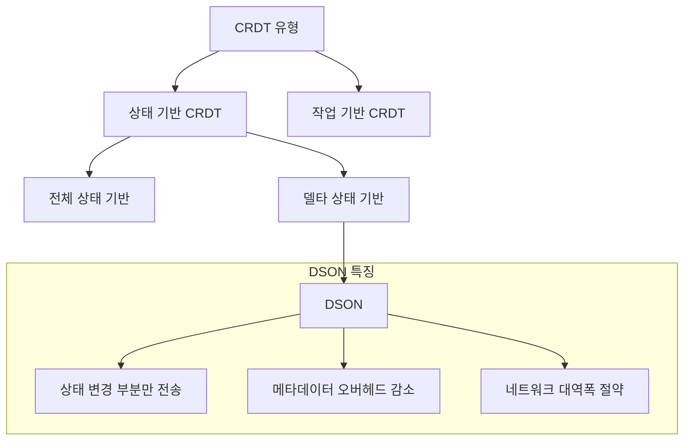
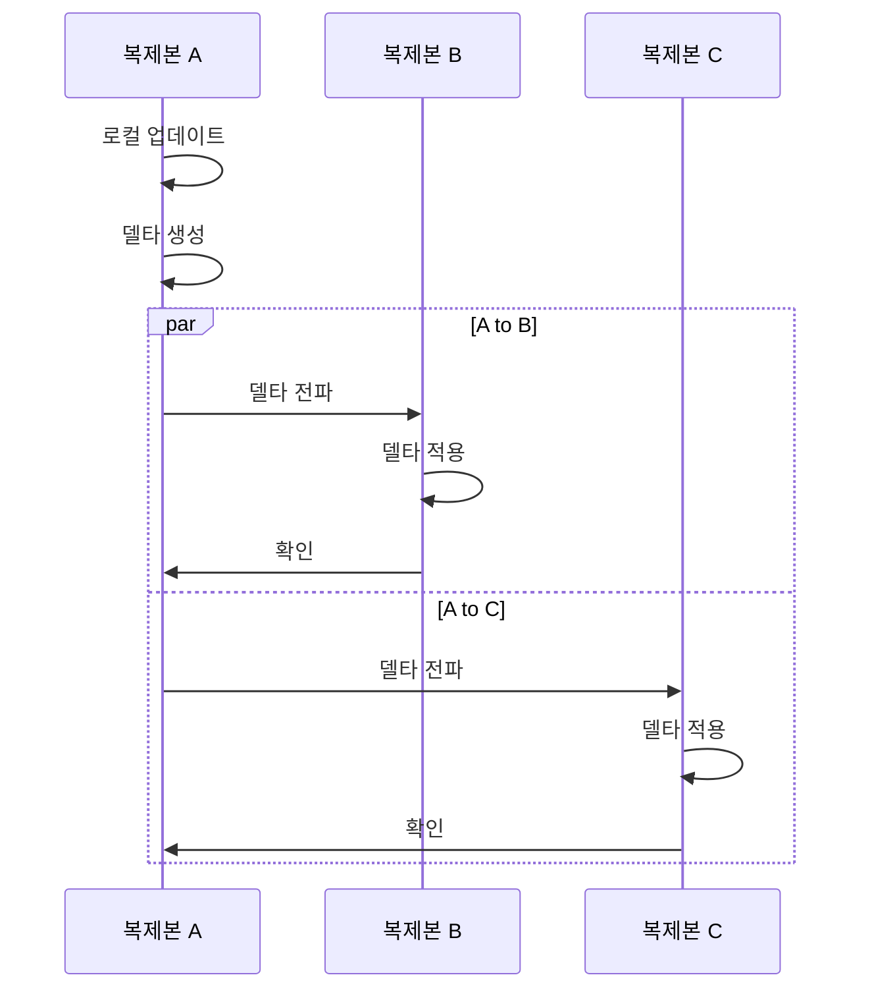
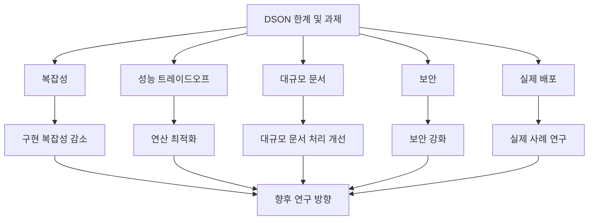

# DSON: JSON CRDT Using Delta-Mutations For Document Stores

## 개요

DSON(Delta-based JSON CRDT)은 분산 JSON 문서 저장소(distributed JSON document stores)를 위한 공간 효율적인 델타 기반(delta-based) CRDT(Conflict-Free Replicated Data Type, 충돌 없는 복제 데이터 타입) 접근 방식입니다. 이 논문은 글로벌 규모의 고가용성(high availability)을 제공하면서 강력한 최종 일관성(strong eventual consistency) 보장을 제공하는 방법을 제안합니다. DSON은 기존 CRDT 접근 방식의 주요 한계인 메타데이터 오버헤드(metadata overhead) 문제를 해결하여, 문서 업데이트 수에 비례하지 않고 복제본 수(number of replicas)와 문서 요소 수(number of document elements)에 비례하는 제한된 메타데이터만 저장합니다.

## 주요 내용

### 1. 배경 및 동기

NoSQL 시스템, 특히 문서 저장소(document stores)는 지난 10년간 인기가 크게 증가했으며, 가장 널리 사용되는 시스템들은 JSON 기반 데이터 모델을 채택하고 있습니다. 이러한 데이터 모델은 일반적인 프로그래밍 언어 데이터 구조에 직접 매핑되고 스키마 제한을 완화하여 개발자의 요구에 적합합니다.

분산 문서 저장소(distributed document stores)는 글로벌 규모와 연결이 끊긴 상태에서의 고가용성이 중요한 모바일 및 엣지 시나리오에서 자주 적용됩니다. 이러한 시스템은 종종 최종 일관성(eventual consistency)을 기본으로 하지만, 이는 문서 상태가 미래의 어느 시점에 수렴한다는 것만 보장하며 추가적인 안전 보장 없이 추론하는 것은 애플리케이션 개발자에게 부담이 됩니다.

### 2. DSON의 접근 방식

DSON은 CRDT(Conflict-Free Replicated Data Type, 충돌 없는 복제 데이터 타입)를 채택하여 강력한 최종 일관성(strong eventual consistency)을 제공합니다. 이는 동일한 업데이트 집합을 받은 두 노드가 동일한 상태에 있음을 보장합니다. 또한 인과 일관성(causal consistency)과 자신이 쓴 내용 읽기(read-your-writes) 보장도 제공합니다.

DSON의 핵심 혁신은 델타 기반(delta-based) 접근 방식을 사용하여 메타데이터 오버헤드(metadata overhead)를 줄이는 것입니다. 기존 CRDT 접근 방식은 문서 업데이트 수에 비례하는 메타데이터를 저장하지만, DSON은 복제본 수(𝑛)와 문서 요소 수(𝑚)에 비례하는 제한된 메타데이터만 저장합니다.

DSON은 상태 기반(state-based) CRDT의 변형으로, 전체 상태가 아닌 상태의 변경 부분(델타)만 전송하는 델타 상태 기반(delta-state based) CRDT에 해당합니다. 이는 작업 기반(operation-based) CRDT와는 다른 접근 방식입니다:

1. **상태 기반(State-based) CRDT**: 전체 데이터 구조를 복제본 간에 전송하고 병합 함수를 사용하여 일관성을 유지합니다.
2. **델타 상태 기반(Delta-state based) CRDT**: 상태 기반 CRDT의 최적화로, 전체 상태 대신 변경된 부분(델타)만 전송합니다.
3. **작업 기반(Operation-based) CRDT**: 데이터 구조에 적용된 작업(연산)을 전파하여 모든 복제본에서 동일하게 적용합니다.

DSON은 상태 기반 CRDT의 안정성과 작업 기반 CRDT의 효율성을 결합하여, 상태의 변경 부분(델타)만 전송함으로써 네트워크 대역폭을 절약하고 메타데이터 오버헤드를 최소화합니다.

### 3. 이론적 기반

DSON은 반격자(semilattice) 대수학을 기반으로 하며, 이는 결합법칙(associativity), 교환법칙(commutativity), 멱등성(idempotence)을 갖는 연산을 제공합니다. 이러한 수학적 기반을 통해 DSON은 분산 환경에서 일관성을 보장할 수 있습니다.

논문은 DSON의 의미론(semantics)을 형식적으로 정의하고, 그 정확성(correctness)과 수렴성(convergence)을 증명합니다. 또한 DSON의 메타데이터 복잡성이 O(𝑛²·log 𝑚)로 제한됨을 보여줍니다. 여기서 𝑛은 복제본 수, 𝑚은 문서 요소 수입니다.

### 4. 구현 및 평가

연구팀은 DSON을 구현하고 그 공간 효율성(space efficiency)을 실증적으로 입증했습니다. 실험 분석 결과, 저장된 메타데이터는 일반적으로 최악의 경우보다 훨씬 적은 것으로 나타났습니다.

DSON은 잘 정의된 의미론과 안전 보장(safety guarantees)을 갖춘 강력한 고가용성 분산 문서 저장소의 기반을 제공하여, 애플리케이션 개발자가 충돌 해결(conflict resolution)의 부담에서 벗어날 수 있게 합니다.

## 목차에 따른 내용

### 1. 서론

논문은 NoSQL 시스템, 특히 JSON 기반 문서 저장소의 증가하는 인기와 이러한 시스템이 직면한 일관성 문제를 소개합니다. 기존 시스템은 최종 일관성을 제공하지만 충돌 해결 정책이 종종 임의적이고 복잡한 의미를 가집니다. DSON은 CRDT를 채택하여 강력한 최종 일관성을 제공하고 메타데이터 오버헤드 문제를 해결합니다.

### 2. 배경

이 섹션에서는 JSON 문서 모델, 벡터 시계, 그리고 CRDT의 기본 개념을 설명합니다. 또한 기존 CRDT 접근 방식의 한계, 특히 메타데이터 오버헤드 문제를 논의합니다.

### 3. 시스템 모델

DSON의 시스템 모델은 비동기 메시지 전달 시스템에서 작동하는 복제본 집합으로 구성됩니다. 각 복제본은 로컬 상태를 유지하고 다른 복제본과 메시지를 교환합니다. 논문은 이 모델에서 DSON이 제공하는 일관성 보장을 정의합니다.

### 4. DSON 설계

DSON의 핵심 설계 원칙과 데이터 구조를 설명합니다. DSON은 JSON 문서를 트리로 모델링하고, 각 노드에 고유 식별자를 할당합니다. 델타 기반 접근 방식을 사용하여 업데이트를 효율적으로 전파합니다.

### 5. 이론적 분석

DSON의 수학적 기반과 형식적 증명을 제시합니다. 반격자 대수학을 사용하여 DSON의 연산이 결합법칙, 교환법칙, 멱등성을 만족함을 보여줍니다. 또한 메타데이터 복잡성이 O(𝑛²·log 𝑚)로 제한됨을 증명합니다.

### 6. 구현

DSON의 실제 구현 세부 사항을 설명합니다. 이는 효율적인 데이터 구조, 업데이트 전파 메커니즘, 그리고 가비지 컬렉션 전략을 포함합니다.

### 7. 평가

다양한 워크로드와 시나리오에서 DSON의 성능을 평가합니다. 메타데이터 오버헤드, 업데이트 전파 효율성, 그리고 확장성 측면에서 DSON을 기존 접근 방식과 비교합니다.

### 8. 관련 연구

JSON CRDT, 문서 저장소, 그리고 분산 시스템의 일관성에 관한 기존 연구를 검토합니다.

### 9. 결론

DSON의 주요 기여와 향후 연구 방향을 요약합니다.

## 관련 연구

### JSON CRDT

- **Kleppmann과 Beresford의 "A Conflict-Free Replicated JSON Datatype"**: 최초의 포괄적인 JSON CRDT 알고리즘을 제안했으나, 메타데이터가 문서 업데이트 수에 비례하여 증가하는 한계가 있습니다.

- **Automerge**: 협업 편집을 위한 CRDT 기반 프레임워크로, 문서 변경 이력을 모두 저장하여 메타데이터 오버헤드가 큽니다.

- **JSON-Joy**: JavaScript에서 구현된 JSON CRDT 라이브러리로, 다양한 CRDT 알고리즘을 제공하지만 역시 메타데이터 오버헤드 문제가 있습니다.

### 델타 기반 CRDT

- **Delta-State CRDTs**: 전체 상태 대신 델타만 전송하여 네트워크 대역폭을 절약하는 접근 방식입니다.

- **Delta-Operation CRDTs**: 작업 기반 CRDT를 델타 기반으로 변환하는 방법을 제안합니다.

### 문서 저장소

- **CouchDB, Couchbase, DynamoDB**: 최종 일관성을 제공하는 인기 있는 분산 문서 저장소들입니다.

- **MongoDB**: 강력한 일관성을 제공하지만 가용성이 제한될 수 있습니다.

## 연구 내용

### DSON의 핵심 혁신

1. **델타 기반 접근 방식**: DSON은 전체 문서 상태가 아닌 델타 변형(delta-mutations)만 전송하여 네트워크 대역폭을 절약합니다.

2. **제한된 메타데이터**: DSON은 메타데이터를 O(𝑛²·log 𝑚)로 제한하여 장기 실행 시스템에서도 효율적으로 작동합니다.

3. **형식적 증명**: DSON은 수학적으로 증명된 일관성 보장을 제공합니다.

### DSON의 데이터 모델

DSON은 JSON 문서를 트리(tree)로 모델링합니다:

- **노드(Node)**: 각 JSON 값(객체, 배열, 원시 값)은 트리의 노드로 표현됩니다.
- **식별자(Identifier)**: 각 노드는 고유 식별자를 가집니다.
- **버전 벡터(Version Vector)**: 각 노드는 버전 벡터를 유지하여 인과 관계를 추적합니다.

### DSON의 연산

DSON은 다음과 같은 기본 연산(operations)을 제공합니다:

- **삽입(Insert)**: 새 노드를 트리에 추가합니다.
- **업데이트(Update)**: 기존 노드의 값을 변경합니다.
- **삭제(Delete)**: 노드를 논리적으로 삭제합니다(tombstone으로 표시).
- **병합(Merge)**: 두 DSON 문서를 병합합니다.

### DSON의 동기화 프로토콜

DSON은 효율적인 동기화 프로토콜(synchronization protocol)을 사용하여 복제본 간에 델타를 전파합니다:

1. **델타 생성(Delta Generation)**: 로컬 업데이트가 발생하면 델타가 생성됩니다.
2. **델타 전파(Delta Propagation)**: 델타는 다른 복제본으로 전파됩니다.
3. **델타 적용(Delta Application)**: 수신 복제본은 델타를 로컬 상태에 적용합니다.
4. **확인(Acknowledgment)**: 델타가 성공적으로 적용되면 확인 메시지가 전송됩니다.

## 결론

DSON은 분산 JSON 문서 저장소를 위한 공간 효율적인 CRDT 접근 방식을 제공합니다. 델타 기반 접근 방식을 사용하여 메타데이터 오버헤드를 줄이고, 강력한 최종 일관성을 보장합니다. 이는 글로벌 규모의 고가용성 분산 시스템에 적합한 솔루션입니다.

DSON의 주요 기여는 다음과 같습니다:

1. 메타데이터가 문서 업데이트 수에 비례하지 않고 복제본 수와 문서 요소 수에 비례하는 제한된 메타데이터만 저장하는 접근 방식
2. 형식적으로 정의된 의미론과 증명된 일관성 보장
3. 실증적으로 입증된 공간 효율성

## 한계 및 과제

DSON에도 몇 가지 한계와 향후 연구 과제가 있습니다:

1. **복잡성(Complexity)**: DSON의 구현은 기존 접근 방식보다 복잡할 수 있습니다.

2. **성능 트레이드오프(Performance Trade-offs)**: 메타데이터 오버헤드를 줄이는 대신 일부 연산의 계산 복잡성이 증가할 수 있습니다.

3. **대규모 문서(Large Documents)**: 매우 큰 문서에서 DSON의 성능을 더 최적화할 필요가 있습니다.

4. **보안(Security)**: 분산 환경에서 DSON의 보안 측면을 더 연구할 필요가 있습니다.

5. **실제 배포(Real-world Deployment)**: 실제 프로덕션 환경에서 DSON의 효과를 더 평가할 필요가 있습니다.

향후 연구 방향으로는 DSON을 다양한 실제 애플리케이션에 적용하고, 성능을 더 최적화하며, 보안 측면을 강화하는 것이 포함됩니다.

