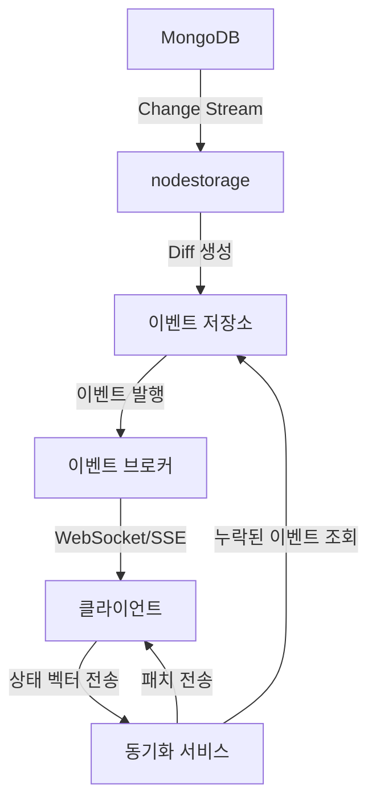

# 이벤트 소싱과 상태 벡터 기반 클라이언트 실시간 동기화 아키텍처

## 1. 아키텍처 개요



## 2. 주요 컴포넌트

### 2.1 서버 측 컴포넌트

1. **이벤트 저장소 (EventStore)**
   - MongoDB에서 생성된 diff를 이벤트로 저장
   - 각 이벤트에 고유 ID와 타임스탬프 부여
   - 문서별 이벤트 히스토리 관리

2. **상태 벡터 관리자 (StateVectorManager)**
   - 클라이언트별 상태 벡터 관리
   - 상태 벡터 비교를 통한 누락된 이벤트 식별

3. **동기화 서비스 (SyncService)**
   - 클라이언트 연결 관리
   - 상태 벡터 기반 동기화 로직 구현
   - 누락된 이벤트 전송

4. **이벤트 브로커 (EventBroker)**
   - 실시간 이벤트 발행
   - WebSocket/SSE 연결 관리

### 2.2 클라이언트 측 컴포넌트

1. **상태 관리자 (StateManager)**
   - 로컬 상태 관리
   - 이벤트 적용 및 상태 업데이트

2. **동기화 클라이언트 (SyncClient)**
   - 서버와의 연결 관리
   - 상태 벡터 유지 및 전송
   - 이벤트 수신 및 처리

3. **충돌 해결기 (ConflictResolver)**
   - 동시 편집 충돌 해결
   - 이벤트 재정렬 및 병합

## 3. 동작 흐름

### 3.1 초기 연결 및 동기화

1. 클라이언트가 서버에 연결
2. 클라이언트가 자신의 상태 벡터 전송
3. 서버가 상태 벡터를 분석하여 누락된 이벤트 식별
4. 서버가 누락된 이벤트를 클라이언트에 전송
5. 클라이언트가 이벤트를 적용하여 상태 업데이트

### 3.2 실시간 업데이트

1. 서버에서 MongoDB 변경 감지
2. nodestorage가 diff 생성
3. diff를 이벤트로 변환하여 이벤트 저장소에 저장
4. 이벤트 브로커가 연결된 클라이언트에 이벤트 발행
5. 클라이언트가 이벤트를 수신하여 상태 업데이트
6. 클라이언트가 상태 벡터 업데이트

### 3.3 오프라인 동기화

1. 클라이언트가 오프라인 상태에서 로컬 변경 사항 기록
2. 클라이언트가 온라인 상태로 전환
3. 클라이언트가 서버에 상태 벡터 전송
4. 서버가 누락된 이벤트 전송
5. 클라이언트가 로컬 변경 사항을 서버에 전송
6. 서버가 변경 사항을 적용하고 다른 클라이언트에 전파

## 4. 데이터 모델

### 4.1 이벤트 모델

```go
type Event struct {
    ID            string                 // 이벤트 고유 ID
    DocumentID    primitive.ObjectID     // 문서 ID
    Timestamp     time.Time              // 이벤트 발생 시간
    SequenceNum   int64                  // 문서 내 이벤트 순서
    Operation     string                 // 작업 유형 (create, update, delete)
    Diff          *nodestorage.Diff      // 변경 내용
    VectorClock   map[string]int64       // 벡터 시계
    ClientID      string                 // 변경을 발생시킨 클라이언트 ID
    Metadata      map[string]interface{} // 추가 메타데이터
}
```

### 4.2 상태 벡터 모델

```go
type StateVector struct {
    ClientID     string           // 클라이언트 ID
    DocumentID   string           // 문서 ID
    VectorClock  map[string]int64 // 클라이언트별 이벤트 시퀀스 번호
    LastUpdated  time.Time        // 마지막 업데이트 시간
}
```

## 5. API 설계

### 5.1 서버 API

1. **WebSocket 연결**
   - `ws://{server}/sync/{documentId}`

2. **상태 벡터 동기화**
   - `POST /api/sync/{documentId}`
   - 요청 본문: 클라이언트 상태 벡터
   - 응답: 누락된 이벤트 목록

3. **이벤트 조회**
   - `GET /api/events/{documentId}?after={sequenceNum}`
   - 응답: 지정된 시퀀스 번호 이후의 이벤트 목록

### 5.2 클라이언트 API

1. **이벤트 수신 핸들러**
   - `onEvent(event: Event): void`

2. **상태 벡터 업데이트**
   - `updateStateVector(clientId: string, sequenceNum: int64): void`

3. **상태 동기화 요청**
   - `syncState(): Promise<void>`
