# CRDT 아키텍처

## 목차
1. [개요](#1-개요)
2. [시스템 아키텍처](#2-시스템-아키텍처)
3. [핵심 컴포넌트](#3-핵심-컴포넌트)
   - 3.1 [CRDT 패키지](#31-crdt-패키지)
   - 3.2 [CRDT Patch 패키지](#32-crdt-patch-패키지)
   - 3.3 [CRDT Edit 패키지](#33-crdt-edit-패키지)
4. [CRDT 노드 타입 및 알고리즘](#4-crdt-노드-타입-및-알고리즘)
   - 4.1 [Constant CRDT 알고리즘](#41-constant-crdt-알고리즘)
   - 4.2 [Last-Write-Wins (LWW) CRDT 알고리즘](#42-last-write-wins-lww-crdt-알고리즘)
   - 4.3 [Replicated Growable Array (RGA) CRDT 알고리즘](#43-replicated-growable-array-rga-crdt-알고리즘)
   - 4.4 [노드 타입 상세 설명](#44-노드-타입-상세-설명)
   - 4.5 [Go 타입과 CRDT 노드 타입 매핑](#45-go-타입과-crdt-노드-타입-매핑)
5. [연산 흐름](#5-연산-흐름)
   - 5.1 [기존 Edit 함수 기반 흐름](#51-기존-edit-함수-기반-흐름)
   - 5.2 [타입별 에디터 직접 접근 흐름](#52-타입별-에디터-직접-접근-흐름)
6. [문서 편집 접근 방식](#6-문서-편집-접근-방식)
   - 6.1 [타입별 에디터 직접 접근 방식](#61-타입별-에디터-직접-접근-방식)
   - 6.2 [트랜잭션 관리 (향후 계획)](#62-트랜잭션-관리-향후-계획)
7. [구현 세부사항](#7-구현-세부사항)
   - 7.1 [논리적 타임스탬프](#71-논리적-타임스탬프)
   - 7.2 [문서 구조](#72-문서-구조)
8. [톰스톤 처리](#8-톰스톤-처리)

## 1. 개요

이 코드베이스의 CRDT(Conflict-free Replicated Data Type) 구현은 최종 일관성 보장을 갖춘 분산 애플리케이션을 구축하기 위한 견고한 기반을 제공합니다. 이 시스템은 연산 기반 JSON CRDT를 중심으로 설계되어 여러 클라이언트가 동시에 동일한 문서를 충돌 없이 수정할 수 있도록 합니다.

아키텍처는 세 가지 주요 패키지로 구성됩니다:
- `crdt`: 핵심 CRDT 데이터 구조 및 노드 구현
- `crdtpatch`: CRDT 문서를 수정하기 위한 연산 및 패치
- `crdtedit`: CRDT 문서 작업을 위한 고수준의 사용자 친화적 API

## 2. 시스템 아키텍처

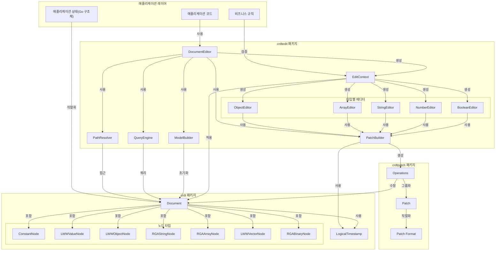

## 3. 핵심 컴포넌트

### 3.1 CRDT 패키지

`crdt` 패키지는 핵심 CRDT 데이터 구조와 알고리즘을 구현합니다.

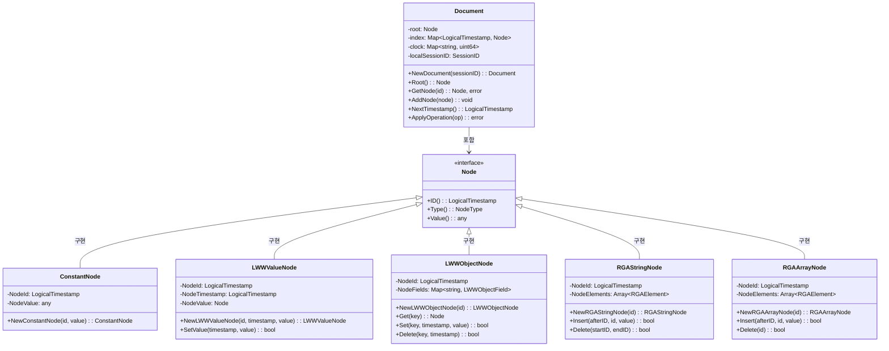

### 3.2 CRDT Patch 패키지

`crdtpatch` 패키지는 CRDT 문서를 수정하기 위한 연산과 패치를 제공합니다.

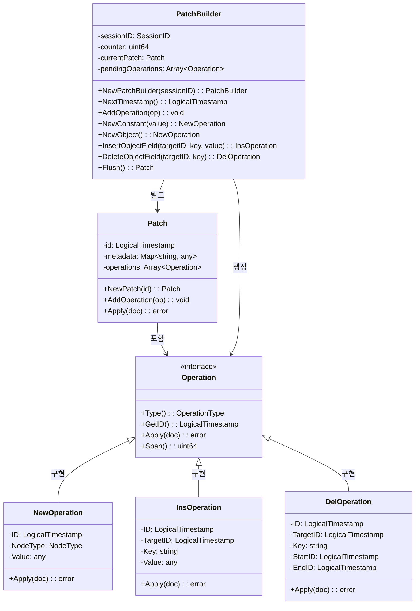

### 3.3 CRDT Edit 패키지

`crdtedit` 패키지는 CRDT 문서 작업을 위한 고수준의 사용자 친화적 API를 제공합니다.

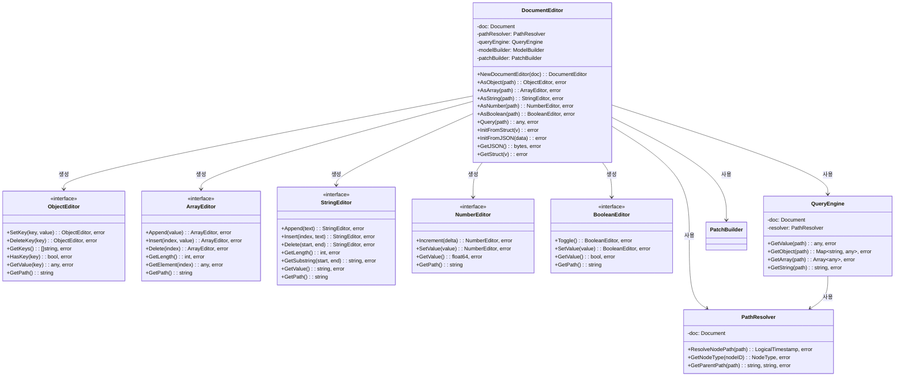

## 4. CRDT 노드 타입 및 알고리즘

시스템은 세 가지 주요 CRDT 알고리즘을 구현합니다:

### 4.1 Constant CRDT 알고리즘
- 불변 값에 사용
- 가장 단순한 형태의 CRDT
- `ConstantNode`에서 사용

### 4.2 Last-Write-Wins (LWW) CRDT 알고리즘
- 동시 편집이 있는 변경 가능한 레지스터에 사용
- 가장 높은 논리적 타임스탬프를 가진 값을 선택하여 충돌 해결
- `LWWValueNode`, `LWWObjectNode`, `LWWVectorNode`에서 사용

### 4.3 Replicated Growable Array (RGA) CRDT 알고리즘
- 동시 삽입/삭제가 있는 순서가 있는 리스트에 사용
- 복제본 간에 일관된 순서 유지
- `RGAStringNode`, `RGAArrayNode`, `RGABinaryNode`에서 사용

### 4.4 노드 타입 상세 설명

#### 4.4.1 ConstantNode
불변 값을 저장하는 가장 기본적인 노드 타입입니다. 한 번 생성되면 값이 변경되지 않습니다.
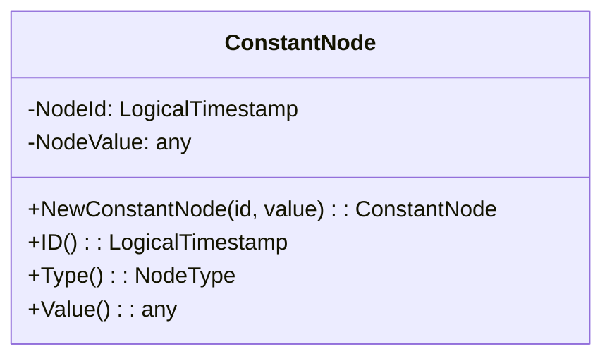

#### 4.4.2 LWWValueNode
단일 값을 저장하는 Last-Write-Wins 노드입니다. 값이 변경될 때마다 타임스탬프가 업데이트되며, 충돌 시 가장 높은 타임스탬프를 가진 값이 선택됩니다.
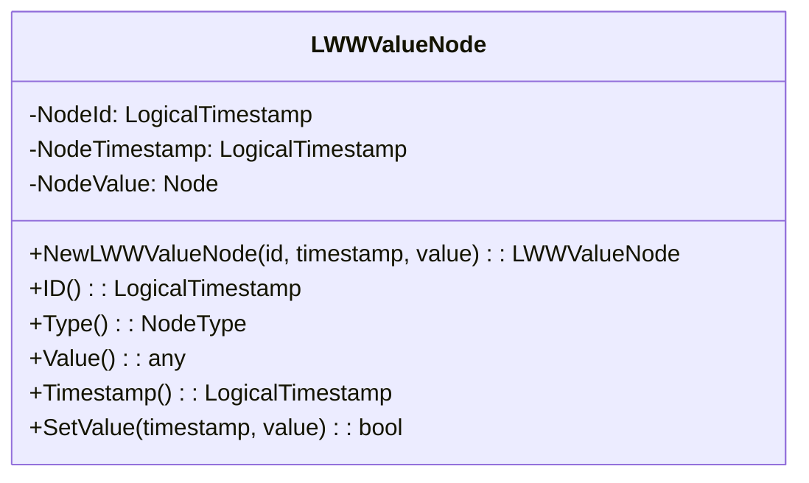

#### 4.4.3 LWWObjectNode
키-값 쌍을 저장하는 Last-Write-Wins 객체 노드입니다. 각 필드는 자체 타임스탬프를 가지며, 필드별로 충돌 해결이 이루어집니다.
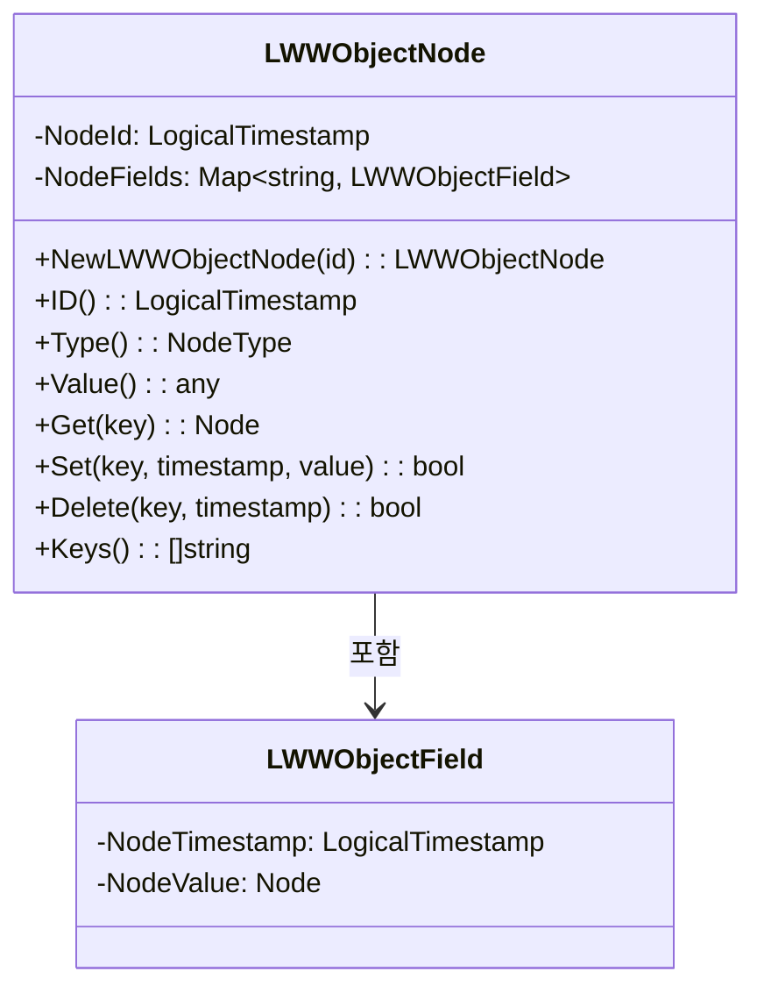

#### 4.4.4 LWWVectorNode
인덱스-값 쌍을 저장하는 Last-Write-Wins 벡터 노드입니다. 각 요소는 자체 타임스탬프를 가지며, 요소별로 충돌 해결이 이루어집니다.
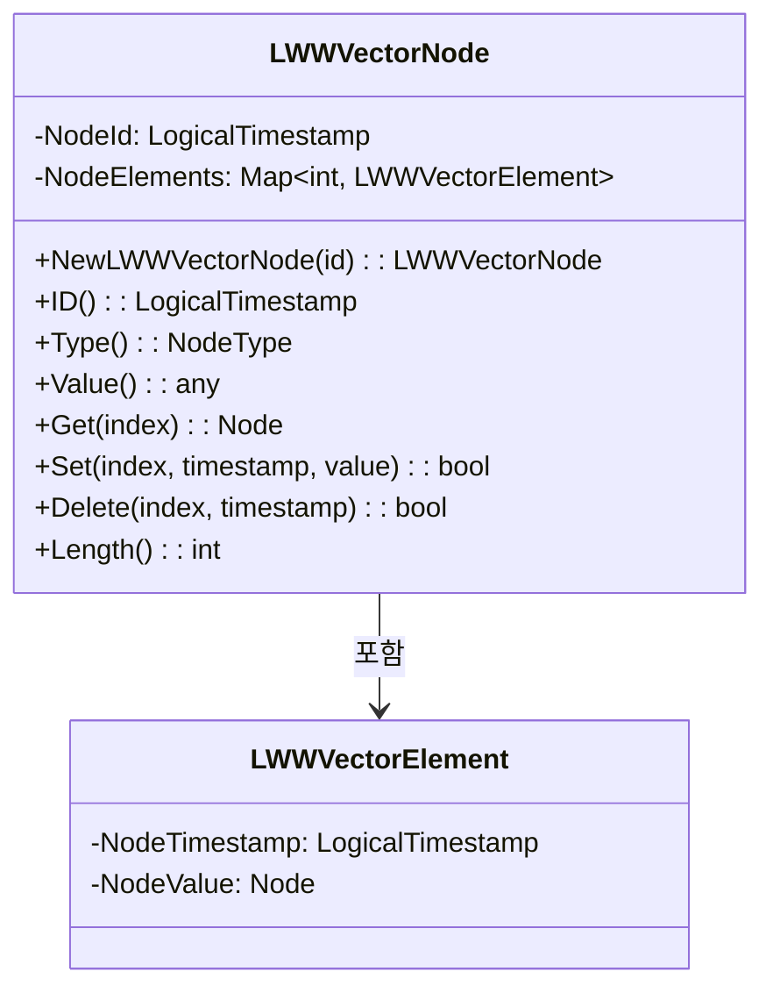

#### 4.4.5 RGAStringNode
문자열을 저장하는 Replicated Growable Array 노드입니다. 각 문자는 고유한 ID를 가지며, 삽입/삭제 연산이 동시에 발생해도 일관된 순서를 유지합니다.
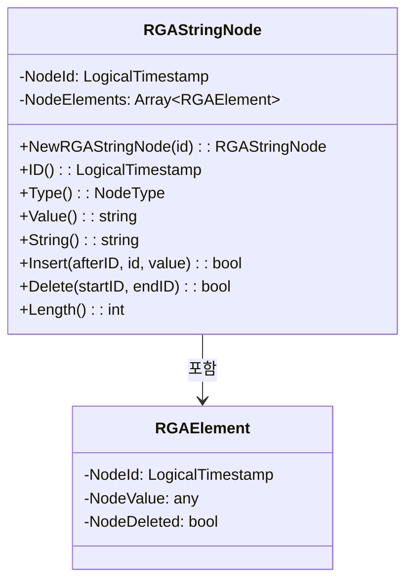

#### 4.4.6 RGAArrayNode
배열을 저장하는 Replicated Growable Array 노드입니다. 각 요소는 고유한 ID를 가지며, 삽입/삭제 연산이 동시에 발생해도 일관된 순서를 유지합니다.
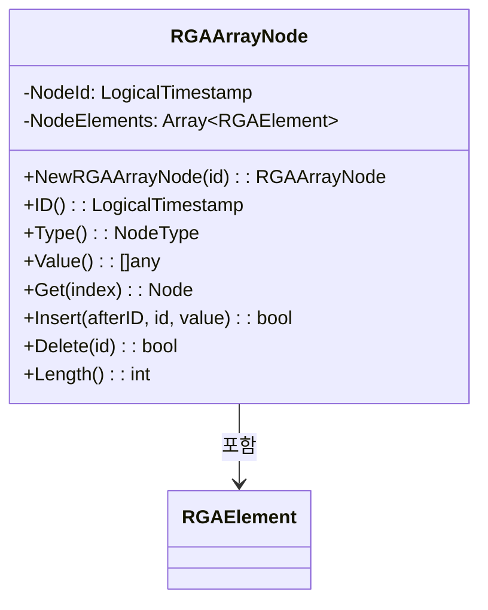

#### 4.4.7 RGABinaryNode
바이너리 데이터를 저장하는 Replicated Growable Array 노드입니다. 각 바이트 청크는 고유한 ID를 가지며, 삽입/삭제 연산이 동시에 발생해도 일관된 순서를 유지합니다.
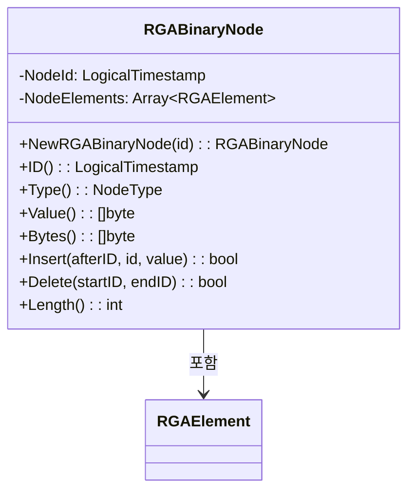

#### 4.4.8 RootNode
문서의 루트 노드입니다. 특별한 ID(RootID)를 가진 LWWValueNode의 확장입니다.
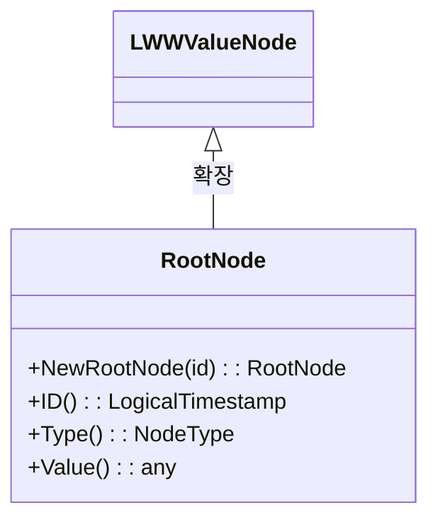

### 4.5 Go 타입과 CRDT 노드 타입 매핑

다음 표는 Go 컨테이너 타입과 CRDT 노드 타입 간의 매핑을 보여줍니다:

| Go 타입 | CRDT 노드 타입 | 알고리즘 |
|---------|---------------|-----------|
| `nil` | `ConstantNode` | Constant |
| `bool` | `ConstantNode` | Constant |
| `int/float` | `ConstantNode` | Constant |
| `string` (불변) | `ConstantNode` | Constant |
| `string` (가변) | `RGAStringNode` | RGA |
| `[]byte` | `RGABinaryNode` | RGA |
| `[]any` | `RGAArrayNode` | RGA |
| `map[string]any` | `LWWObjectNode` | LWW |
| `map[int]any` | `LWWVectorNode` | LWW |
| 커스텀 값 | `LWWValueNode` | LWW |

## 5. 연산 흐름

### 5.1 기존 Edit 함수 기반 흐름

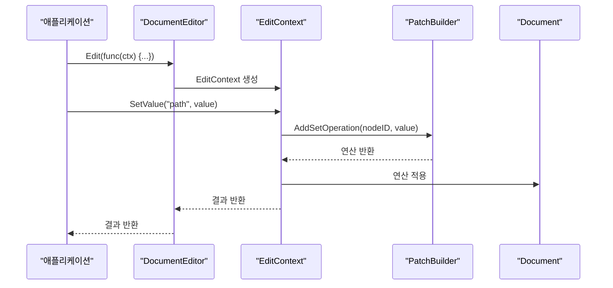

### 5.2 타입별 에디터 직접 접근 흐름

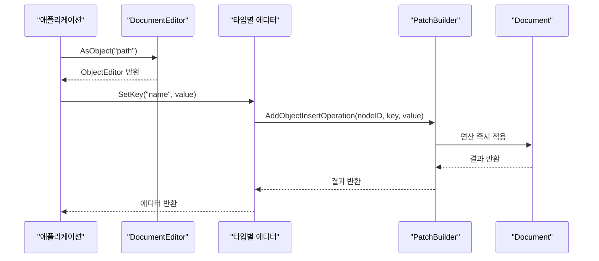

## 6. 문서 편집 접근 방식

### 6.1 타입별 에디터 직접 접근 방식

`crdtedit` 패키지는 CRDT 문서를 편집하기 위한 두 가지 접근 방식을 제공합니다:

1. **Edit 함수 기반 접근 방식**: 이 방식은 `Edit` 함수를 통해 `EditContext`를 제공하고, 이를 통해 문서를 편집합니다. 이 방식은 단순하지만, 모든 변경 사항이 즉시 적용되므로 트랜잭션 관리가 어렵습니다.

2. **타입별 에디터 직접 접근 방식**: 이 방식은 `AsObject`, `AsArray` 등의 메서드를 통해 타입별 에디터를 직접 가져와서 사용합니다. 각 에디터 메서드 호출 시 변경 사항이 즉시 적용되어 직관적인 사용 경험을 제공합니다.

#### 타입별 에디터 직접 접근 방식의 장점

- **직관적인 API**: 객체, 배열, 문자열 등 각 타입에 맞는 직관적인 메서드를 제공합니다.
- **타입 안전성**: 각 에디터는 특정 타입의 노드에 대한 작업만 제공하므로, 타입 안전성이 보장됩니다.
- **유연성**: 사용자가 필요한 에디터만 가져와서 사용할 수 있습니다.
- **즉각적인 피드백**: 각 작업이 즉시 적용되므로 결과를 바로 확인할 수 있습니다.

#### 사용 예시

```go
// 문서 에디터 생성
editor := crdtedit.NewDocumentEditor(doc)

// 객체 에디터 가져오기
userObj, err := editor.AsObject("root.user")
if err != nil {
    return err
}

// 객체 속성 설정 (즉시 적용됨)
if err := userObj.SetKey("name", "Jane Doe"); err != nil {
    return err
}

// 배열 에디터 가져오기
itemsArr, err := editor.AsArray("root.user.items")
if err != nil {
    return err
}

// 배열 요소 추가 (즉시 적용됨)
if err := itemsArr.Append("Item 3"); err != nil {
    return err
}

// 변경된 값 즉시 조회 가능
name, err := userObj.GetValue("name")
if err != nil {
    return err
}
fmt.Println("Updated name:", name)
```

### 6.2 트랜잭션 관리 (향후 계획)

현재 구현에서는 각 에디터 메서드 호출 시 변경 사항이 즉시 적용됩니다. 향후에는 트랜잭션 관리 기능을 추가하여, 여러 변경 사항을 하나의 트랜잭션으로 묶어 처리할 수 있도록 할 계획입니다.

이를 위해 다음과 같은 기능을 구현할 예정입니다:

1. **트랜잭션 시작/종료**: 여러 변경 사항을 하나의 트랜잭션으로 묶어 처리할 수 있는 기능
2. **롤백**: 트랜잭션 내에서 발생한 변경 사항을 취소할 수 있는 기능
3. **스냅샷**: 문서의 현재 상태를 저장하고 나중에 복원할 수 있는 기능

이러한 기능을 통해 더 복잡한 편집 작업을 안전하게 수행할 수 있을 것입니다.

## 7. 구현 세부사항

### 7.1 논리적 타임스탬프

시스템은 타임스탬프에 하이브리드 논리적 시계를 사용합니다:

```go
// SessionID는 세션을 식별하는 고유 식별자입니다.
type SessionID uint64

type LogicalTimestamp struct {
    SID     SessionID  // 고유 세션 식별자
    Counter uint64     // 단조 증가 카운터
}
```

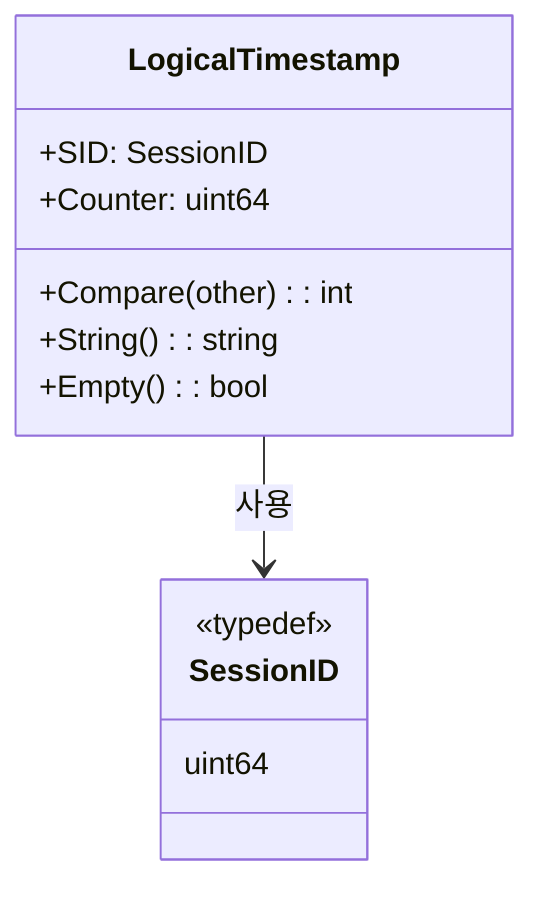

### 6.2 문서 구조

CRDT 문서는 각각 고유 ID를 가진 노드의 트리로 구성됩니다:

```
Document
└── Root (RootNode)
    └── Object (LWWObjectNode)
        ├── "name" → String (RGAStringNode)
        │   └── Elements: ["J", "o", "h", "n"]
        ├── "age" → Value (LWWValueNode)
        │   └── Value: 30 (ConstantNode)
        └── "items" → Array (RGAArrayNode)
            ├── Element 0: "Item 1" (ConstantNode)
            └── Element 1: "Item 2" (ConstantNode)
```

## 8. 톰스톤 처리

톰스톤은 CRDT 데이터 구조에서 삭제된 요소를 추적하는 데 사용됩니다:

1. **LWWObjectNode**: 키가 삭제되면 `NodeFields` 맵에서 제거됩니다. 삭제는 삭제 연산의 타임스탬프로 추적됩니다.

2. **RGAStringNode/RGAArrayNode**: 요소가 삭제되면 `NodeDeleted = true`로 표시되지만 배열에 남아 있습니다. 이를 통해 동시 연산을 병합할 때 일관된 순서를 유지할 수 있습니다.

3. **가비지 컬렉션**: 모든 복제본이 삭제를 확인한 경우 압축 연산 중에 톰스톤을 주기적으로 제거할 수 있습니다.

4. **충돌 해결**: 삭제 연산과 삽입 연산이 충돌하는 경우, 더 높은 타임스탬프를 가진 연산이 우선합니다.

5. **가시성**: 삭제된 요소는 `Value()` 메서드가 반환하는 값에 포함되지 않아 사용자에게 보이지 않습니다.
