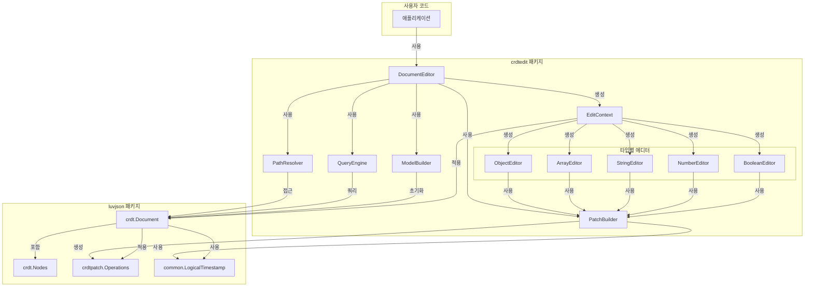
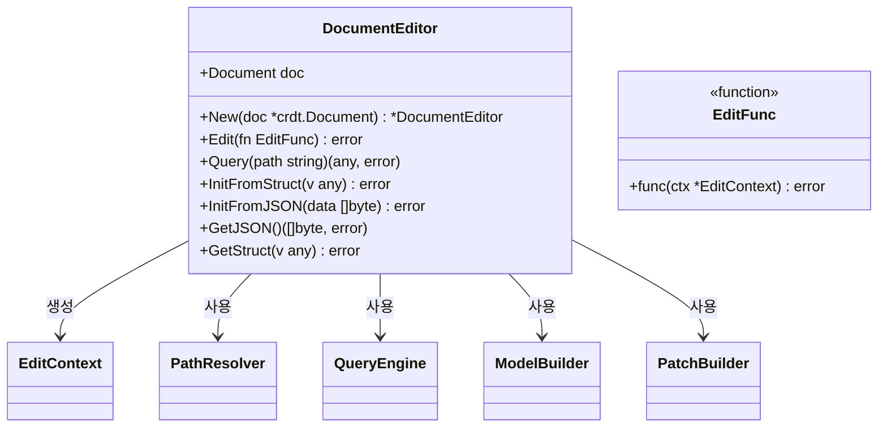
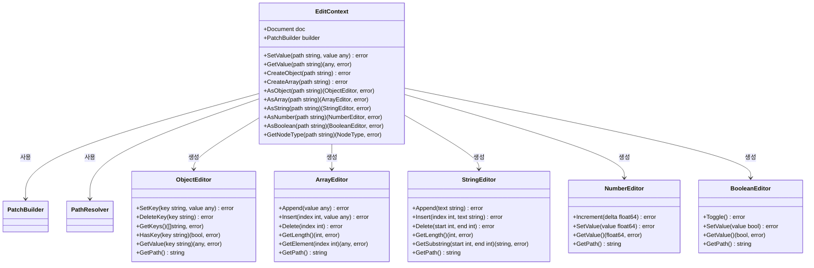
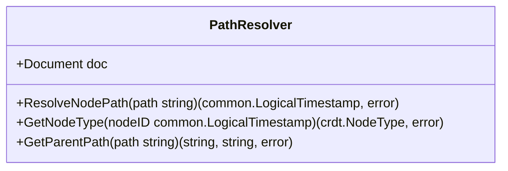
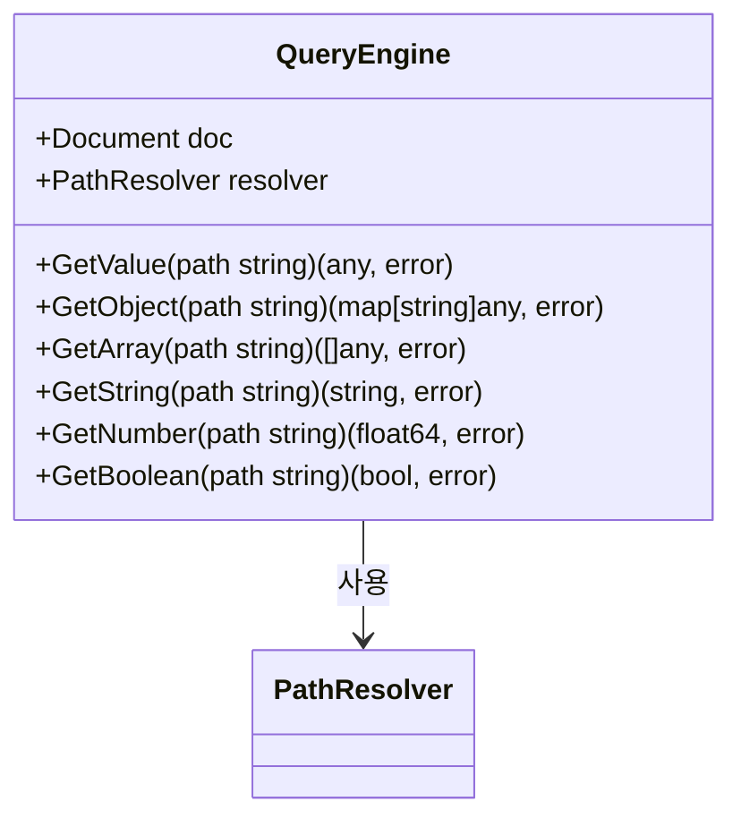
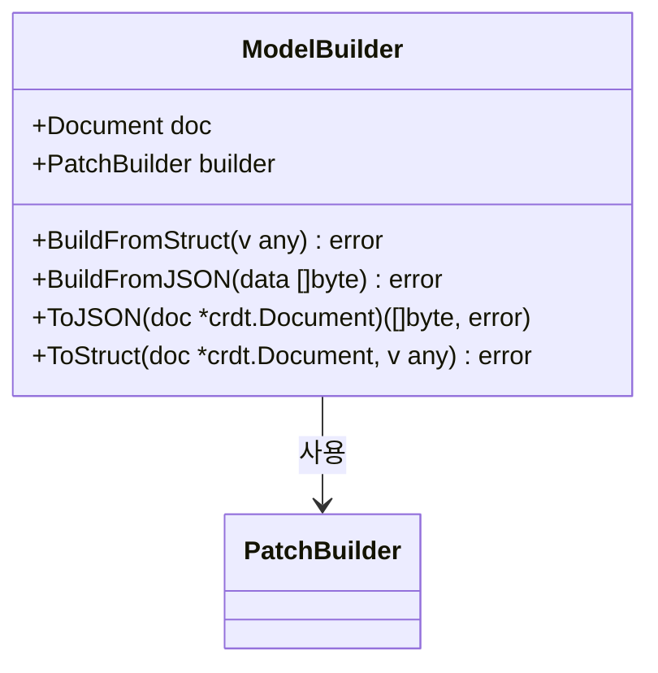
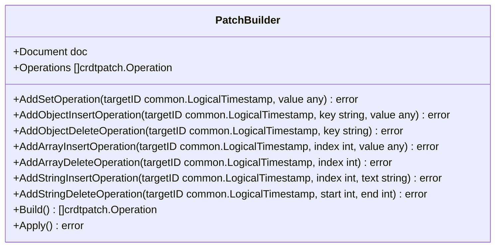

# crdtedit 패키지 아키텍처 설계

## 1. 개요

`crdtedit` 패키지는 `luvjson`의 CRDT 구현에서 Document 수정 연산을 추상화하여 사용자 친화적인 API를 제공합니다. 이 패키지는 CRDT의 복잡한 내부 구현을 숨기고, 일반적인 컨테이너 타입(배열, 맵, 문자열 등)의 CRUD 작업처럼 직관적인 인터페이스를 제공합니다.

## 2. 시스템 아키텍처



## 3. 주요 컴포넌트

### 3.1 DocumentEditor



### 3.2 EditContext 및 타입별 노드 인터페이스



### 3.3 PathResolver



### 3.4 QueryEngine



### 3.5 ModelBuilder



### 3.6 PatchBuilder



## 4. 사용 예시

### 4.1 기본 사용법

```go
// 문서 생성
doc := crdt.NewDocument()

// 편집기 생성
editor := crdtedit.NewDocumentEditor(doc)

// 문서 편집
err := editor.Edit(func(ctx *crdtedit.EditContext) error {
    // 루트에 객체 생성
    if err := ctx.CreateObject("root"); err != nil {
        return err
    }

    // 사용자 객체 생성 및 속성 설정
    if err := ctx.CreateObject("root.user"); err != nil {
        return err
    }
    if err := ctx.SetObjectKey("root.user", "name", "John Doe"); err != nil {
        return err
    }
    if err := ctx.SetObjectKey("root.user", "age", 30); err != nil {
        return err
    }

    // 아이템 배열 생성 및 요소 추가
    if err := ctx.CreateArray("root.user.items"); err != nil {
        return err
    }
    if err := ctx.AppendArrayElement("root.user.items", "Item 1"); err != nil {
        return err
    }
    if err := ctx.AppendArrayElement("root.user.items", "Item 2"); err != nil {
        return err
    }

    return nil
})
```

### 4.1.1 타입별 에디터 사용법

```go
err := editor.Edit(func(ctx *crdtedit.EditContext) error {
    // 객체 에디터 사용
    userObj, err := ctx.AsObject("root.user")
    if err != nil {
        return err
    }

    // 객체 속성 설정
    if err := userObj.SetKey("name", "Jane Doe"); err != nil {
        return err
    }

    // 객체의 모든 키 가져오기
    keys, err := userObj.GetKeys()
    if err != nil {
        return err
    }
    fmt.Println("User keys:", keys)

    // 배열 에디터 사용
    itemsArr, err := ctx.AsArray("root.user.items")
    if err != nil {
        return err
    }

    // 배열 요소 추가
    if err := itemsArr.Append("Item 3"); err != nil {
        return err
    }

    // 배열 길이 가져오기
    length, err := itemsArr.GetLength()
    if err != nil {
        return err
    }
    fmt.Println("Items count:", length)

    // 숫자 에디터 사용
    ageNum, err := ctx.AsNumber("root.user.age")
    if err != nil {
        return err
    }

    // 숫자 증가
    if err := ageNum.Increment(1); err != nil {
        return err
    }

    // 현재 값 가져오기
    currentAge, err := ageNum.GetValue()
    if err != nil {
        return err
    }
    fmt.Println("Current age:", currentAge)

    return nil
})
```

### 4.2 구조체에서 초기화

```go
type User struct {
    Name  string   `json:"name"`
    Age   int      `json:"age"`
    Items []string `json:"items"`
}

type RootData struct {
    User User `json:"user"`
}

// 구조체에서 문서 초기화
data := RootData{
    User: User{
        Name:  "John Doe",
        Age:   30,
        Items: []string{"Item 1", "Item 2"},
    },
}

err := editor.InitFromStruct(data)
```

### 4.3 쿼리 및 수정

```go
// 값 쿼리
name, err := editor.Query("root.user.name")
fmt.Println("Name:", name)

// 값 수정
err = editor.Edit(func(ctx *crdtedit.EditContext) error {
    // 나이 증가
    if err := ctx.IncrementNumber("root.user.age", 1); err != nil {
        return err
    }

    // 새 아이템 추가
    if err := ctx.AppendArrayElement("root.user.items", "Item 3"); err != nil {
        return err
    }

    return nil
})
```

## 5. 구현 계획

1. **기본 인터페이스 정의 (1주)**
   - DocumentEditor 인터페이스 설계
   - EditContext 인터페이스 설계
   - 기타 컴포넌트 인터페이스 설계

2. **경로 해석 및 쿼리 엔진 구현 (1주)**
   - PathResolver 구현
   - QueryEngine 구현

3. **편집 컨텍스트 및 패치 빌더 구현 (2주)**
   - EditContext 구현
   - PatchBuilder 구현

4. **모델 빌더 구현 (1주)**
   - 구조체 <-> CRDT 변환 구현
   - JSON <-> CRDT 변환 구현

5. **통합 및 테스트 (1주)**
   - 모든 컴포넌트 통합
   - 단위 테스트 및 통합 테스트 작성

6. **문서화 및 예제 작성 (1주)**
   - API 문서 작성
   - 사용 예제 작성

## 6. 확장 가능성

1. **스키마 검증**
   - JSON 스키마 기반 검증 추가
   - 구조체 태그 기반 검증 추가

2. **변경 감지 및 이벤트**
   - 특정 경로 변경 시 콜백 실행
   - 변경 이벤트 구독 메커니즘

3. **트랜잭션 지원**
   - 여러 편집 작업을 원자적으로 처리
   - 롤백 기능 지원

4. **쿼리 언어 확장**
   - JSONPath 또는 유사한 쿼리 언어 지원
   - 복잡한 조건부 쿼리 지원

5. **타입 안전성 강화**
   - 제네릭을 활용한 타입 안전한 API 제공
   - 컴파일 타임 타입 검사 지원

6. **커스텀 노드 타입 지원**
   - 사용자 정의 노드 타입 및 에디터 확장 메커니즘
   - 도메인 특화 데이터 타입 지원

## 7. 타입별 에디터 사용 이점

타입별 에디터 인터페이스(`ObjectEditor`, `ArrayEditor` 등)를 제공함으로써 얻을 수 있는 이점:

1. **타입 안전성**: 각 노드 타입에 맞는 작업만 수행할 수 있어 런타임 오류 감소
2. **코드 가독성**: 노드 타입이 명시적으로 드러나 코드의 의도가 명확해짐
3. **자동 완성**: IDE에서 해당 타입에 맞는 메서드만 자동 완성되어 개발 경험 향상
4. **체이닝 가능**: 같은 노드에 대한 여러 작업을 체이닝하여 간결한 코드 작성 가능
5. **확장성**: 각 타입별로 특화된 기능을 추가하기 용이함

```go
// 타입별 에디터를 활용한 체이닝 예시
err := editor.Edit(func(ctx *crdtedit.EditContext) error {
    // 객체 에디터로 여러 작업 체이닝
    userObj, err := ctx.AsObject("root.user")
    if err != nil {
        return err
    }

    // 사용자 정보 업데이트
    userObj.SetKey("name", "Jane Doe")
           .SetKey("email", "jane@example.com")
           .SetKey("active", true)
           .DeleteKey("temporary")

    // 배열 에디터로 여러 작업 체이닝
    itemsArr, err := ctx.AsArray("root.user.items")
    if err != nil {
        return err
    }

    itemsArr.Append("New Item")
            .Delete(0)  // 첫 번째 항목 삭제
            .Insert(0, "First Item")  // 새 첫 번째 항목 추가

    return nil
})
```
