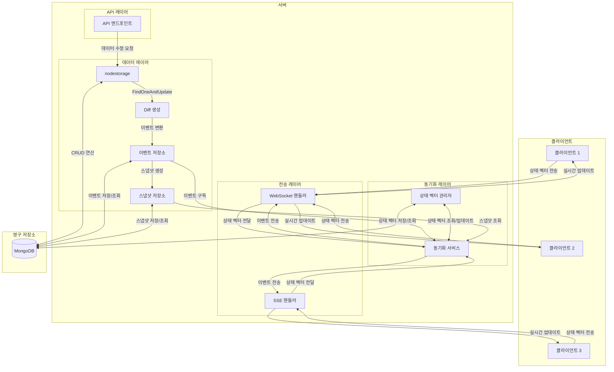
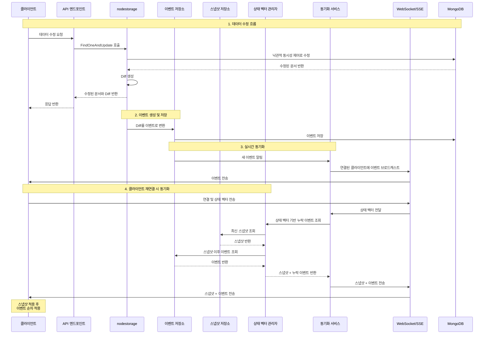

# nodestorage와 eventsync 통합 아키텍처

## 전체 아키텍처 다이어그램

## 데이터 흐름 시퀀스 다이어그램

## 주요 컴포넌트 설명

### 1. nodestorage

- **역할**: 낙관적 동시성 제어를 통한 데이터 수정 및 Diff 생성
- **주요 기능**:
  - `FindOneAndUpdate`: 문서를 수정하고 변경 전후 상태를 비교하여 Diff 생성
  - 버전 필드를 사용한 낙관적 동시성 제어
  - MongoDB를 영구 저장소로 사용

### 2. 이벤트 저장소 (EventStore)

- **역할**: nodestorage에서 생성된 Diff를 이벤트로 변환하여 저장
- **주요 기능**:
  - 이벤트 저장 및 조회
  - 시퀀스 번호 관리
  - 이벤트 압축 및 만료 처리

### 3. 스냅샷 저장소 (SnapshotStore)

- **역할**: 특정 시점의 문서 상태를 스냅샷으로 저장
- **주요 기능**:
  - 주기적 또는 조건부 스냅샷 생성
  - 스냅샷 조회 및 관리
  - 오래된 스냅샷 정리

### 4. 상태 벡터 관리자 (StateVectorManager)

- **역할**: 클라이언트별 상태 벡터 관리
- **주요 기능**:
  - 클라이언트 상태 벡터 저장 및 조회
  - 상태 벡터 기반 누락 이벤트 식별
  - 클라이언트 동기화 상태 추적

### 5. 동기화 서비스 (SyncService)

- **역할**: 클라이언트와 서버 간 데이터 동기화 관리
- **주요 기능**:
  - 클라이언트 연결 관리
  - 이벤트 브로드캐스트
  - 상태 벡터 기반 동기화 처리

### 6. 전송 레이어 (WebSocket/SSE)

- **역할**: 클라이언트와의 실시간 통신 채널 제공
- **주요 기능**:
  - WebSocket 또는 SSE 연결 관리
  - 이벤트 전송
  - 클라이언트 상태 벡터 수신

## 동작 원리

1. **데이터 수정 및 Diff 생성**:
   - 클라이언트가 API를 통해 데이터 수정 요청
   - nodestorage가 FindOneAndUpdate를 사용하여 데이터 수정
   - 수정 과정에서 변경 전후 상태를 비교하여 Diff 생성

2. **이벤트 저장**:
   - nodestorage에서 생성된 Diff를 이벤트로 변환
   - 이벤트에 시퀀스 번호, 타임스탬프 등 메타데이터 추가
   - 이벤트를 MongoDB의 events 컬렉션에 저장

3. **실시간 동기화**:
   - 새 이벤트가 저장되면 동기화 서비스에 알림
   - 동기화 서비스는 연결된 모든 클라이언트에 이벤트 브로드캐스트
   - 클라이언트는 이벤트를 수신하여 로컬 상태 업데이트

4. **클라이언트 재연결 시 동기화**:
   - 클라이언트가 연결 시 자신의 상태 벡터 전송
   - 서버는 상태 벡터를 기반으로 누락된 이벤트 식별
   - 최신 스냅샷과 누락된 이벤트를 클라이언트에 전송
   - 클라이언트는 스냅샷을 적용한 후 이벤트를 순차적으로 적용

5. **최적화**:
   - 주기적으로 스냅샷 생성
   - 오래된 이벤트 압축 또는 삭제
   - 계층형 저장소를 통한 효율적인 데이터 관리

## 서버 권한 모델 적용

이 아키텍처는 서버 권한 모델을 채택하여:

- 모든 데이터 수정은 서버 API를 통해서만 가능
- 클라이언트는 서버의 변경 사항을 수신만 함
- 클라이언트는 상태 벡터를 통해 자신의 동기화 상태만 서버에 전달
- 서버가 모든 데이터 일관성과 충돌 해결을 담당
