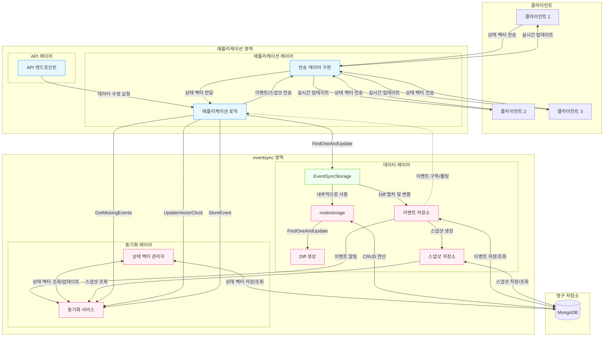
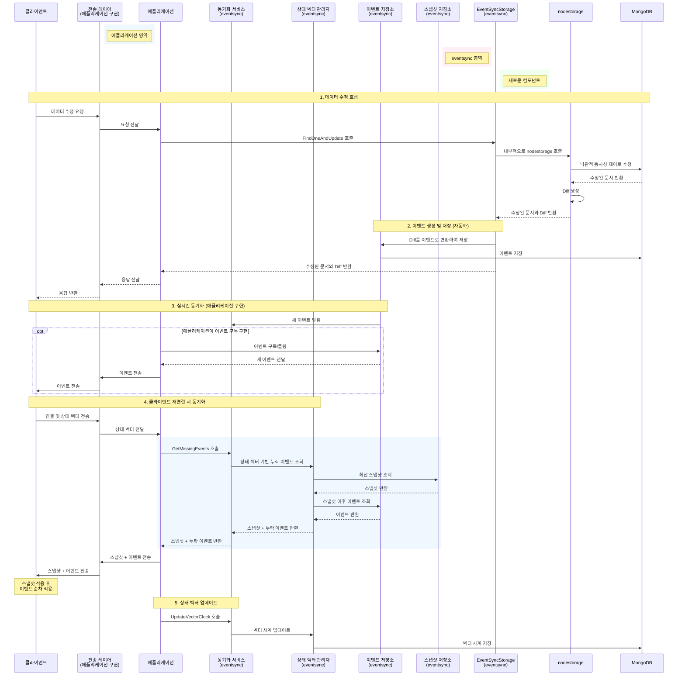
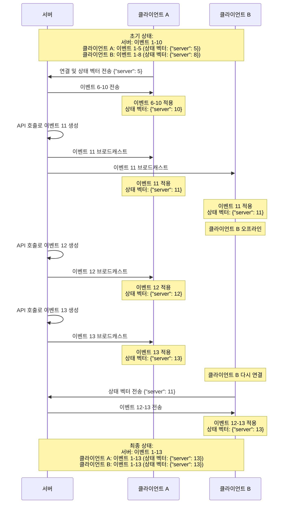
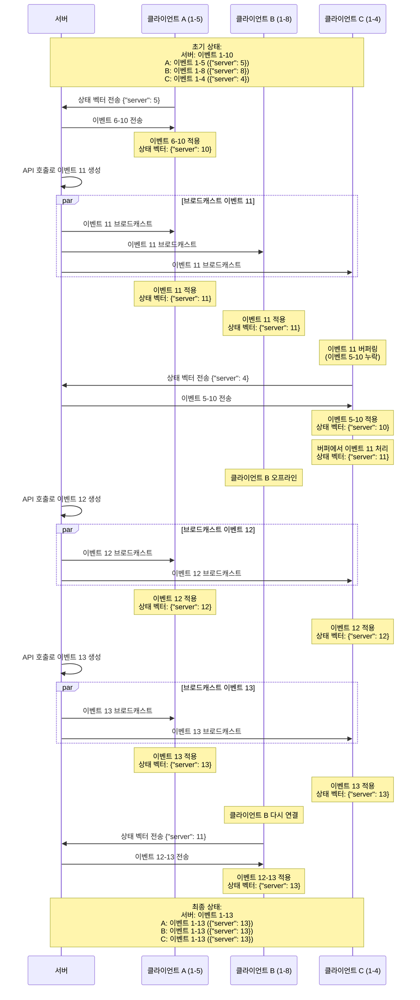
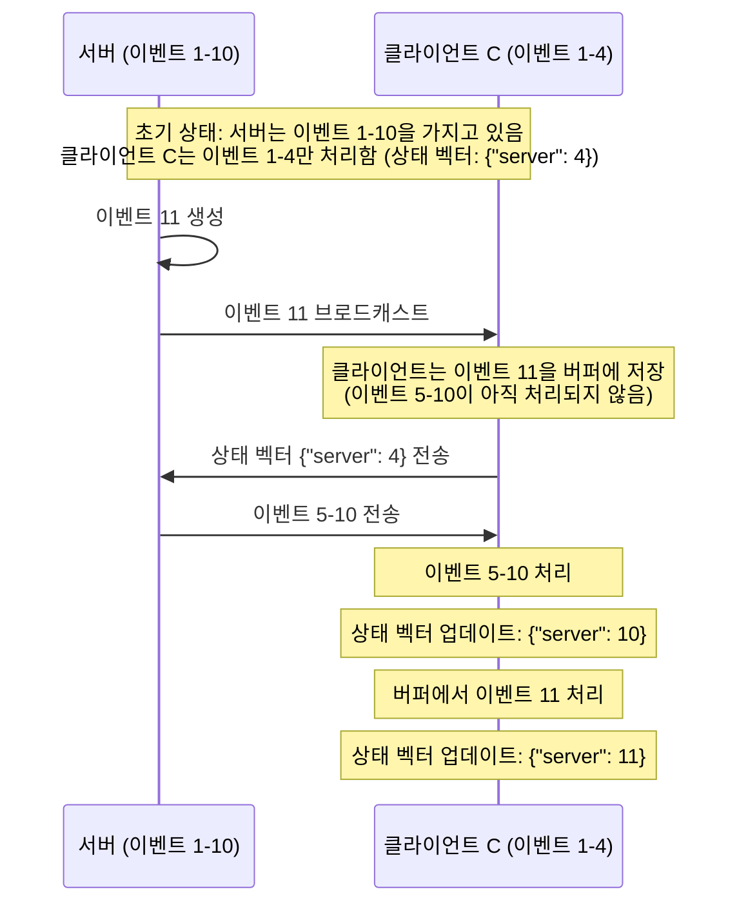
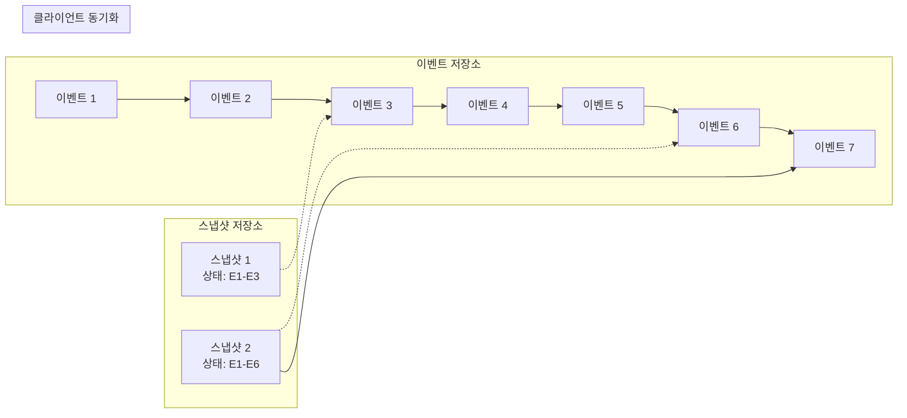
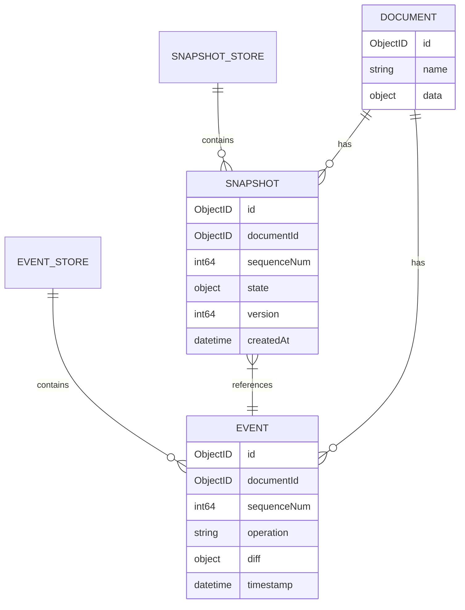
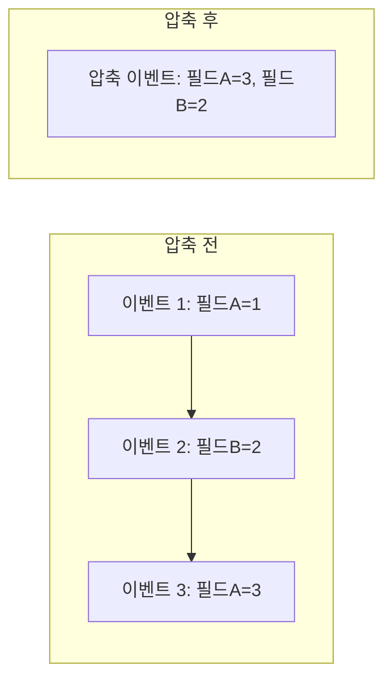
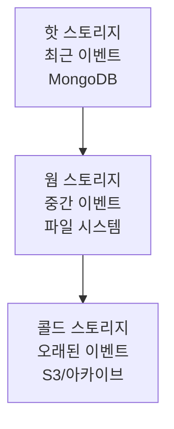

# EventSync

EventSync는 nodestorage의 FindOneAndUpdate로 생성되는 diff를 활용하여 이벤트 소싱과 상태 벡터 기반의 클라이언트 실시간 동기화를 구현하는 패키지입니다.

## 테스트 실행 방법

EventSync 패키지는 실제 MongoDB 인스턴스를 사용하여 테스트합니다. 테스트를 실행하기 전에 MongoDB가 실행 중인지 확인하세요.

### 테스트 환경 요구사항

- MongoDB 인스턴스 (localhost:27017)
- Go 테스트 환경

### 테스트 실행 명령어

```bash
# 모든 테스트 실행
go test ./eventsync/... -v

# 특정 테스트 실행
go test ./eventsync/... -run TestMongoEventStore_StoreEvent -v

# 통합 테스트 실행
go test ./eventsync/... -run TestStorageListener_Integration -v

# 벤치마크 테스트 실행
go test ./eventsync/... -bench=. -benchmem
```

### 테스트 구조

1. **단위 테스트**
   - `event_store_test.go`: 이벤트 저장소 테스트
   - `snapshot_test.go`: 스냅샷 저장소 테스트
   - `state_vector_test.go`: 상태 벡터 관리자 테스트
   - `sync_service_test.go`: 동기화 서비스 테스트

2. **통합 테스트**
   - `integration_test.go`: nodestorage와 EventSync 통합 테스트

### 테스트 데이터베이스

테스트는 자동으로 고유한 테스트 데이터베이스를 생성하고 테스트 종료 후 삭제합니다. 테스트 데이터베이스 이름은 `eventsync_test_[timestamp]` 형식으로 생성됩니다.

## 주요 기능

- MongoDB Change Stream을 활용한 실시간 변경 감지
- 이벤트 소싱 패턴을 통한 변경 이력 관리
- 상태 벡터 기반의 효율적인 동기화
- 전송 레이어 독립적 설계 (WebSocket, SSE, REST API 등 자유롭게 선택 가능)
- 서버 권한 모델 (Server Authority Model) 구현
- 상태 벡터 기반 클라이언트 동기화

## nodestorage와 eventsync 통합 아키텍처

### 전체 아키텍처 다이어그램



### 데이터 흐름 시퀀스 다이어그램



### 주요 컴포넌트 설명

#### 1. EventSyncStorage

- **역할**: nodestorage와 이벤트 저장소 간의 연결 역할
- **주요 기능**:
  - nodestorage.Storage 인터페이스 구현으로 기존 코드와 호환성 유지
  - nodestorage의 FindOneAndUpdate 호출 시 생성된 Diff를 자동으로 이벤트로 변환하여 저장
  - 낙관적 동시성 제어 기능 제공
  - 이벤트 저장소와의 통합을 통한 실시간 동기화 지원

#### 2. EventSourcedStorage

- **역할**: 이벤트 소싱 패턴을 구현한 저장소
- **주요 기능**:
  - 각 작업마다 클라이언트 ID를 지정하여 이벤트 생성
  - 문서별, 클라이언트별 벡터 시계 자동 관리
  - 모든 변경 사항을 이벤트로 저장하고 이를 통해 상태 재구성
  - 클라이언트의 벡터 시계를 기반으로 누락된 이벤트 조회

#### 3. nodestorage

- **역할**: 낙관적 동시성 제어를 통한 데이터 수정 및 Diff 생성
- **주요 기능**:
  - `FindOneAndUpdate`: 문서를 수정하고 변경 전후 상태를 비교하여 Diff 생성
  - 버전 필드를 사용한 낙관적 동시성 제어
  - MongoDB를 영구 저장소로 사용

#### 4. 이벤트 저장소 (EventStore)

- **역할**: EventSyncStorage에서 캡처한 Diff를 이벤트로 변환하여 저장
- **주요 기능**:
  - 이벤트 저장 및 조회
  - 시퀀스 번호 관리
  - 이벤트 압축 및 만료 처리

#### 5. 스냅샷 저장소 (SnapshotStore)

- **역할**: 특정 시점의 문서 상태를 스냅샷으로 저장
- **주요 기능**:
  - 주기적 또는 조건부 스냅샷 생성
  - 스냅샷 조회 및 관리
  - 오래된 스냅샷 정리
  - 버전 기반 스냅샷 관리
  - 서버 시퀀스 번호와 연동된 스냅샷 생성

#### 6. 상태 벡터 관리자 (StateVectorManager)

- **역할**: 클라이언트별 상태 벡터 관리
- **주요 기능**:
  - 클라이언트 상태 벡터 저장 및 조회
  - 상태 벡터 기반 누락 이벤트 식별
  - 클라이언트 동기화 상태 추적

#### 7. 동기화 서비스 (SyncService)

- **역할**: 클라이언트와 서버 간 데이터 동기화 관리
- **주요 기능**:
  - 클라이언트 연결 관리
  - 이벤트 브로드캐스트
  - 상태 벡터 기반 동기화 처리

#### 8. 애플리케이션 레이어

- **역할**: 애플리케이션 로직 및 전송 레이어 구현
- **주요 기능**:
  - 동기화 서비스와 통합
  - 전송 방식 선택 및 구현 (WebSocket, SSE, REST API 등)
  - 클라이언트 상태 관리

### 동작 원리

#### EventSyncStorage 동작 원리

1. **데이터 수정 및 Diff 생성**:
   - 클라이언트가 API를 통해 데이터 수정 요청
   - 애플리케이션이 EventSyncStorage의 FindOneAndUpdate를 호출
   - EventSyncStorage가 내부적으로 nodestorage를 사용하여 데이터 수정
   - nodestorage가 변경 전후 상태를 비교하여 Diff 생성

2. **이벤트 자동 저장**:
   - EventSyncStorage가 nodestorage에서 생성된 Diff를 자동으로 캡처
   - Diff를 이벤트로 변환하고 시퀀스 번호, 타임스탬프 등 메타데이터 추가
   - 이벤트를 MongoDB의 events 컬렉션에 저장
   - 애플리케이션 코드 수정 없이 이벤트 저장 자동화

#### EventSourcedStorage 동작 원리

1. **클라이언트별 데이터 수정 및 이벤트 생성**:
   - 클라이언트가 API를 통해 데이터 수정 요청
   - 애플리케이션이 EventSourcedStorage의 UpdateDocument를 호출하면서 클라이언트 ID 전달
   - EventSourcedStorage가 내부적으로 nodestorage를 사용하여 데이터 수정
   - nodestorage가 변경 전후 상태를 비교하여 Diff 생성

#### EventSourcedStorage 생성 방법

1. **기본 생성자 사용**:
   ```go
   // 기본 생성자 사용
   eventSourcedStorage := eventsync.NewEventSourcedStorage[GameState](
       storage,
       eventStore,
       logger,
       eventsync.WithSnapshotStore(snapshotStore),
       eventsync.WithAutoSnapshot(true),
       eventsync.WithSnapshotInterval(5),
   )
   ```

2. **옵션 패턴 기반 생성자 사용**:
   ```go
   // MongoDB 저장소 제공자 생성
   provider := eventsync.NewMongoDBStorageProvider(client, dbName, logger)

   // 옵션 패턴 기반 생성자 사용
   eventSourcedStorage, err := eventsync.NewEventSourcedStorageWithOptions[GameState](
       ctx,
       provider,
       collectionName,
       eventsync.WithEventCollectionName("game_events"),
       eventsync.WithEnableSnapshot(true),
       eventsync.WithSnapshotCollectionName("game_snapshots"),
       eventsync.WithFactoryAutoSnapshot(true),
       eventsync.WithFactorySnapshotInterval(5),
       eventsync.WithFactoryLogger(logger),
   )
   ```

이 옵션 패턴 기반 생성자는 다음과 같은 장점을 제공합니다:
- 필수 인자만 직접 받고 나머지는 옵션으로 설정
- 데이터베이스 시스템에 종속적이지 않은 설계
- 기본값 제공으로 간편한 사용
- 필요한 의존성 자동 생성

2. **버전 관리 및 이벤트 저장**:
   - EventSourcedStorage가 문서의 현재 버전 확인
   - Diff를 이벤트로 변환하고 버전, 클라이언트 ID 등 메타데이터 추가
   - 이벤트를 MongoDB의 events 컬렉션에 저장
   - 자동 스냅샷 생성 (설정된 경우)

3. **누락된 이벤트 조회**:
   - 클라이언트가 자신의 마지막 버전을 서버에 전송
   - EventSourcedStorage가 클라이언트의 버전을 기반으로 누락된 이벤트 조회
   - 누락된 이벤트를 클라이언트에 전송
   - 클라이언트가 이벤트를 적용하여 상태 업데이트

4. **실시간 동기화**:
   - 새 이벤트가 저장되면 동기화 서비스에 알림
   - 애플리케이션은 동기화 서비스로부터 이벤트를 수신
   - 애플리케이션은 선택한 전송 방식을 통해 클라이언트에 이벤트 전송
   - 클라이언트는 이벤트를 수신하여 로컬 상태 업데이트

4. **클라이언트 재연결 시 동기화**:
   - 클라이언트가 연결 시 자신의 마지막 버전 전송
   - 애플리케이션은 동기화 서비스에 누락된 이벤트 요청
   - 동기화 서비스는 버전을 기반으로 누락된 이벤트 식별
   - 최신 스냅샷과 누락된 이벤트를 애플리케이션에 반환
   - 애플리케이션은 선택한 전송 방식을 통해 클라이언트에 전송
   - 클라이언트는 스냅샷을 적용한 후 이벤트를 순차적으로 적용

5. **최적화**:
   - 주기적으로 스냅샷 생성 (자동 또는 수동)
   - 이벤트 개수 기반 자동 스냅샷 생성
   - 오래된 이벤트 압축 또는 삭제
   - 계층형 저장소를 통한 효율적인 데이터 관리
   - 스냅샷과 이벤트를 함께 사용한 효율적인 상태 복원

### 서버 권한 모델 적용

이 아키텍처는 서버 권한 모델을 채택하여:

- 모든 데이터 수정은 서버 API를 통해서만 가능
- 클라이언트는 서버의 변경 사항을 수신만 함
- 클라이언트는 상태 벡터를 통해 자신의 동기화 상태만 서버에 전달
- 서버가 모든 데이터 일관성과 충돌 해결을 담당

### EventSyncStorage와 EventSourcedStorage 비교

eventsync 패키지는 두 가지 저장소 구현을 제공합니다:

#### EventSyncStorage

- **장점**:
  - nodestorage.Storage 인터페이스를 구현하여 기존 코드와의 호환성 유지
  - 애플리케이션 코드 수정 없이 이벤트 소싱 기능 추가 가능
  - 이벤트 저장 실패가 전체 작업 실패로 이어지지 않음

- **단점**:
  - 생성 시 클라이언트 ID를 고정하여 모든 이벤트에 동일한 클라이언트 ID 사용
  - 다양한 클라이언트의 요청을 처리하기 위해 매번 새로운 인스턴스 생성 필요

#### EventSourcedStorage

- **장점**:
  - 각 작업마다 클라이언트 ID를 지정할 수 있어 다양한 클라이언트의 요청 처리 가능
  - 이벤트 소싱에 특화된 인터페이스 제공
  - 버전 기반 이벤트 관리 및 누락된 이벤트 조회 기능 제공
  - 자동 또는 수동 스냅샷 생성 지원
  - 스냅샷과 이벤트를 함께 사용한 효율적인 상태 복원

- **단점**:
  - nodestorage.Storage 인터페이스와 호환되지 않아 기존 코드 수정 필요
  - 이벤트 저장 실패 시 전체 작업 실패로 이어짐

#### 선택 가이드

- **기존 코드와의 호환성이 중요한 경우**: EventSyncStorage
- **다양한 클라이언트의 요청을 처리해야 하는 경우**: EventSourcedStorage
- **이벤트 소싱 패턴을 처음부터 구현하고 싶은 경우**: EventSourcedStorage

자세한 비교는 [STORAGE_COMPARISON.md](STORAGE_COMPARISON.md) 문서를 참조하세요.

## EventSyncStorage 구현 방식

EventSyncStorage는 nodestorage와 eventsync를 효과적으로 통합하기 위한 핵심 컴포넌트입니다. 이 컴포넌트는 다음과 같은 방식으로 구현됩니다:

### 1. 인터페이스 호환성

```go
// EventSyncStorage는 nodestorage.Storage 인터페이스를 구현하여 기존 코드와의 호환성을 유지합니다.
type EventSyncStorage[T nodestorage.Cachable[T]] struct {
    storage    nodestorage.Storage[T]  // 내부적으로 실제 nodestorage 인스턴스 사용
    eventStore eventsync.EventStore    // 이벤트 저장소
    logger     *zap.Logger
}

// nodestorage.Storage 인터페이스의 모든 메서드 구현
func (s *EventSyncStorage[T]) FindOne(ctx context.Context, id primitive.ObjectID, opts ...*options.FindOneOptions) (T, error) {
    return s.storage.FindOne(ctx, id, opts...)
}

// 다른 메서드들도 동일하게 구현...
```

### 2. Diff 자동 캡처 및 이벤트 저장

```go
// FindOneAndUpdate는 nodestorage의 동일 메서드를 호출하고 생성된 Diff를 이벤트로 저장합니다.
func (s *EventSyncStorage[T]) FindOneAndUpdate(ctx context.Context, id primitive.ObjectID, updateFn nodestorage.EditFunc[T], opts ...nodestorage.EditOption) (T, *nodestorage.Diff, error) {
    // 1. nodestorage의 FindOneAndUpdate 호출
    updatedDoc, diff, err := s.storage.FindOneAndUpdate(ctx, id, updateFn, opts...)

    // 2. 에러가 없고 변경사항이 있는 경우에만 이벤트 저장
    if err == nil && diff != nil && diff.HasChanges {
        // 3. Diff를 이벤트로 변환
        event := &eventsync.Event{
            ID:          primitive.NewObjectID(),
            DocumentID:  id,
            Timestamp:   time.Now(),
            Operation:   "update",
            Diff:        diff,
            ClientID:    "server",
            VectorClock: map[string]int64{"server": 1},
        }

        // 4. 이벤트 저장
        if storeErr := s.eventStore.StoreEvent(ctx, event); storeErr != nil {
            // 이벤트 저장 실패 로깅 (하지만 원래 작업은 성공했으므로 에러 반환하지 않음)
            s.logger.Error("Failed to store event",
                zap.String("document_id", id.Hex()),
                zap.Error(storeErr))
        }
    }

    return updatedDoc, diff, err
}
```

### 3. 다른 작업에 대한 이벤트 처리

```go
// DeleteOne은 문서 삭제 시 이벤트를 생성합니다.
func (s *EventSyncStorage[T]) DeleteOne(ctx context.Context, id primitive.ObjectID) error {
    // 1. 삭제 전 문서 조회 (이벤트에 포함시키기 위함)
    doc, err := s.storage.FindOne(ctx, id)

    // 2. 실제 삭제 수행
    err = s.storage.DeleteOne(ctx, id)
    if err != nil {
        return err
    }

    // 3. 삭제 이벤트 생성 및 저장
    event := &eventsync.Event{
        ID:          primitive.NewObjectID(),
        DocumentID:  id,
        Timestamp:   time.Now(),
        Operation:   "delete",
        ClientID:    "server",
        VectorClock: map[string]int64{"server": 1},
        Metadata:    map[string]interface{}{"deleted_doc": doc},
    }

    if storeErr := s.eventStore.StoreEvent(ctx, event); storeErr != nil {
        s.logger.Error("Failed to store delete event",
            zap.String("document_id", id.Hex()),
            zap.Error(storeErr))
    }

    return nil
}
```

### 4. 생성자 함수

```go
// NewEventSyncStorage는 새로운 EventSyncStorage 인스턴스를 생성합니다.
func NewEventSyncStorage[T nodestorage.Cachable[T]](
    storage nodestorage.Storage[T],
    eventStore eventsync.EventStore,
    logger *zap.Logger,
) *EventSyncStorage[T] {
    return &EventSyncStorage[T]{
        storage:    storage,
        eventStore: eventStore,
        logger:     logger,
    }
}
```

이 구현 방식을 통해 애플리케이션 코드를 최소한으로 수정하면서 nodestorage와 eventsync를 효과적으로 통합할 수 있습니다. 기존에 nodestorage.Storage를 사용하던 코드는 EventSyncStorage로 대체하기만 하면 자동으로 이벤트 저장 기능이 활성화됩니다.

## EventSourcedStorage 구현 방식

EventSourcedStorage는 이벤트 소싱 패턴을 구현한 저장소로, 각 작업마다 클라이언트 ID를 지정할 수 있어 다양한 클라이언트의 요청을 처리할 수 있습니다.

### 1. 인터페이스 설계

```go
// EventSourcedStorage는 이벤트 소싱 패턴을 구현한 저장소입니다.
type EventSourcedStorage[T nodestorage.Cachable[T]] struct {
    storage           nodestorage.Storage[T] // 내부적으로 실제 nodestorage 인스턴스 사용
    eventStore        EventStore             // 이벤트 저장소
    vectorClockManager VectorClockManager    // 벡터 시계 관리자
    logger            *zap.Logger
}
```

### 2. 문서 생성 및 이벤트 저장

```go
// CreateDocument는 새 문서를 생성하고 이벤트를 저장합니다.
func (s *EventSourcedStorage[T]) CreateDocument(ctx context.Context, data T, clientID string) (T, error) {
    // 1. nodestorage를 사용하여 문서 생성
    doc, err := s.storage.FindOneAndUpsert(ctx, data)

    // 2. 벡터 시계 관리 및 이벤트 저장
    // 벡터 시계 가져오기
    vectorClock, err := s.vectorClockManager.GetVectorClock(ctx, documentID)

    // 현재 클라이언트의 시퀀스 번호 증가
    currentSeq := vectorClock[clientID]
    newSeq := currentSeq + 1
    vectorClock[clientID] = newSeq

    // 이벤트 생성 및 저장
    event := &Event{
        ID:          primitive.NewObjectID(),
        DocumentID:  documentID,
        Timestamp:   time.Now(),
        Operation:   "create",
        ClientID:    clientID,
        VectorClock: vectorClock,
        Metadata:    map[string]interface{}{"created_doc": doc},
    }

    // 이벤트 저장
    if err := s.eventStore.StoreEvent(ctx, event); err != nil {
        return doc, fmt.Errorf("document created but failed to store event: %w", err)
    }

    // 벡터 시계 업데이트
    s.vectorClockManager.UpdateVectorClock(ctx, documentID, clientID, newSeq)

    return doc, nil
}
```

### 3. 누락된 이벤트 조회

```go
// GetMissingEvents는 클라이언트의 벡터 시계를 기반으로 누락된 이벤트를 조회합니다.
func (s *EventSourcedStorage[T]) GetMissingEvents(ctx context.Context, documentID primitive.ObjectID, clientVectorClock map[string]int64) ([]*Event, error) {
    return s.eventStore.GetEventsByVectorClock(ctx, documentID, clientVectorClock)
}
```

이 구현 방식을 통해 다양한 클라이언트의 요청을 처리하고, 벡터 시계를 자동으로 관리하며, 누락된 이벤트를 조회할 수 있는 이벤트 소싱 패턴을 구현할 수 있습니다.


## 이벤트 소싱과 상태 벡터

### 이벤트 소싱 (Event Sourcing)

이벤트 소싱은 애플리케이션의 상태 변화를 일련의 이벤트로 저장하는 패턴입니다. 이 패턴에서는 현재 상태를 직접 저장하는 대신, 상태 변화를 일으킨 모든 이벤트를 시간 순서대로 저장합니다.

#### 이벤트 소싱의 주요 특징:

1. **불변성(Immutability)**: 이벤트는 한 번 생성되면 변경되지 않습니다.
2. **완전한 감사 추적(Audit Trail)**: 모든 변경 사항의 전체 이력이 보존됩니다.
3. **시간 여행(Time Travel)**: 특정 시점의 상태를 재구성할 수 있습니다.
4. **이벤트 재생(Event Replay)**: 저장된 이벤트를 재생하여 현재 상태를 구축합니다.

#### nodestorage와 이벤트 소싱:

nodestorage의 FindOneAndUpdate는 문서 변경 시 diff를 생성합니다. EventSyncStorage는 이 diff를 자동으로 캡처하여 이벤트 소싱의 이벤트로 변환하고 저장합니다. 각 이벤트는 다음 정보를 포함합니다:

- 문서 ID
- 타임스탬프
- 시퀀스 번호
- 작업 유형 (생성, 업데이트, 삭제)
- 변경 내용 (diff)
- 벡터 시계

이 자동화된 프로세스는 애플리케이션 코드를 수정하지 않고도 이벤트 소싱 패턴을 구현할 수 있게 해줍니다. EventSyncStorage는 nodestorage.Storage 인터페이스를 구현하므로 기존 코드와의 호환성을 유지하면서 이벤트 소싱의 이점을 제공합니다.

### 상태 벡터 (State Vector)

상태 벡터는 분산 시스템에서 데이터 동기화를 위한 중요한 개념입니다. 이는 각 클라이언트나 노드가 어떤 이벤트까지 처리했는지를 추적하는 메커니즘을 제공합니다.

#### 상태 벡터란?

상태 벡터는 `{클라이언트ID: 시퀀스번호}` 형태의 맵으로, 각 클라이언트나 소스에 대해 마지막으로 처리한 이벤트의 시퀀스 번호를 저장합니다.

예를 들어:
```json
{
  "client1": 5,  // client1의 5번 이벤트까지 처리함
  "client2": 10, // client2의 10번 이벤트까지 처리함
  "server": 8    // 서버의 8번 이벤트까지 처리함
}
```

#### 상태 벡터의 작동 방식

1. **이벤트 추적**: 각 이벤트는 소스 ID와 시퀀스 번호를 가집니다.
2. **벡터 업데이트**: 이벤트를 처리할 때마다 해당 소스의 시퀀스 번호를 업데이트합니다.
3. **동기화 요청**: 클라이언트는 자신의 상태 벡터를 서버에 전송합니다.
4. **차이 계산**: 서버는 클라이언트의 상태 벡터와 서버의 상태 벡터를 비교하여 클라이언트가 아직 받지 못한 이벤트를 식별합니다.
5. **선택적 전송**: 서버는 클라이언트가 필요로 하는 이벤트만 전송합니다.

#### 상태 벡터의 이점

1. **효율적인 동기화**: 전체 데이터가 아닌 필요한 이벤트만 전송하여 네트워크 트래픽 감소
2. **인과성 보장**: 이벤트 간의 인과 관계를 유지하여 일관된 상태 보장
3. **오프라인 지원**: 클라이언트가 오프라인 상태에서도 상태를 추적하고 나중에 동기화 가능
4. **충돌 감지**: 동시 편집 충돌을 감지하고 해결하는 기반 제공

### 이벤트 소싱과 상태 벡터의 결합

EventSync에서는 이벤트 소싱과 상태 벡터를 결합하여 강력한 실시간 동기화 시스템을 구현합니다:

1. **자동화된 이벤트 저장**: EventSyncStorage가 nodestorage의 diff를 자동으로 캡처하여 이벤트로 변환하고 저장
2. **상태 벡터 관리**: 각 클라이언트의 상태 벡터를 추적하여 동기화 상태 관리
3. **효율적인 동기화**: 클라이언트의 상태 벡터를 기반으로 필요한 이벤트만 선택적으로 전송
4. **실시간 업데이트**: 이벤트 저장소와 동기화 서비스를 통해 변경 사항을 실시간으로 클라이언트에 전파
5. **일관된 인터페이스**: nodestorage.Storage 인터페이스와 호환되는 EventSyncStorage를 통해 기존 코드 재사용

### 동기화 시나리오 예제

다음은 상태 벡터와 이벤트 소싱을 활용한 실제 동기화 시나리오입니다:

#### 초기 상태

- 서버에는 문서 ID "game123"에 대한 이벤트가 10개 있습니다 (시퀀스 번호 1-10).
- 클라이언트 A는 이벤트 1-5까지 처리했습니다. 상태 벡터: `{"server": 5}`.
- 클라이언트 B는 이벤트 1-8까지 처리했습니다. 상태 벡터: `{"server": 8}`.

#### 동기화 과정

1. **클라이언트 A가 서버에 연결**:
   - 클라이언트 A가 상태 벡터 `{"server": 5}`를 서버에 전송합니다.
   - 서버는 클라이언트 A가 이벤트 6-10을 아직 받지 않았음을 확인합니다.
   - 서버는 이벤트 6-10을 클라이언트 A에 전송합니다.
   - 클라이언트 A는 이벤트를 적용하고 상태 벡터를 `{"server": 10}`으로 업데이트합니다.

2. **서버에 새 이벤트 발생**:
   - 서버에서 API를 통해 문서가 수정되어 이벤트 11이 생성됩니다.
   - 서버는 연결된 모든 클라이언트에 이벤트 11을 브로드캐스트합니다.
   - 클라이언트 A와 B는 이벤트 11을 적용하고 상태 벡터를 `{"server": 11}`로 업데이트합니다.

3. **클라이언트 B가 일시적으로 오프라인 상태**:
   - 서버에서 이벤트 12와 13이 생성됩니다.
   - 클라이언트 A는 이벤트 12와 13을 수신하고 적용합니다. 상태 벡터: `{"server": 13}`.
   - 클라이언트 B는 오프라인 상태여서 이벤트를 수신하지 못합니다. 상태 벡터: `{"server": 11}`.

4. **클라이언트 B가 다시 연결**:
   - 클라이언트 B가 상태 벡터 `{"server": 11}`을 서버에 전송합니다.
   - 서버는 클라이언트 B가 이벤트 12-13을 아직 받지 않았음을 확인합니다.
   - 서버는 이벤트 12-13만 클라이언트 B에 전송합니다.
   - 클라이언트 B는 이벤트를 적용하고 상태 벡터를 `{"server": 13}`으로 업데이트합니다.

#### 클라이언트 A와 B의 동기화 시퀀스 다이어그램

다음은 클라이언트 A와 B의 동기화 과정을 보여주는 시퀀스 다이어그램입니다:



이 다이어그램은 다음과 같은 주요 동기화 단계를 보여줍니다:

1. 클라이언트 A의 초기 동기화 (이벤트 6-10 수신)
2. 새 이벤트 11의 실시간 브로드캐스트
3. 클라이언트 B의 오프라인 상태 동안 이벤트 12-13 생성
4. 클라이언트 B의 재연결 및 누락된 이벤트 동기화

#### 통합 시나리오: 클라이언트 A, B, C의 동기화

다음은 클라이언트 A, B, C가 모두 참여하는 통합 시나리오를 보여주는 시퀀스 다이어그램입니다:



이 통합 시나리오는 다음과 같은 주요 상황을 보여줍니다:

1. **클라이언트 A의 정상 동기화**: 이벤트 6-10을 수신하고 이후 실시간 업데이트를 받음
2. **클라이언트 B의 오프라인 동기화**: 오프라인 상태에서 이벤트 12-13을 놓치고 재연결 시 동기화
3. **클라이언트 C의 순서 불일치 처리**: 이벤트 11을 먼저 받았지만 이벤트 5-10이 누락되어 버퍼링 후 처리

이 다이어그램은 다양한 상황에서 상태 벡터와 이벤트 버퍼링이 어떻게 효과적으로 동작하는지 보여줍니다.

이 방식을 통해 각 클라이언트는 필요한 이벤트만 수신하여 효율적으로 동기화할 수 있습니다.

#### 이벤트 순서 불일치 시나리오

클라이언트가 이전 이벤트를 모두 처리하지 않은 상태에서 최신 이벤트를 받는 경우도 있습니다. 다음은 이러한 시나리오를 보여주는 시퀀스 다이어그램입니다:



이 시나리오에서:

1. 클라이언트 C는 이벤트 1-4만 처리한 상태입니다.
2. 서버에서 이벤트 11이 생성되고 브로드캐스트됩니다.
3. 클라이언트 C는 이벤트 11을 받지만, 이벤트 5-10이 아직 처리되지 않았으므로 즉시 적용하지 않고 버퍼에 저장합니다.
4. 클라이언트 C는 상태 벡터 `{"server": 4}`를 서버에 전송하여 누락된 이벤트를 요청합니다.
5. 서버는 이벤트 5-10을 클라이언트 C에 전송합니다.
6. 클라이언트 C는 이벤트 5-10을 처리하고 상태 벡터를 `{"server": 10}`으로 업데이트합니다.
7. 그 후 버퍼에 저장된 이벤트 11을 처리하고 상태 벡터를 `{"server": 11}`로 업데이트합니다.

이 방식을 통해 클라이언트는 이벤트의 순서를 유지하면서도 실시간 업데이트를 받을 수 있습니다.

#### 클라이언트 측 이벤트 버퍼링 구현

클라이언트 측에서 이벤트 순서를 유지하기 위한 버퍼링 메커니즘은 다음과 같이 구현됩니다:

```javascript
// 이벤트 처리
_handleEvent(event) {
  // 이미 처리한 이벤트인지 확인
  if (event.clientId && event.sequenceNum) {
    const currentSeq = this.vectorClock[event.clientId] || 0;

    // 이미 처리한 이벤트는 건너뜀
    if (currentSeq >= event.sequenceNum) {
      return;
    }

    // 이벤트 순서 확인
    // 이벤트 시퀀스 번호가 현재 상태 벡터보다 1보다 크게 앞서 있으면 버퍼에 저장
    if (event.sequenceNum > currentSeq + 1) {
      this._bufferEvent(event);
      return;
    }
  }

  // 이벤트 처리 및 상태 벡터 업데이트
  this.options.onEvent(event);
  this.vectorClock[event.clientId] = event.sequenceNum;

  // 버퍼에서 다음 이벤트 처리 시도
  this._processEventBuffer(event.clientId);
}

// 이벤트 버퍼링
_bufferEvent(event) {
  if (!this.eventBuffer) {
    this.eventBuffer = {};
  }

  const clientId = event.clientId;
  if (!this.eventBuffer[clientId]) {
    this.eventBuffer[clientId] = {};
  }

  this.eventBuffer[clientId][event.sequenceNum] = event;
}

// 버퍼 처리
_processEventBuffer(clientId) {
  if (!this.eventBuffer || !this.eventBuffer[clientId]) {
    return;
  }

  const currentSeq = this.vectorClock[clientId] || 0;
  const nextSeq = currentSeq + 1;

  // 버퍼에서 다음 시퀀스 번호의 이벤트 찾기
  const nextEvent = this.eventBuffer[clientId][nextSeq];
  if (nextEvent) {
    // 버퍼에서 이벤트 제거
    delete this.eventBuffer[clientId][nextSeq];

    // 이벤트 처리 (재귀적으로 버퍼 처리)
    this._handleEvent(nextEvent);
  }
}
```

이 구현을 통해 클라이언트는 이벤트를 순서대로 처리하면서도 실시간 업데이트를 놓치지 않을 수 있습니다.

## 이벤트 저장소 최적화 전략

이벤트 소싱 시스템에서는 이벤트가 계속 누적되므로 저장 공간과 성능 문제가 발생할 수 있습니다. 다음은 이벤트 저장소를 최적화하기 위한 전략들입니다:

### 1. 스냅샷 (Snapshots)



- **개념**: 특정 시점의 전체 상태를 저장하여 그 이전 이벤트를 재생할 필요가 없게 함
- **저장 방식**:
  - 스냅샷은 이벤트 저장소와 별도의 컬렉션이나 저장소에 저장됨
  - 각 스냅샷은 해당 시점까지의 모든 이벤트가 적용된 최종 상태를 포함
  - 스냅샷은 참조하는 마지막 이벤트의 시퀀스 번호를 저장하여 연결성 유지
- **구현 방법**:
  - 주기적으로(예: 100개 이벤트마다) 또는 특정 조건에서 스냅샷 생성
  - 스냅샷은 해당 시점의 전체 문서 상태를 포함
  - 클라이언트는 가장 최근 스냅샷부터 동기화 시작 가능
- **이점**:
  - 재생해야 할 이벤트 수 감소
  - 동기화 시간 단축
  - 오래된 이벤트 삭제 가능

#### 스냅샷과 이벤트 저장소의 관계



- **물리적 분리**: 스냅샷과 이벤트는 별도의 컬렉션에 저장됨
  - `events` 컬렉션: 모든 이벤트 저장
  - `snapshots` 컬렉션: 주기적으로 생성된 스냅샷 저장
- **논리적 연결**: 스냅샷은 특정 시퀀스 번호의 이벤트까지 적용된 상태를 나타냄
- **동기화 과정**:
  1. 최신 스냅샷 조회
  2. 스냅샷의 시퀀스 번호 이후의 이벤트만 조회
  3. 스냅샷 상태에 이벤트 적용하여 최신 상태 구성

### 2. 이벤트 압축 (Event Compaction)



- **개념**: 동일한 엔티티에 대한 여러 이벤트를 하나의 이벤트로 압축
- **구현 방법**:
  - 같은 필드에 대한 연속적인 업데이트를 하나로 병합
  - 중간 상태를 건너뛰고 최종 상태만 유지
  - 특정 기간(예: 1주일) 이상 지난 이벤트들을 압축
- **이점**:
  - 저장 공간 절약
  - 이벤트 재생 성능 향상

### 3. 이벤트 만료 (Event Expiration)

- **개념**: 일정 기간이 지난 이벤트를 자동으로 삭제하거나 아카이브
- **구현 방법**:
  - MongoDB TTL(Time-To-Live) 인덱스 활용
  - 이벤트에 만료 시간 필드 추가
  - 주기적인 배치 작업으로 오래된 이벤트 아카이브
- **이점**:
  - 데이터베이스 크기 관리
  - 쿼리 성능 유지

### 4. 선택적 동기화 (Selective Synchronization)

- **개념**: 클라이언트가 필요한 이벤트만 선택적으로 동기화
- **구현 방법**:
  - 이벤트에 메타데이터(태그, 카테고리 등) 추가
  - 클라이언트가 관심 있는 이벤트 유형만 구독
  - 동기화 범위를 시간 또는 이벤트 수로 제한
- **이점**:
  - 네트워크 트래픽 감소
  - 클라이언트 처리 부하 감소

### 5. 계층형 이벤트 저장소 (Tiered Event Storage)



- **개념**: 이벤트의 나이와 접근 빈도에 따라 다른 저장소 사용
- **구현 방법**:
  - 최근 이벤트는 고성능 데이터베이스(MongoDB)에 저장
  - 중간 이벤트는 파일 시스템이나 저비용 데이터베이스로 이동
  - 오래된 이벤트는 아카이브 스토리지(S3 등)로 이동
- **이점**:
  - 비용 효율적인 저장소 활용
  - 자주 접근하는 이벤트에 대한 빠른 접근성 유지

### 6. 이벤트 스트림 분할 (Event Stream Sharding)

- **개념**: 이벤트 스트림을 여러 파티션으로 분할하여 확장성 확보
- **구현 방법**:
  - 문서 ID나 다른 키를 기준으로 이벤트 스트림 분할
  - 각 파티션을 별도의 컬렉션이나 데이터베이스에 저장
  - 파티션별 독립적인 스냅샷 및 압축 정책 적용
- **이점**:
  - 수평적 확장성 확보
  - 대규모 이벤트 처리 가능

### 구현 예시: 스냅샷 기반 최적화

```go
// 스냅샷 구조체
type Snapshot struct {
    ID          primitive.ObjectID     `bson:"_id,omitempty" json:"id"`
    DocumentID  primitive.ObjectID     `bson:"document_id" json:"documentId"`
    State       map[string]interface{} `bson:"state" json:"state"`
    Version     int64                  `bson:"version" json:"version"`
    SequenceNum int64                  `bson:"sequence_num" json:"sequenceNum"`
    CreatedAt   time.Time              `bson:"created_at" json:"createdAt"`
}

// 스냅샷 생성 함수
func (s *MongoEventStore) CreateSnapshot(ctx context.Context, documentID primitive.ObjectID, state map[string]interface{}, version int64) (*Snapshot, error) {
    // 현재 시퀀스 번호 조회
    seqNum, err := s.GetLatestSequence(ctx, documentID)
    if err != nil {
        return nil, fmt.Errorf("failed to get latest sequence: %w", err)
    }

    // 스냅샷 생성
    snapshot := &Snapshot{
        ID:          primitive.NewObjectID(),
        DocumentID:  documentID,
        State:       state,
        Version:     version,
        SequenceNum: seqNum,
        CreatedAt:   time.Now(),
    }

    // 스냅샷 저장
    _, err = s.snapshotCollection.InsertOne(ctx, snapshot)
    if err != nil {
        return nil, fmt.Errorf("failed to insert snapshot: %w", err)
    }

    return snapshot, nil
}

// 최신 스냅샷 조회 함수
func (s *MongoEventStore) GetLatestSnapshot(ctx context.Context, documentID primitive.ObjectID) (*Snapshot, error) {
    opts := options.FindOne().SetSort(bson.D{{Key: "sequence_num", Value: -1}})

    var snapshot Snapshot
    err := s.snapshotCollection.FindOne(ctx, bson.M{"document_id": documentID}, opts).Decode(&snapshot)
    if err != nil {
        if err == mongo.ErrNoDocuments {
            return nil, nil // 스냅샷이 없는 경우
        }
        return nil, fmt.Errorf("failed to find snapshot: %w", err)
    }

    return &snapshot, nil
}

// 스냅샷 이후의 이벤트만 조회하는 함수
func (s *MongoEventStore) GetEventsAfterSnapshot(ctx context.Context, documentID primitive.ObjectID) ([]*Event, error) {
    // 최신 스냅샷 조회
    snapshot, err := s.GetLatestSnapshot(ctx, documentID)
    if err != nil {
        return nil, err
    }

    // 스냅샷이 없으면 모든 이벤트 반환
    if snapshot == nil {
        return s.GetEvents(ctx, documentID, 0)
    }

    // 스냅샷 이후의 이벤트만 조회
    return s.GetEvents(ctx, documentID, snapshot.SequenceNum)
}
```

### 최적화 전략 구현 가이드

이벤트 저장소 최적화를 위한 구현 가이드입니다:

#### 1. 스냅샷 생성 정책

스냅샷을 생성하는 시점을 결정하는 정책을 설정해야 합니다:

1. **주기적 스냅샷**: 일정 시간 간격으로 스냅샷 생성 (예: 6시간마다)
2. **이벤트 수 기반 스냅샷**: 특정 개수의 이벤트가 누적되면 스냅샷 생성 (예: 100개 이벤트마다)
3. **하이브리드 접근**: 두 조건 중 먼저 충족되는 조건에 따라 스냅샷 생성

```go
// 스냅샷 생성 조건 확인
func shouldCreateSnapshot(lastSnapshot *Snapshot, eventCount int64, lastEventTime time.Time) bool {
    // 스냅샷이 없는 경우
    if lastSnapshot == nil {
        return true
    }

    // 이벤트 수 기반 조건
    if eventCount > 100 {
        return true
    }

    // 시간 기반 조건 (6시간)
    if time.Since(lastSnapshot.CreatedAt) > 6*time.Hour {
        return true
    }

    return false
}
```

#### 2. 이벤트 압축 및 만료 설정

MongoDB의 TTL 인덱스를 활용하여 이벤트 만료를 구현할 수 있습니다:

```go
// TTL 인덱스 생성
indexModel := mongo.IndexModel{
    Keys: bson.D{{Key: "timestamp", Value: 1}},
    Options: options.Index().SetExpireAfterSeconds(int32(30 * 24 * 60 * 60)), // 30일
}
_, err = eventCollection.Indexes().CreateOne(ctx, indexModel)
```

#### 3. 계층형 저장소 구현

계층형 저장소를 구현하기 위한 인터페이스:

```go
// TieredEventStore는 계층형 이벤트 저장소 인터페이스입니다.
type TieredEventStore interface {
    // StoreEvent는 이벤트를 저장합니다.
    StoreEvent(ctx context.Context, event *Event) error

    // MoveToWarmStorage는 이벤트를 웜 스토리지로 이동합니다.
    MoveToWarmStorage(ctx context.Context, documentID primitive.ObjectID, maxAge time.Duration) error

    // MoveToArchive는 이벤트를 아카이브로 이동합니다.
    MoveToArchive(ctx context.Context, documentID primitive.ObjectID, maxAge time.Duration) error

    // GetEvents는 모든 계층의 저장소에서 이벤트를 조회합니다.
    GetEvents(ctx context.Context, documentID primitive.ObjectID, afterSequence int64) ([]*Event, error)
}
```

#### 4. 최적화 모니터링

최적화 작업의 효과를 모니터링하기 위한 지표:

1. **저장소 크기**: 각 컬렉션의 크기 추적
2. **이벤트 수**: 문서별 이벤트 수 추적
3. **압축률**: 압축 전후의 데이터 크기 비교
4. **동기화 시간**: 클라이언트 동기화에 소요되는 시간 측정

```go
// 저장소 통계 조회
func getStorageStats(ctx context.Context, db *mongo.Database) (map[string]interface{}, error) {
    stats := make(map[string]interface{})

    // 이벤트 컬렉션 통계
    eventStats := bson.M{}
    err := db.RunCommand(ctx, bson.D{{Key: "collStats", Value: "events"}}).Decode(&eventStats)
    if err != nil {
        return nil, err
    }
    stats["events"] = eventStats

    // 스냅샷 컬렉션 통계
    snapshotStats := bson.M{}
    err = db.RunCommand(ctx, bson.D{{Key: "collStats", Value: "snapshots"}}).Decode(&snapshotStats)
    if err != nil {
        return nil, err
    }
    stats["snapshots"] = snapshotStats

    return stats, nil
}
```

## 서버 권한 모델 (Server Authority Model)

EventSync는 서버 권한 모델을 채택하여 데이터 일관성과 보안을 강화합니다:

1. **모든 변경은 서버에서 시작됩니다**
   - 클라이언트는 서버 API를 통해서만 데이터를 변경할 수 있습니다
   - 클라이언트는 직접 이벤트를 생성하거나 전송하지 않습니다
   - 모든 변경 사항은 서버에서 검증되고 처리됩니다

2. **단방향 데이터 흐름**
   - 서버 → 클라이언트 방향으로만 이벤트가 전송됩니다
   - 클라이언트는 서버의 변경 사항을 수신만 합니다

3. **상태 벡터 기반 동기화**
   - 클라이언트는 자신의 상태 벡터를 서버에 전송하여 누락된 이벤트를 요청합니다
   - 서버는 클라이언트의 상태 벡터를 기반으로 필요한 이벤트만 전송합니다

## 주요 컴포넌트

### 서버 측 컴포넌트

1. **이벤트 저장소 (EventStore)**
   - MongoDB에서 생성된 diff를 이벤트로 저장
   - 각 이벤트에 고유 ID와 타임스탬프 부여
   - 문서별 이벤트 히스토리 관리

2. **상태 벡터 관리자 (StateVectorManager)**
   - 클라이언트별 상태 벡터 관리
   - 상태 벡터 비교를 통한 누락된 이벤트 식별

3. **동기화 서비스 (SyncService)**
   - 클라이언트 연결 관리
   - 상태 벡터 기반 동기화 로직 구현
   - 누락된 이벤트 전송

4. **스토리지 리스너 (StorageListener)**
   - nodestorage 이벤트 수신
   - 이벤트 변환 및 처리

### 클라이언트 측 컴포넌트

1. **EventSyncClient**
   - 서버와의 연결 관리
   - 상태 벡터 유지 및 전송
   - 이벤트 수신 및 처리

## 설치

```bash
go get github.com/yourusername/eventsync
```

## 사용 방법

### 서버 측 설정

```go
// MongoDB 연결
client, _ := mongo.Connect(ctx, options.Client().ApplyURI("mongodb://localhost:27017"))

// 컬렉션 설정
gameCollection := client.Database("game_db").Collection("games")
eventCollection := client.Database("game_db").Collection("events")
stateVectorCollection := client.Database("game_db").Collection("state_vectors")

// 로거 설정
logger, _ := zap.NewDevelopment()

// Storage 생성
memCache := cache.NewMemoryCache[*GameState](nil)
storageOptions := &nodestorage.Options{
    VersionField:      "version",
    WatchEnabled:      true,
    WatchFullDocument: "updateLookup",
}
storage, _ := nodestorage.NewStorage[*GameState](ctx, gameCollection, memCache, storageOptions)

// 이벤트 저장소 생성
eventStore, _ := eventsync.NewMongoEventStore(ctx, client, "game_db", "events", logger)

// 상태 벡터 관리자 생성
stateVectorManager, _ := eventsync.NewMongoStateVectorManager(ctx, client, "game_db", "state_vectors", eventStore, logger)

// 동기화 서비스 생성
syncService := eventsync.NewSyncService(eventStore, stateVectorManager, logger)

// 스토리지 리스너 생성 및 시작
storageListener := eventsync.NewStorageListener[*GameState](storage, syncService, logger)
storageListener.Start()

// WebSocket 핸들러
wsHandler := eventsync.NewWebSocketHandler(syncService, logger)
http.Handle("/sync", wsHandler)

// SSE 핸들러
sseHandler := eventsync.NewSSEHandler(syncService, logger)
http.Handle("/events", sseHandler)

// HTTP 서버 시작
http.ListenAndServe(":8080", nil)
```

### 클라이언트 측 사용 (JavaScript)

```javascript
// EventSync 클라이언트 생성
const client = new EventSyncClient({
  serverUrl: 'http://localhost:8080',
  documentId: 'your-document-id',
  transport: 'websocket', // 또는 'sse'
  onConnect: () => {
    console.log('Connected to server');
  },
  onDisconnect: () => {
    console.log('Disconnected from server');
  },
  onEvent: (event) => {
    console.log('Received event:', event);
    // 이벤트 처리 로직
  },
  onError: (error) => {
    console.error('Error:', error);
  }
});

// 서버에 연결
client.connect();

// 상태 동기화 요청
client.syncState();

// 서버 API를 통한 데이터 변경
async function updateData() {
  try {
    const response = await fetch(`${client.options.serverUrl}/api/documents/${client.options.documentId}`, {
      method: 'PUT',
      headers: {
        'Content-Type': 'application/json'
      },
      body: JSON.stringify({
        field: 'value'
      })
    });

    if (!response.ok) {
      throw new Error(`HTTP error: ${response.status}`);
    }

    console.log('Data updated successfully');
  } catch (error) {
    console.error('Failed to update data:', error);
  }
}

// 연결 종료
client.disconnect();
```

## 예제

전체 예제는 `examples/eventsync` 디렉토리에서 확인할 수 있습니다.

```bash
cd examples/eventsync
go run main.go
```

그런 다음 웹 브라우저에서 `http://localhost:8080/eventsync-example.html`을 열어 예제를 확인할 수 있습니다.

## 라이선스

MIT
