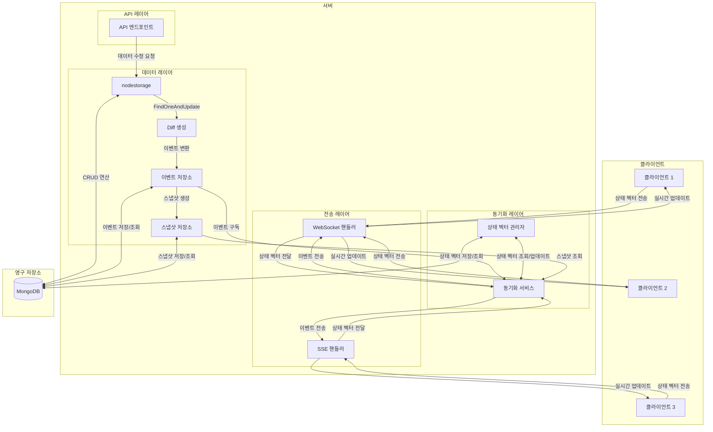

# EventSync 통합 예제 애플리케이션

이 예제는 nodestorage와 eventsync를 통합하여 실시간 동기화 기능을 구현한 애플리케이션입니다.

## 기능

- nodestorage를 사용한 데이터 관리
- eventsync를 사용한 이벤트 저장 및 동기화
- WebSocket 및 SSE를 통한 실시간 클라이언트 동기화
- 상태 벡터 기반 동기화 구현
- 스냅샷 생성 및 관리

## 아키텍처



## 필요 조건

- Go 1.16 이상
- MongoDB 4.4 이상
- 웹 브라우저 (Chrome, Firefox, Edge 등)

## 실행 방법

1. MongoDB 서버가 실행 중인지 확인합니다.

2. 애플리케이션을 실행합니다:

   ```bash
   go run main.go
   ```

   또는 Windows에서는 `run.bat` 스크립트를 실행합니다:

   ```bash
   run.bat
   ```

3. 웹 브라우저에서 다음 URL로 접속합니다:

   ```
   http://localhost:8080
   ```

## 사용 방법

1. **연결 설정**:
   - 전송 방식(WebSocket 또는 SSE)을 선택합니다.
   - "연결" 버튼을 클릭하여 서버에 연결합니다.

2. **게임 관리**:
   - "새 게임 생성" 버튼을 클릭하여 새 게임을 생성합니다.
   - 게임 목록에서 게임을 선택하여 상세 정보를 확인합니다.
   - "게임 업데이트" 버튼을 클릭하여 게임 상태를 업데이트합니다.
   - "게임 삭제" 버튼을 클릭하여 게임을 삭제합니다.

3. **실시간 동기화**:
   - 다른 브라우저 창을 열어 동일한 URL로 접속합니다.
   - 한 창에서 게임을 업데이트하면 다른 창에서도 실시간으로 업데이트됩니다.
   - "상태 동기화" 버튼을 클릭하여 수동으로 동기화할 수 있습니다.

4. **이벤트 로그**:
   - 이벤트 로그 섹션에서 모든 이벤트를 확인할 수 있습니다.
   - 각 이벤트는 타임스탬프, 클라이언트 ID, 작업 유형 및 변경 내용을 포함합니다.

5. **상태 벡터**:
   - 상태 벡터 섹션에서 현재 클라이언트의 상태 벡터를 확인할 수 있습니다.
   - 상태 벡터는 각 소스(클라이언트 또는 서버)별로 마지막으로 처리한 이벤트의 시퀀스 번호를 추적합니다.

## 컬렉션 구조

이 애플리케이션은 MongoDB에 다음 컬렉션을 사용합니다:

1. **games**: 게임 데이터 저장
   - nodestorage에서 관리하는 주요 데이터 컬렉션
   - 낙관적 동시성 제어를 위한 버전 필드 포함

2. **events**: 이벤트 저장
   - nodestorage에서 생성된 Diff를 이벤트로 변환하여 저장
   - 각 이벤트는 시퀀스 번호, 타임스탬프, 문서 ID 등의 메타데이터 포함

3. **snapshots**: 스냅샷 저장
   - 특정 시점의 문서 전체 상태를 저장
   - 동기화 최적화를 위해 사용됨

4. **state_vectors**: 상태 벡터 저장
   - 클라이언트별 동기화 상태를 추적
   - 각 클라이언트가 어떤 이벤트까지 처리했는지 기록

## 코드 구조

- **main.go**: 애플리케이션 진입점 및 주요 로직
- **client/index.html**: 클라이언트 측 UI 및 JavaScript 코드
- **client/static/**: 정적 파일 디렉토리

## 주요 컴포넌트

1. **App**: 애플리케이션의 주요 컴포넌트를 관리하는 구조체
2. **StorageEventHandler**: nodestorage 이벤트를 처리하는 핸들러
3. **API 핸들러**: 게임 CRUD 작업을 처리하는 HTTP 핸들러
4. **WebSocket/SSE 핸들러**: 실시간 통신을 위한 핸들러

## 참고 사항

- 이 예제는 개발 및 학습 목적으로 제공됩니다.
- 실제 프로덕션 환경에서는 추가적인 보안 및 성능 최적화가 필요할 수 있습니다.
- 주기적인 스냅샷 생성 및 이벤트 압축을 통해 데이터베이스 크기를 관리합니다.
