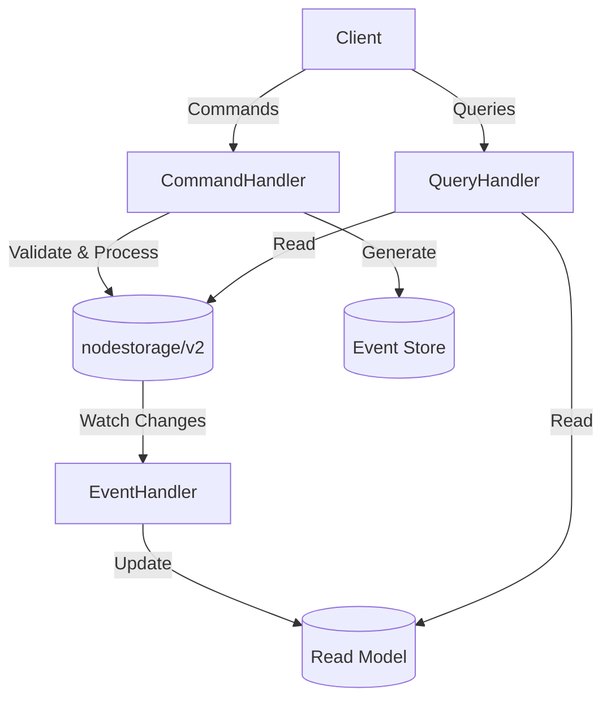

# Server Authority Model with CQRS and Event Sourcing

This example demonstrates how to implement a server authority model using:
- Optimistic concurrency control from nodestorage/v2
- Event sourcing for tracking all changes
- CQRS pattern to separate read and write operations

## Overview

The example simulates a game resource management system where:
- Players can request resource allocation (command)
- Server validates and processes these requests (domain logic)
- Other clients can query the current state (query)
- All changes are tracked as events

## Server Authority Model

In a server authority model:
1. Clients send commands to the server
2. Server validates commands and applies business rules
3. Server is the single source of truth for game state
4. Clients receive updates but cannot directly modify state

This approach provides several benefits:
- Prevents cheating by validating all actions on the server
- Ensures consistent state across all clients
- Allows for complex business logic that clients don't need to understand
- Provides audit trail of all changes

## Key Components

### Domain Models
- `ServerResource`: Server-side resource model with full details
- `ClientResource`: Client-side resource model with limited details
- Different DB schema for server vs client representation

### Commands
- `CreateResourceCommand`: Create a new resource
- `AllocateResourceCommand`: Consume resources
- `AddResourceCommand`: Add resources
- `LockResourceCommand`: Lock a resource
- `UnlockResourceCommand`: Unlock a resource

### Events
- `ResourceCreatedEvent`: Emitted when a resource is created
- `ResourceAllocatedEvent`: Emitted when resources are consumed
- `ResourceAddedEvent`: Emitted when resources are added
- `ResourceLockedEvent`: Emitted when a resource is locked
- `ResourceUnlockedEvent`: Emitted when a resource is unlocked

### Handlers
- `ResourceCommandHandler`: Handles resource-related commands
- `ResourceQueryHandler`: Handles resource-related queries
- `ResourceReadModelUpdater`: Updates read models based on events

## Architecture



## Optimistic Concurrency Control

The example uses nodestorage/v2's optimistic concurrency control to handle concurrent modifications:
1. Each resource has a version field
2. When updating a resource, the version is checked
3. If the version has changed, the update fails and is retried
4. This ensures that only one modification succeeds when multiple instances attempt concurrent modifications

## Running the Example

### Prerequisites
- MongoDB running on localhost:27017
- Go 1.18 or later

### Steps
1. Start MongoDB
2. Run the example:
   ```
   go run .
   ```

## Example Scenarios

The example demonstrates several scenarios:
1. Creating a resource
2. Allocating (consuming) resources
3. Adding resources
4. Locking a resource
5. Attempting to allocate a locked resource (fails)
6. Unlocking a resource
7. Allocating resources after unlock (succeeds)

## Key Concepts Demonstrated

1. **Server Authority Model**: All state changes are validated and processed by the server
2. **Different DB Schemas**: Server uses a detailed model, clients use a simplified model
3. **Optimistic Concurrency Control**: Prevents race conditions in distributed environments
4. **Event Sourcing**: All changes are tracked as events for audit and replay
5. **CQRS Pattern**: Separates read and write operations for better scalability
6. **Read Models**: Optimized representations of data for query operations

## Code Structure

- `models.go`: Domain models
- `commands.go`: Command definitions
- `events.go`: Event definitions
- `command_handlers.go`: Command handling logic
- `query_handlers.go`: Query handling logic
- `event_handlers.go`: Event handling logic
- `event_store.go`: Event storage and retrieval
- `main.go`: Example application
