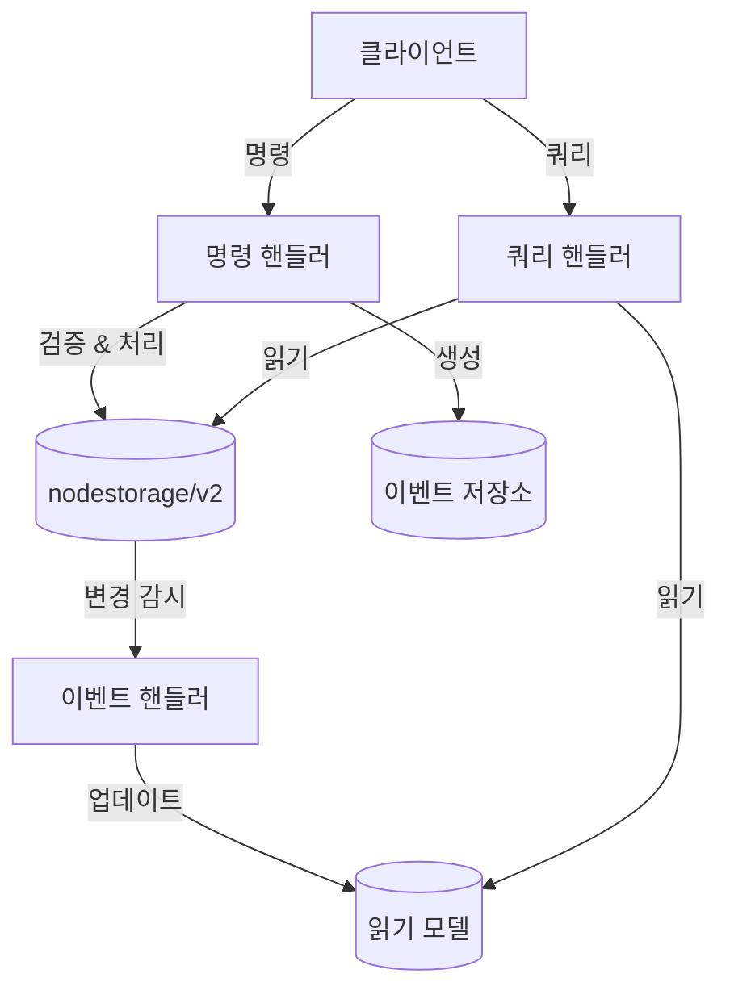

# CQRS와 이벤트 소싱을 활용한 서버 권한 모델

이 예제는 다음 기술을 활용하여 서버 권한 모델을 구현하는 방법을 보여줍니다:
- nodestorage/v2의 낙관적 동시성 제어
- 모든 변경 사항을 추적하기 위한 이벤트 소싱
- 읽기 및 쓰기 작업을 분리하는 CQRS 패턴

## 개요

이 예제는 게임 리소스 관리 시스템을 시뮬레이션합니다:
- 플레이어가 리소스 할당을 요청합니다(명령)
- 서버가 요청을 검증하고 비즈니스 규칙을 적용합니다(도메인 로직)
- 다른 클라이언트가 현재 상태를 조회할 수 있습니다(쿼리)
- 모든 변경 사항은 이벤트로 추적됩니다

## 서버 권한 모델

서버 권한 모델에서는:
1. 클라이언트가 서버에 명령을 보냅니다
2. 서버가 명령을 검증하고 비즈니스 규칙을 적용합니다
3. 서버가 게임 상태에 대한 유일한 신뢰 소스입니다
4. 클라이언트는 업데이트를 받지만 상태를 직접 수정할 수 없습니다

이 접근 방식은 다음과 같은 이점을 제공합니다:
- 서버에서 모든 작업을 검증하여 치팅 방지
- 모든 클라이언트에서 일관된 상태 보장
- 클라이언트가 이해할 필요가 없는 복잡한 비즈니스 로직 허용
- 모든 변경 사항에 대한 감사 추적 제공

## 주요 구성 요소

### 도메인 모델
- `ServerResource`: 전체 세부 정보가 포함된 서버 측 리소스 모델
- `ClientResource`: 제한된 세부 정보가 포함된 클라이언트 측 리소스 모델
- 서버와 클라이언트 표현을 위한 서로 다른 DB 스키마

### 명령
- `CreateResourceCommand`: 새 리소스 생성
- `AllocateResourceCommand`: 리소스 소비
- `AddResourceCommand`: 리소스 추가
- `LockResourceCommand`: 리소스 잠금
- `UnlockResourceCommand`: 리소스 잠금 해제

### 이벤트
- `ResourceCreatedEvent`: 리소스가 생성될 때 발생
- `ResourceAllocatedEvent`: 리소스가 소비될 때 발생
- `ResourceAddedEvent`: 리소스가 추가될 때 발생
- `ResourceLockedEvent`: 리소스가 잠길 때 발생
- `ResourceUnlockedEvent`: 리소스 잠금이 해제될 때 발생

### 핸들러
- `ResourceCommandHandler`: 리소스 관련 명령 처리
- `ResourceQueryHandler`: 리소스 관련 쿼리 처리
- `ResourceReadModelUpdater`: 이벤트 기반 읽기 모델 업데이트

## 아키텍처



## 낙관적 동시성 제어

이 예제는 nodestorage/v2의 낙관적 동시성 제어를 사용하여 동시 수정을 처리합니다:
1. 각 리소스에는 버전 필드가 있습니다
2. 리소스를 업데이트할 때 버전이 확인됩니다
3. 버전이 변경된 경우 업데이트가 실패하고 재시도됩니다
4. 이를 통해 여러 인스턴스가 동시에 수정을 시도할 때 하나의 수정만 성공하도록 보장합니다

## 예제 실행

### 사전 요구 사항
- localhost:27017에서 실행 중인 MongoDB
- Go 1.18 이상

### 단계
1. MongoDB 시작
2. 예제 실행:
   ```
   go run .
   ```

## 예제 시나리오

이 예제는 다음과 같은 여러 시나리오를 보여줍니다:
1. 리소스 생성
2. 리소스 할당(소비)
3. 리소스 추가
4. 리소스 잠금
5. 잠긴 리소스 할당 시도(실패)
6. 리소스 잠금 해제
7. 잠금 해제 후 리소스 할당(성공)

## 주요 개념 설명

1. **서버 권한 모델**: 모든 상태 변경은 서버에서 검증 및 처리됩니다
2. **서로 다른 DB 스키마**: 서버는 상세 모델을 사용하고, 클라이언트는 간소화된 모델을 사용합니다
3. **낙관적 동시성 제어**: 분산 환경에서 경쟁 조건을 방지합니다
4. **이벤트 소싱**: 모든 변경 사항은 감사 및 재생을 위해 이벤트로 추적됩니다
5. **CQRS 패턴**: 더 나은 확장성을 위해 읽기 및 쓰기 작업을 분리합니다
6. **읽기 모델**: 쿼리 작업을 위한 최적화된 데이터 표현

## 코드 구조

- `models.go`: 도메인 모델
- `commands.go`: 명령 정의
- `events.go`: 이벤트 정의
- `command_handlers.go`: 명령 처리 로직
- `query_handlers.go`: 쿼리 처리 로직
- `event_handlers.go`: 이벤트 처리 로직
- `event_store.go`: 이벤트 저장 및 검색
- `main.go`: 예제 애플리케이션
