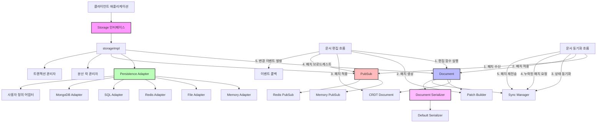
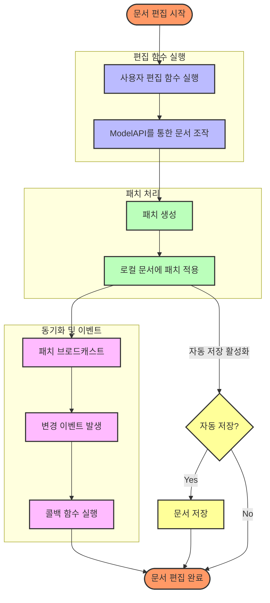
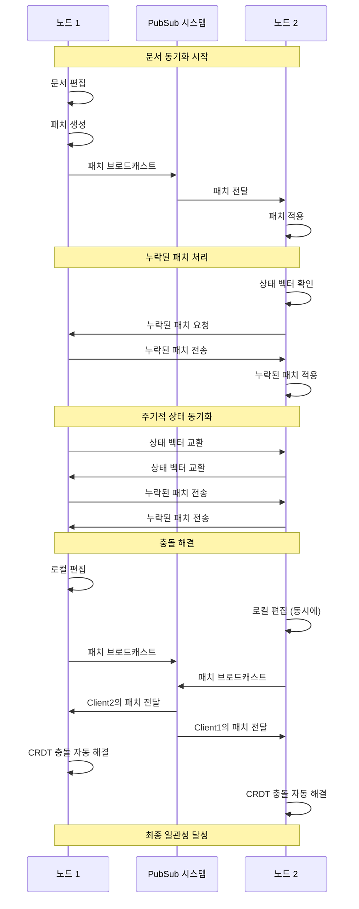

# LuvJSON CRDT Storage

LuvJSON CRDT Storage는 LuvJSON CRDT, CRDTSync, CRDTPubSub 패키지를 통합한 고수준 저장소 API입니다. 이 패키지는 저수준 CRDT 기능을 기반으로 자동 동기화 및 편집 관리를 제공합니다.

## 기능

- **문서 관리**: 문서 생성, 로드, 저장, 삭제 기능
- **자동 동기화**: 여러 노드 간 문서 자동 동기화
- **편집 관리**: 문서 편집 및 변경 추적
- **다양한 영구 저장소**: 메모리, 파일, Redis, SQL, MongoDB 등 다양한 저장소 지원
- **이벤트 시스템**: 문서 변경 이벤트 처리
- **자동 저장**: 주기적인 문서 자동 저장
- **어댑터 패턴**: 다양한 저장소 타입에 맞는 어댑터 제공
- **직렬화/역직렬화**: 유연한 문서 직렬화/역직렬화 지원

## 사용법

### 저장소 생성

```go
// 저장소 옵션 생성
options := crdtstorage.DefaultStorageOptions()
options.PubSubType = "redis"
options.RedisAddr = "localhost:6379"
options.PersistenceType = "redis"
options.AutoSave = true
options.AutoSaveInterval = time.Minute * 5

// 저장소 생성
storage, err := crdtstorage.NewStorage(ctx, options)
if err != nil {
    log.Fatalf("Failed to create storage: %v", err)
}
defer storage.Close()
```

### 문서 생성

```go
// 문서 생성
doc, err := storage.CreateDocument(ctx, "example-doc")
if err != nil {
    log.Fatalf("Failed to create document: %v", err)
}

// 초기 문서 내용 설정
result := doc.Edit(ctx, func(api *api.ModelApi) error {
    api.Root(map[string]interface{}{
        "title":    "Example Document",
        "content":  "Initial content",
        "authors":  []string{"user1"},
        "modified": time.Now().Format(time.RFC3339),
    })
    return nil
})
if !result.Success {
    log.Fatalf("Failed to initialize document: %v", result.Error)
}
```

### 문서 로드

```go
// 문서 로드
doc, err := storage.GetDocument(ctx, "example-doc")
if err != nil {
    log.Fatalf("Failed to load document: %v", err)
}
```

### 수동 동기화

```go
// 특정 문서를 모든 피어와 동기화
if err := doc.Sync(ctx, ""); err != nil {
    log.Fatalf("Failed to sync document: %v", err)
}

// 특정 문서를 특정 피어와 동기화
if err := doc.Sync(ctx, "peer-123"); err != nil {
    log.Fatalf("Failed to sync document with peer: %v", err)
}

// 저장소의 모든 문서를 모든 피어와 동기화
if err := storage.SyncAllDocuments(ctx, ""); err != nil {
    log.Fatalf("Failed to sync all documents: %v", err)
}

// 저장소의 특정 문서를 모든 피어와 동기화
if err := storage.SyncDocument(ctx, "example-doc", ""); err != nil {
    log.Fatalf("Failed to sync document: %v", err)
}
```

### 문서 편집

```go
// 문서 편집
result := doc.Edit(ctx, func(api *api.ModelApi) error {
    // 현재 내용 가져오기
    currentContent, err := api.View()
    if err != nil {
        return fmt.Errorf("failed to get current content: %w", err)
    }

    // 맵으로 변환
    contentMap, ok := currentContent.(map[string]interface{})
    if !ok {
        return fmt.Errorf("content is not a map")
    }

    // 필드 업데이트
    contentMap["title"] = "New Title"
    contentMap["modified"] = time.Now().Format(time.RFC3339)

    // 루트 설정
    return api.Root(contentMap)
})

if !result.Success {
    log.Fatalf("Failed to edit document: %v", result.Error)
}
```

### 문서 내용 가져오기

```go
// 문서 내용 가져오기
var content MyDocumentType
if err := doc.GetContentAs(&content); err != nil {
    log.Fatalf("Failed to get document content: %v", err)
}
fmt.Printf("Title: %s\n", content.Title)
```

### 문서 변경 이벤트 처리

```go
// 문서 변경 콜백 등록
doc.OnChange(func(d *crdtstorage.Document, patch *crdtpatch.Patch) {
    fmt.Println("Document changed")
    // 변경 처리
})
```

### 문서 저장

```go
// 문서 저장
if err := doc.Save(ctx); err != nil {
    log.Fatalf("Failed to save document: %v", err)
}
```

### 문서 삭제

```go
// 문서 삭제
if err := storage.DeleteDocument(ctx, "example-doc"); err != nil {
    log.Fatalf("Failed to delete document: %v", err)
}
```

## 저장소 유형

### 저장소 타입 클래스 다이어그램

```mermaid
classDiagram
    class Storage {
        <<interface>>
        +CreateDocument(ctx, documentID) Document
        +GetDocument(ctx, documentID) Document
        +ListDocuments(ctx) []string
        +DeleteDocument(ctx, documentID) error
        +SyncDocument(ctx, documentID, peerID) error
        +SyncAllDocuments(ctx, peerID) error
        +Close() error
    }

    class storageImpl {
        -options *StorageOptions
        -pubsub PubSub
        -persistence PersistenceAdapter
        -documents map[string]*Document
        -mutex sync.RWMutex
        +CreateDocument(ctx, documentID) Document
        +GetDocument(ctx, documentID) Document
        +ListDocuments(ctx) []string
        +DeleteDocument(ctx, documentID) error
        +SyncDocument(ctx, documentID, peerID) error
        +SyncAllDocuments(ctx, peerID) error
        +Close() error
    }

    class PersistenceAdapter {
        <<interface>>
        +SaveDocument(ctx, doc) error
        +LoadDocument(ctx, documentID) ([]byte, error)
        +ListDocuments(ctx) []string
        +DeleteDocument(ctx, documentID) error
        +Close() error
    }

    class MemoryAdapter {
        -documents map[string][]byte
        -mutex sync.RWMutex
        +SaveDocument(ctx, doc) error
        +LoadDocument(ctx, documentID) ([]byte, error)
        +ListDocuments(ctx) []string
        +DeleteDocument(ctx, documentID) error
        +Close() error
    }

    class FileAdapter {
        -basePath string
        -serializer DocumentSerializer
        -mutex sync.RWMutex
        +SaveDocument(ctx, doc) error
        +LoadDocument(ctx, documentID) ([]byte, error)
        +ListDocuments(ctx) []string
        +DeleteDocument(ctx, documentID) error
        +Close() error
    }

    class RedisAdapter {
        -client *redis.Client
        -keyPrefix string
        -serializer DocumentSerializer
        -mutex sync.RWMutex
        +SaveDocument(ctx, doc) error
        +LoadDocument(ctx, documentID) ([]byte, error)
        +ListDocuments(ctx) []string
        +DeleteDocument(ctx, documentID) error
        +Close() error
    }

    class SQLAdapter {
        -db *sql.DB
        -tableName string
        -serializer DocumentSerializer
        -mutex sync.RWMutex
        +SaveDocument(ctx, doc) error
        +LoadDocument(ctx, documentID) ([]byte, error)
        +ListDocuments(ctx) []string
        +DeleteDocument(ctx, documentID) error
        +Close() error
    }

    class MongoDBAdapter {
        -collection *mongo.Collection
        -serializer DocumentSerializer
        -mutex sync.RWMutex
        +SaveDocument(ctx, doc) error
        +LoadDocument(ctx, documentID) ([]byte, error)
        +ListDocuments(ctx) []string
        +DeleteDocument(ctx, documentID) error
        +Close() error
    }

    class DocumentSerializer {
        <<interface>>
        +Serialize(doc) ([]byte, error)
        +Deserialize(doc, data) error
        +ToMap(doc) (map[string]interface{}, error)
        +FromMap(doc, data) error
    }

    Storage <|.. storageImpl
    PersistenceAdapter <|.. MemoryAdapter
    PersistenceAdapter <|.. FileAdapter
    PersistenceAdapter <|.. RedisAdapter
    PersistenceAdapter <|.. SQLAdapter
    PersistenceAdapter <|.. MongoDBAdapter
    storageImpl --> PersistenceAdapter
    storageImpl --> DocumentSerializer
```

### 메모리 저장소

메모리 저장소는 문서를 메모리에 저장합니다. 프로그램이 종료되면 모든 데이터가 손실됩니다.

```go
options := crdtstorage.DefaultStorageOptions()
options.PubSubType = "memory"
options.PersistenceType = "memory"
```

### 파일 저장소

파일 저장소는 문서를 파일 시스템에 저장합니다. 프로그램이 종료되어도 데이터가 유지됩니다.

```go
options := crdtstorage.DefaultStorageOptions()
options.PubSubType = "memory"
options.PersistenceType = "file"
options.PersistencePath = "documents"
```

### Redis 저장소

Redis 저장소는 문서를 Redis에 저장합니다. 여러 노드 간에 데이터를 공유할 수 있습니다.

```go
options := crdtstorage.DefaultStorageOptions()
options.PubSubType = "redis"
options.RedisAddr = "localhost:6379"
options.PersistenceType = "redis"
```

### SQL 저장소

SQL 저장소는 문서를 SQL 데이터베이스에 저장합니다. 관계형 데이터베이스를 사용하여 데이터를 구조화할 수 있습니다.

```go
// SQL 데이터베이스 연결
db, err := sql.Open("mysql", "user:password@tcp(localhost:3306)/dbname")
if err != nil {
    log.Fatalf("Failed to connect to database: %v", err)
}

// SQL 어댑터 생성
sqlAdapter, err := crdtstorage.NewSQLAdapter(db, "documents")
if err != nil {
    log.Fatalf("Failed to create SQL adapter: %v", err)
}

// 저장소 생성
options := crdtstorage.DefaultStorageOptions()
storage, err := crdtstorage.NewStorageWithCustomPersistence(ctx, options, sqlAdapter)
```

### MongoDB 저장소

MongoDB 저장소는 문서를 MongoDB에 저장합니다. 문서 지향 데이터베이스를 사용하여 유연한 스키마를 지원합니다.

```go
// MongoDB 클라이언트 생성
client, err := mongo.Connect(ctx, options.Client().ApplyURI("mongodb://localhost:27017"))
if err != nil {
    log.Fatalf("Failed to connect to MongoDB: %v", err)
}

// 컬렉션 가져오기
collection := client.Database("mydb").Collection("documents")

// MongoDB 어댑터 생성
mongoAdapter := crdtstorage.NewMongoDBAdapter(collection)

// 저장소 생성
options := crdtstorage.DefaultStorageOptions()
storage, err := crdtstorage.NewStorageWithCustomPersistence(ctx, options, mongoAdapter)
```

### 사용자 정의 저장소

사용자 정의 저장소는 `PersistenceAdapter` 인터페이스를 구현하여 만들 수 있습니다. 이를 통해 다양한 저장소 타입을 지원할 수 있습니다.

```go
// 사용자 정의 어댑터 구현
type MyCustomAdapter struct {
    // 필요한 필드
}

// PersistenceAdapter 인터페이스 구현
func (a *MyCustomAdapter) SaveDocument(ctx context.Context, doc *Document) error {
    // 구현
}

func (a *MyCustomAdapter) LoadDocument(ctx context.Context, documentID string) ([]byte, error) {
    // 구현
}

func (a *MyCustomAdapter) ListDocuments(ctx context.Context) ([]string, error) {
    // 구현
}

func (a *MyCustomAdapter) DeleteDocument(ctx context.Context, documentID string) error {
    // 구현
}

func (a *MyCustomAdapter) Close() error {
    // 구현
}

// 저장소 생성
options := crdtstorage.DefaultStorageOptions()
storage, err := crdtstorage.NewStorageWithCustomPersistence(ctx, options, &MyCustomAdapter{})
```

## 동기화 메커니즘

CRDTStorage는 다음과 같은 동기화 메커니즘을 사용합니다:

1. **PubSub 기반 브로드캐스팅**: 변경사항을 다른 노드에 브로드캐스트
2. **상태 벡터 기반 동기화**: 상태 벡터를 사용하여 누락된 변경사항 식별
3. **자동 피어 발견**: Redis를 사용하여 자동으로 피어 발견
4. **패치 저장소**: 패치를 저장하고 필요할 때 재전송

## 예제

`examples/crdtstorage` 디렉토리에 다음 예제가 있습니다:

- `simple_example.go`: 기본적인 문서 관리 예제
- `collaborative_example.go`: 여러 노드 간 협업 편집 예제
- `custom_key_example.go`: 사용자 정의 키 사용 예제
- `manual_sync_example.go`: 수동 동기화 예제

## 아키텍처

### 시스템 아키텍처 다이어그램



### 주요 인터페이스

- **Storage**: CRDT 문서 저장소 인터페이스
- **Document**: CRDT 문서 인터페이스
- **PersistenceAdapter**: 영구 저장소 어댑터 인터페이스
- **DocumentSerializer**: 문서 직렬화/역직렬화 인터페이스

### 구현체

- **storageImpl**: Storage 인터페이스 구현체
- **MemoryAdapter**: 메모리 기반 영구 저장소
- **FileAdapter**: 파일 기반 영구 저장소
- **RedisAdapter**: Redis 기반 영구 저장소
- **SQLAdapter**: SQL 기반 영구 저장소
- **MongoDBAdapter**: MongoDB 기반 영구 저장소
- **DefaultDocumentSerializer**: 기본 문서 직렬화/역직렬화 구현체

### 문서 편집 흐름

1. **편집 함수 실행**: 사용자가 제공한 편집 함수 실행
2. **패치 생성**: 변경사항으로부터 패치 생성
3. **패치 적용**: 로컬 문서에 패치 적용
4. **패치 브로드캐스트**: 다른 노드에 패치 브로드캐스트
5. **변경 이벤트 발생**: 문서 변경 이벤트 발생



### 문서 동기화 흐름

1. **패치 수신**: 다른 노드에서 브로드캐스트된 패치 수신
2. **패치 적용**: 수신된 패치를 로컬 문서에 적용
3. **상태 동기화**: 주기적으로 다른 노드와 상태 동기화
4. **누락된 패치 요청**: 필요한 경우 누락된 패치 요청
5. **패치 재전송**: 요청된 패치 재전송



## 어댑터 패턴

crdtstorage 패키지는 어댑터 패턴을 사용하여 다양한 저장소 타입을 지원합니다. 이를 통해 SQL과 NoSQL 데이터베이스와 같이 근본적으로 다른 데이터 모델을 가진 저장소를 효과적으로 지원할 수 있습니다.

### PersistenceAdapter 인터페이스

```go
type PersistenceAdapter interface {
    // SaveDocument는 문서를 저장합니다.
    SaveDocument(ctx context.Context, doc *Document) error

    // LoadDocument는 문서를 로드합니다.
    LoadDocument(ctx context.Context, documentID string) ([]byte, error)

    // ListDocuments는 모든 문서 목록을 반환합니다.
    ListDocuments(ctx context.Context) ([]string, error)

    // DeleteDocument는 문서를 삭제합니다.
    DeleteDocument(ctx context.Context, documentID string) error

    // Close는 어댑터를 닫습니다.
    Close() error
}
```

### DocumentSerializer 인터페이스

```go
type DocumentSerializer interface {
    // Serialize는 문서를 바이트 배열로 직렬화합니다.
    Serialize(doc *Document) ([]byte, error)

    // Deserialize는 바이트 배열에서 문서를 역직렬화합니다.
    Deserialize(doc *Document, data []byte) error

    // ToMap은 문서를 맵으로 변환합니다.
    ToMap(doc *Document) (map[string]interface{}, error)

    // FromMap은 맵에서 문서를 생성합니다.
    FromMap(doc *Document, data map[string]interface{}) error
}
```

## 확장성

crdtstorage 패키지는 다음과 같은 방식으로 확장할 수 있습니다:

1. **새로운 어댑터 구현**: `PersistenceAdapter` 인터페이스를 구현하여 새로운 저장소 타입 지원
2. **새로운 직렬화/역직렬화 구현**: `DocumentSerializer` 인터페이스를 구현하여 새로운 직렬화/역직렬화 방식 지원
3. **사용자 정의 동기화 메커니즘**: `SyncManager` 인터페이스를 구현하여 새로운 동기화 메커니즘 지원
4. **사용자 정의 이벤트 처리**: 콜백 함수를 등록하여 문서 변경 이벤트 처리

## 성능 고려 사항

- **메모리 사용량**: 대량의 문서를 로드할 때 메모리 사용량 고려
- **동기화 오버헤드**: 많은 노드 간 동기화 시 네트워크 오버헤드 고려
- **저장소 선택**: 사용 사례에 맞는 저장소 타입 선택 (메모리, 파일, Redis, SQL, MongoDB 등)
- **직렬화/역직렬화 성능**: 대용량 문서 처리 시 직렬화/역직렬화 성능 고려
- **캐싱**: 자주 접근하는 문서에 대한 캐싱 고려

## 스레드 안전성

crdtstorage 패키지는 다음과 같은 방식으로 스레드 안전성을 보장합니다:

1. **뮤텍스 사용**: 문서 맵과 저장소 작업에 대한 동시 접근 보호
2. **낙관적 동시성 제어**: 문서 버전을 사용한 낙관적 동시성 제어
3. **분산 락**: 분산 환경에서 트랜잭션 보장을 위한 분산 락 지원
4. **트랜잭션 관리**: 분산 환경에서 트랜잭션 추적 및 관리

## 라이선스

이 프로젝트는 MIT 라이선스 하에 배포됩니다. 자세한 내용은 LICENSE 파일을 참조하세요.
