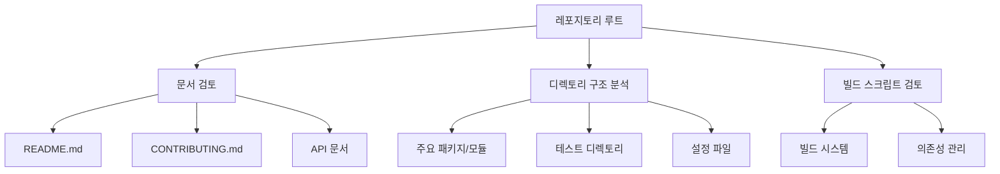
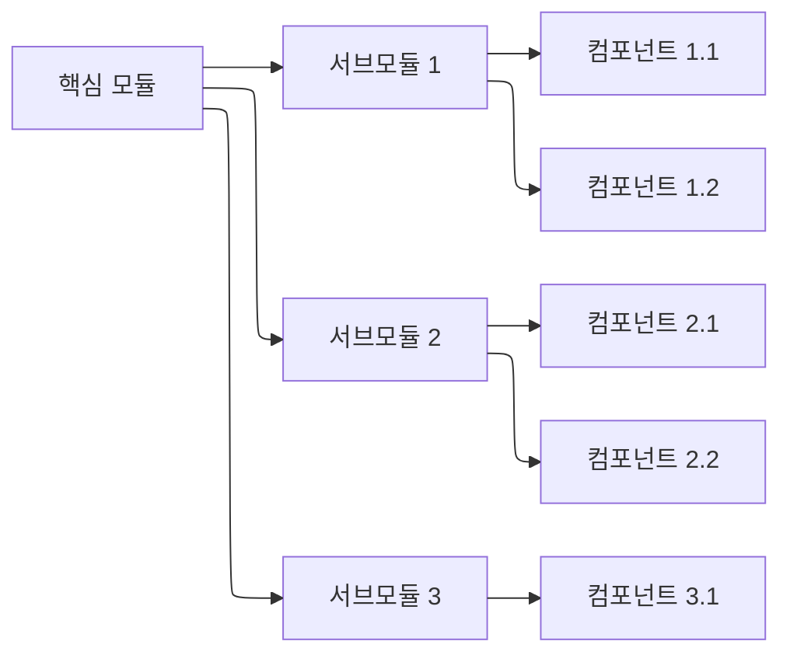
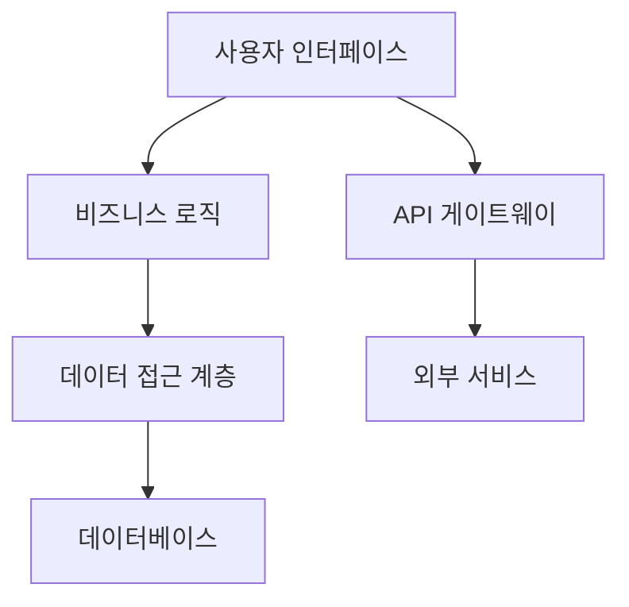
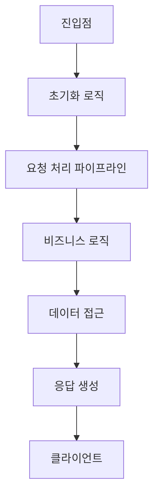
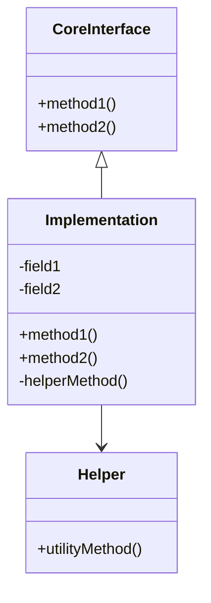
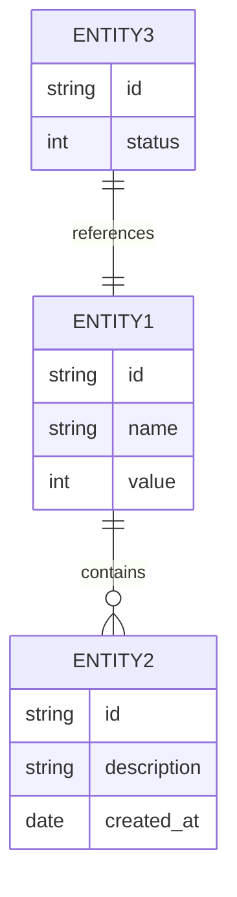
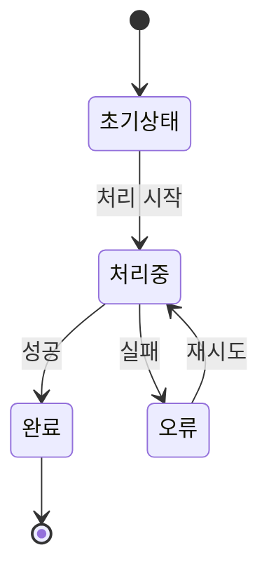

# 대규모 레포지토리 분석을 위한 단계별 문서화 가이드

각 단계별로 분리된 마크다운 문서 형식으로 대규모 레포지토리 분석 과정을 체계화했습니다. 각 문서는 특정 분석 단계에 초점을 맞추며, 필요한 다이어그램과 분석 지침을 포함합니다.

## 1. 초기 탐색 (01_initial_exploration.md)

```markdown
# 01. 레포지토리 초기 탐색

## 1.1 레포지토리 기본 구조


### 1.1.1 기본 정보 수집
- 프로젝트명: 
- 프로젝트 목적: 
- 라이센스: 
- 주요 기여자: 
- 최근 활동 수준: 

### 1.1.2 디렉토리 구조
| 디렉토리 | 설명 | 주요 파일 |
|---------|------|----------|
| / | 루트 디렉토리 | |
| /docs | 문서 | |
| /src | 소스 코드 | |
| /tests | 테스트 코드 | |

### 1.1.3 핵심 문서 요약
- README.md 요약:
- CONTRIBUTING.md 요약:
- 기타 주요 문서:

## 1.2 기술 스택 및 의존성
- 프로그래밍 언어:
- 프레임워크:
- 주요 라이브러리:
- 빌드 도구:
- 테스트 프레임워크:

## 1.3 초기 탐색 발견사항
- 주요 발견사항:
- 추가 조사가 필요한 영역:
- 명확하지 않은 부분:

## 1.4 다음 단계
- [ ] 핵심 모듈 식별
- [ ] 아키텍처 패턴 분석
- [ ] 진입점 파악

## 2. 구조적 분석 (02_structural_analysis.md)

# 02. 레포지토리 구조적 분석

## 2.1 모듈 및 패키지 구조


### 2.1.1 주요 모듈 분석
| 모듈명 | 역할 | 중요도 | 복잡도 |
|-------|-----|--------|-------|
| | | | |
| | | | |

### 2.1.2 모듈 의존성 매트릭스
| 모듈 | 의존하는 모듈 | 의존하는 외부 라이브러리 |
|------|-------------|------------------------|
| | | |
| | | |

### 2.1.3 모듈화 평가
- 응집도 평가:
- 결합도 평가:
- 모듈 경계 명확성:
- 모듈 크기 적절성:

## 2.2 아키텍처 패턴 분석


### 2.2.1 식별된 아키텍처 패턴
- 주요 아키텍처 패턴:
- 패턴 적용 일관성:
- 계층 구조 분석:

### 2.2.2 관심사 분리 평가
- 프레젠테이션 로직:
- 비즈니스 로직:
- 데이터 접근 로직:
- 크로스커팅 관심사:

### 2.2.3 아키텍처 준수 평가
- 설계 원칙 준수 여부:
- 아키텍처 일관성:
- 문서화된 아키텍처와 실제 구현 일치도:

## 2.3 구조적 분석 요약
- 주요 발견사항:
- 구조적 강점:
- 구조적 약점:
- 추가 조사가 필요한 영역:

## 2.4 다음 단계
- [ ] 핵심 코드 경로 분석
- [ ] 주요 클래스 및 인터페이스 검토
- [ ] 데이터 모델 분석

## 3. 핵심 코드 분석 (03_core_code_analysis.md)

# 03. 핵심 코드 분석

## 3.1 진입점 및 실행 흐름


### 3.1.1 주요 진입점
| 진입점 | 파일 위치 | 역할 | 호출 경로 |
|-------|---------|-----|----------|
| | | | |
| | | | |

### 3.1.2 핵심 실행 경로
- 주요 워크플로우 1:
  - 단계 1:
  - 단계 2:
  - 단계 3:
- 주요 워크플로우 2:
  - 단계 1:
  - 단계 2:
  - 단계 3:

### 3.1.3 제어 흐름 분석
- 동기/비동기 패턴:
- 오류 처리 경로:
- 주요 결정 포인트:

## 3.2 주요 클래스 및 인터페이스


### 3.2.1 핵심 클래스 목록
| 클래스/인터페이스명 | 유형 | 역할 | 중요도 |
|-------------------|-----|-----|--------|
| | | | |
| | | | |

### 3.2.2 클래스 관계 분석
- 상속 계층:
- 의존성 관계:
- 컴포지션/위임 패턴:

### 3.2.3 디자인 패턴 사용
- 식별된 디자인 패턴:
- 패턴 구현 평가:
- 패턴 적용 적절성:

## 3.3 알고리즘 및 로직 분석
- 주요 알고리즘:
- 성능 핫스팟:
- 로직 복잡도:
- 최적화 가능성:

## 3.4 코드 분석 요약
- 주요 발견사항:
- 코드 품질 평가:
- 복잡성 평가:
- 추가 조사가 필요한 영역:

## 3.5 다음 단계
- [ ] 데이터 모델 분석
- [ ] 상태 관리 검토
- [ ] API 및 인터페이스 분석

## 4. 데이터 및 상태 관리 (04_data_state_management.md)

# 04. 데이터 및 상태 관리 분석

## 4.1 데이터 모델 구조


### 4.1.1 주요 엔티티 분석
| 엔티티명 | 역할 | 주요 속성 | 관계 |
|---------|-----|----------|-----|
| | | | |
| | | | |

### 4.1.2 데이터 모델 평가
- 정규화 수준:
- 무결성 제약조건:
- 모델 일관성:
- 확장성:

### 4.1.3 데이터 접근 패턴
- 주요 쿼리 패턴:
- 인덱싱 전략:
- 성능 최적화:

## 4.2 상태 관리 메커니즘


### 4.2.1 상태 관리 접근방식
- 사용된 상태 관리 패턴:
- 상태 변이 메커니즘:
- 상태 격리 수준:

### 4.2.2 동시성 및 동기화
- 동시성 제어 메커니즘:
- 락킹 전략:
- 경쟁 조건 방지:

### 4.2.3 캐싱 전략
- 캐시 계층:
- 캐시 무효화 전략:
- 캐시 효율성:

## 4.3 데이터 및 상태 관리 요약
- 주요 발견사항:
- 강점:
- 약점:
- 개선 가능성:

## 4.4 다음 단계
- [ ] API 및 인터페이스 분석
- [ ] 통합 패턴 분석
- [ ] 테스트 전략 검토

## 5. 코드 사용 예제 문서화 (05_code_usage_examples.md)
- 5.1 사용 예제 작성 계획
  - 5.1.1 예제 유형 및 목적
  - 5.1.2 예제 작성 지침
- 5.2 기본 사용 예제
  - 5.2.1 설치 및 초기화
  - 5.2.2 기본 기능 사용
  - 5.2.3 다양한 옵션 활용
- 5.3 중급 사용 예제
  - 5.3.1 실제 사용 사례
  - 5.3.2 이벤트 처리 예제
  - 5.3.3 비동기 작업 관리
- 5.4 고급 응용 예제
  - 5.4.1 성능 최적화
  - 5.4.2 확장 및 플러그인
  - 5.4.3 고급 에러 처리 및 복구
- 5.5 문제 해결 예제
  - 5.5.1 일반적인 오류 해결
  - 5.5.2 디버깅 기법
  - 5.5.3 성능 문제 해결
- 5.6 사용 예제 테스트 가이드
  - 5.6.1 테스트 환경 설정
  - 5.6.2 예제 검증 방법
  - 5.6.3 예제 문서 유지보수

# 6. 코드 상세 구현 분석 (06_detailed_implementation_analysis.md)

## 6.1 코드 구조 및 설계 원리
- 6.1.1 코드 구조의 계층적 분석
- 6.1.2 설계 철학 및 아키텍처 원칙
- 6.1.3 사용된 디자인 패턴 심층 분석
- 6.1.4 코드 모듈화 및 의존성 주입 방식

## 6.2 핵심 알고리즘 분석
- 6.2.1 주요 알고리즘 식별 및 분류
- 6.2.2 알고리즘 복잡도 및 성능 분석
- 6.2.3 알고리즘 최적화 기법 검토
- 6.2.4 주요 알고리즘 의사코드 작성

## 6.3 구현 상세 케이스 스터디
- 6.3.1 핵심 기능 구현 상세 분석
- 6.3.2 복잡한 로직 흐름 사례 연구
- 6.3.3 중요 버그 수정 및 최적화 사례
- 6.3.4 구현 결정의 트레이드오프 평가

## 6.4 구현 전체 시스템 아키텍처 다이어그램
- 6.4.1 핵심 컴포넌트 및 데이터 흐름
- 6.4.2 외부 시스템과의 인터페이스
- 6.4.3 확장성 및 확장 가능성
