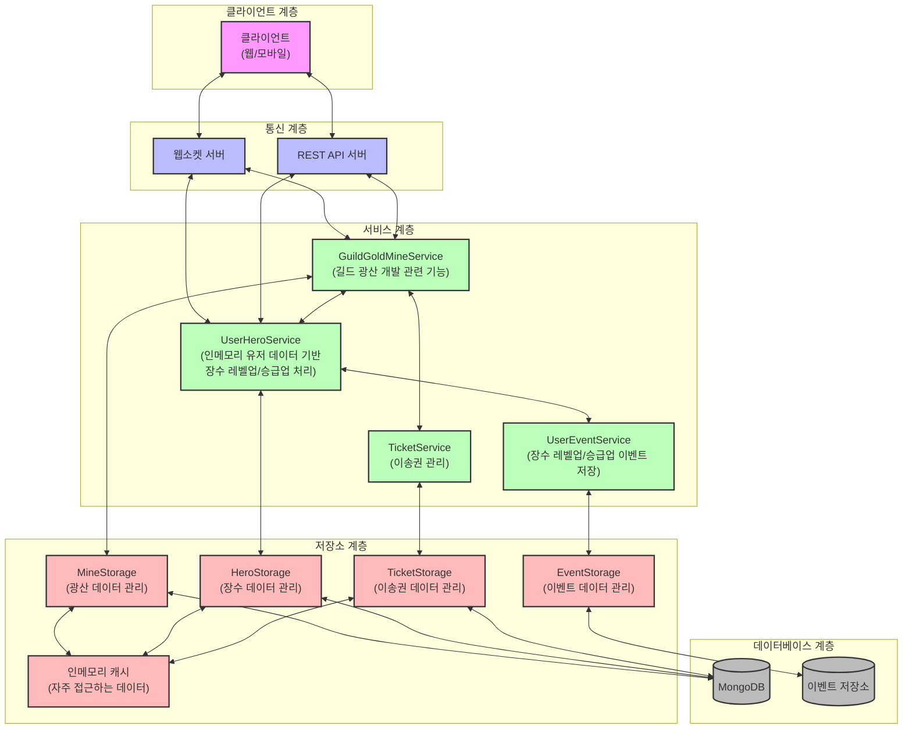
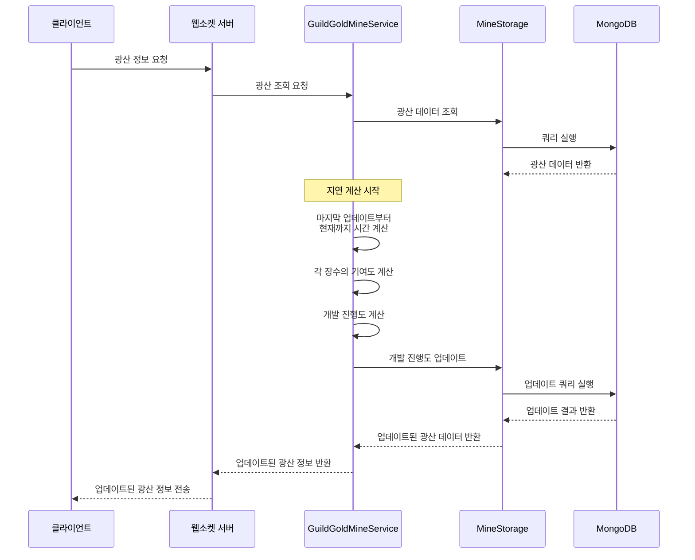
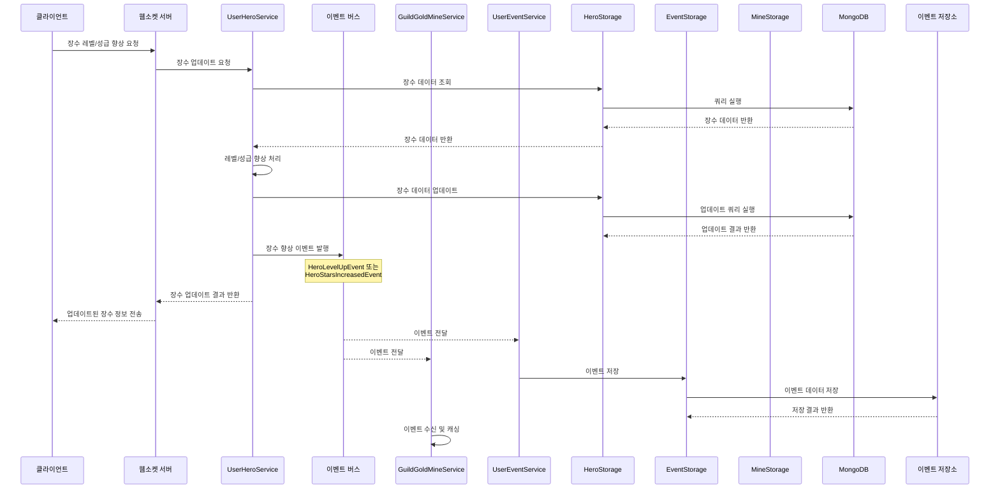
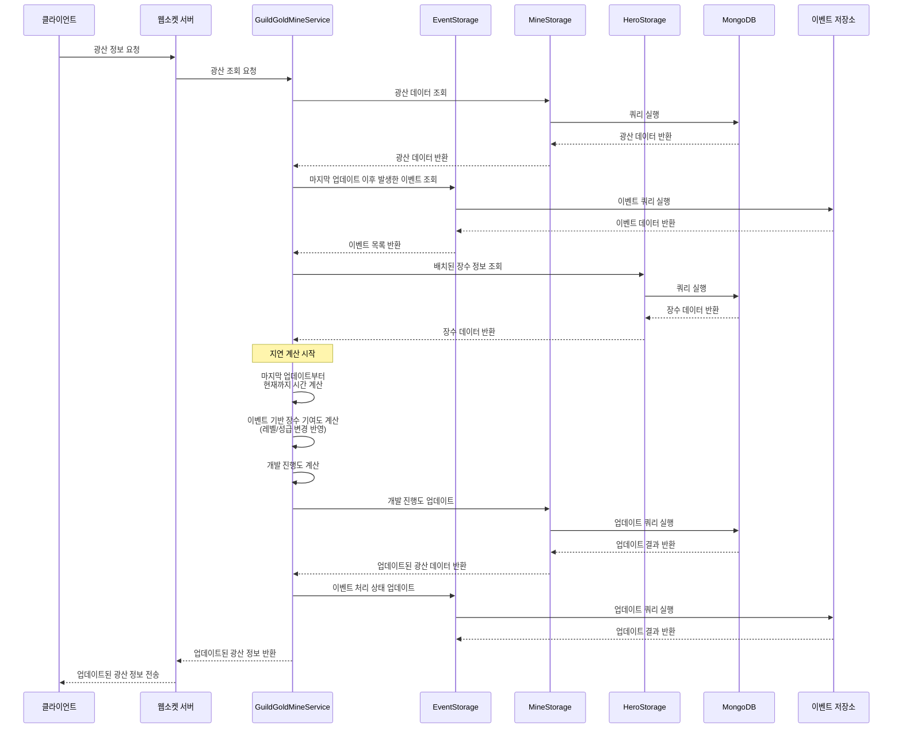
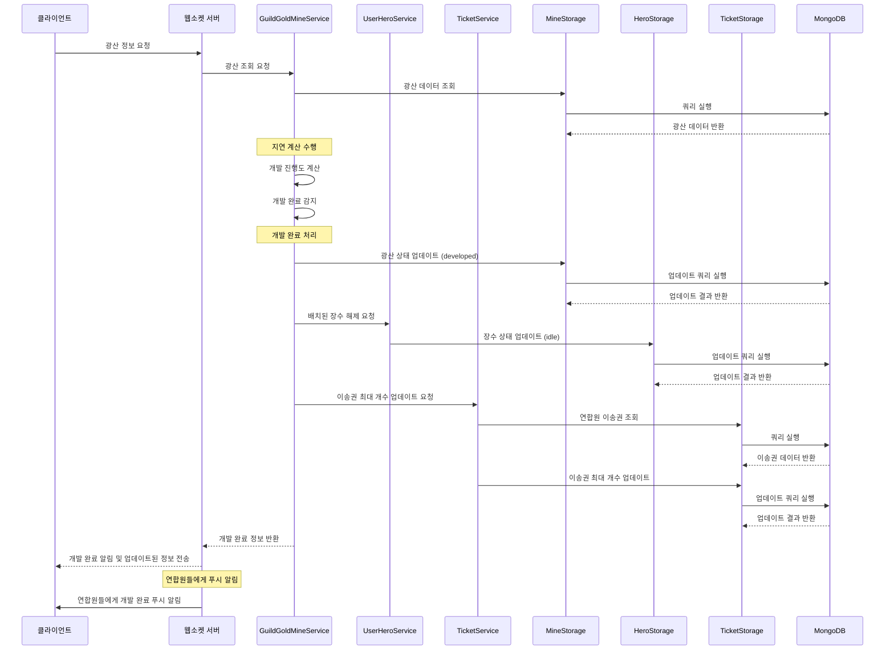

# 연합 광산 개발 시스템 설계

## 1. 개요

연합 광산 개발 시스템은 연합원들이 장수를 배치하여 광산의 개발 진행도를 높이고, 일정 개발 진행도를 달성하면 광산을 채광할 수 있는 상태로 만드는 기능입니다. 이 문서는 광산 개발 시스템의 설계와 구현에 대한 내용을 담고 있습니다.

## 2. 요구사항 분석

### 2.1 기본 요구사항

- 연합원은 오픈된 광산에 장수를 배치하여 개발 진행도를 상승시킬 수 있음
- 각 연합원은 개발 중인 광산마다 1명의 장수를 배치할 수 있음
- 광산당 최대 30명의 장수를 배치할 수 있음
- 광산 개발에 배치된 장수는 다른 연합 금광 컨텐츠(채광, 개발, 이송, 약탈, 약탈 방어)에 사용할 수 없음
- 개발 진행도가 목표치에 도달하면 광산 개발이 완료되고, 배치된 장수는 모두 해제됨
- 광산 개발이 완료되면 이송권 최대 충전 개수가 증가하는 혜택이 제공됨

### 2.2 개발 진행도 계산

- 기본 상승량: 장수 1명당 1시간마다 10/60 (약 0.167) 포인트 상승
- 장수 성급 보너스: 성급당 2% 상승 (0성은 0%, 최대 15성은 30%)
- 장수 레벨 보너스: 레벨당 0.12658% 상승 (1레벨은 0%, 최대 80레벨은 10%)
- 장수 희귀도 보너스: 일반(0.2배), 고급(0.4배), 희귀&병졸(0.6배), 영웅(0.8배), 전설(1배)

### 2.3 광산별 요구 개발 진행도

- 광산1: 10,000 포인트 (약 1일)
- 광산2: 30,000 포인트 (약 3일)
- 광산3: 70,000 포인트 (약 7일)

### 2.4 광산 개발 완료 혜택

- 광산1 개발 완료: 이송권 최대 충전 개수 5개
- 광산2 개발 완료: 이송권 최대 충전 개수 10개 (광산1 대비 5개 상승)
- 광산3 개발 완료: 이송권 최대 충전 개수 15개 (광산2 대비 5개 상승)

## 3. 시스템 아키텍처

### 3.1 전체 아키텍처

```
+------------------+     +------------------+     +------------------+
|                  |     |                  |     |                  |
|  MineService     |<--->|  GeneralService  |<--->|  TicketService   |
|                  |     |                  |     |                  |
+------------------+     +------------------+     +------------------+
         ^                       ^                       ^
         |                       |                       |
         v                       v                       v
+------------------+     +------------------+     +------------------+
|                  |     |                  |     |                  |
|  MineStorage     |     |  GeneralStorage  |     |  TicketStorage   |
|                  |     |                  |     |                  |
+------------------+     +------------------+     +------------------+
         ^                       ^                       ^
         |                       |                       |
         v                       v                       v
+------------------+     +------------------+     +------------------+
|                  |     |                  |     |                  |
|  MongoDB         |     |  MongoDB         |     |  MongoDB         |
|  (mines)         |     |  (generals)      |     |  (tickets)       |
|                  |     |                  |     |                  |
+------------------+     +------------------+     +------------------+
```

### 3.2 주요 컴포넌트

1. **MineService**: 광산 관련 비즈니스 로직 처리
   - 광산 개발 진행도 계산
   - 장수 배치 및 해제
   - 광산 개발 상태 관리

2. **GeneralService**: 장수 관련 비즈니스 로직 처리
   - 장수 정보 관리
   - 장수 배치 상태 관리

3. **TicketService**: 이송권 관련 비즈니스 로직 처리
   - 이송권 최대 충전 개수 관리

4. **Storage 계층**: MongoDB와의 상호작용 담당
   - 낙관적 동시성 제어
   - 캐싱
   - 변경 감지

5. **MongoDB**: 영구 저장소
   - 광산, 장수, 이송권 데이터 저장

### 3.3 주요 프로세스

1. **광산 개발 시작**:
   - 연합원이 광산에 장수 배치
   - 장수 상태 업데이트
   - 광산 개발 진행도 계산 시작

2. **개발 진행도 업데이트**:
   - 주기적으로 배치된 장수에 따라 개발 진행도 계산
   - 광산 개발 진행도 업데이트

3. **광산 개발 완료**:
   - 개발 진행도가 목표치에 도달하면 광산 상태 업데이트
   - 배치된 장수 모두 해제
   - 이송권 최대 충전 개수 업데이트

## 4. 데이터 모델링

### 4.1 Mine (광산)

```go
type MineStatus string

const (
    MineStatusUndeveloped MineStatus = "undeveloped" // 개발 전
    MineStatusDeveloping  MineStatus = "developing"  // 개발 중
    MineStatusDeveloped   MineStatus = "developed"   // 개발 완료
    MineStatusActive      MineStatus = "active"      // 활성화 (채광 가능)
    MineStatusInactive    MineStatus = "inactive"    // 비활성화
)

type Mine struct {
    ID                 primitive.ObjectID `bson:"_id,omitempty"`
    AllianceID         primitive.ObjectID `bson:"alliance_id"`
    Name               string             `bson:"name"`
    Level              MineLevel          `bson:"level"`
    Status             MineStatus         `bson:"status"`
    GoldOre            int                `bson:"gold_ore"`
    DevelopmentPoints  float64            `bson:"development_points"`  // 현재 개발 진행도
    RequiredPoints     float64            `bson:"required_points"`     // 필요한 개발 진행도
    AssignedGenerals   []AssignedGeneral  `bson:"assigned_generals"`   // 배치된 장수 목록
    LastUpdatedAt      time.Time          `bson:"last_updated_at"`     // 마지막 업데이트 시간
    CreatedAt          time.Time          `bson:"created_at"`
    UpdatedAt          time.Time          `bson:"updated_at"`
    VectorClock        int64              `bson:"vector_clock"`
}

type AssignedGeneral struct {
    PlayerID       primitive.ObjectID `bson:"player_id"`
    PlayerName     string             `bson:"player_name"`
    GeneralID      primitive.ObjectID `bson:"general_id"`
    GeneralName    string             `bson:"general_name"`
    AssignedAt     time.Time          `bson:"assigned_at"`
    ContributionRate float64          `bson:"contribution_rate"`  // 시간당 기여도
}
```

### 4.2 General (장수)

```go
type GeneralRarity string

const (
    GeneralRarityCommon     GeneralRarity = "common"     // 일반
    GeneralRarityUncommon   GeneralRarity = "uncommon"   // 고급
    GeneralRarityRare       GeneralRarity = "rare"       // 희귀
    GeneralRarityEpic       GeneralRarity = "epic"       // 영웅
    GeneralRarityLegendary  GeneralRarity = "legendary"  // 전설
    GeneralRaritySoldier    GeneralRarity = "soldier"    // 병졸
)

type GeneralStatus string

const (
    GeneralStatusIdle       GeneralStatus = "idle"        // 대기 중
    GeneralStatusAssigned   GeneralStatus = "assigned"    // 배치됨
)

type General struct {
    ID              primitive.ObjectID `bson:"_id,omitempty"`
    PlayerID        primitive.ObjectID `bson:"player_id"`
    Name            string             `bson:"name"`
    Level           int                `bson:"level"`
    Stars           int                `bson:"stars"`           // 성급
    Rarity          GeneralRarity      `bson:"rarity"`          // 희귀도
    Status          GeneralStatus      `bson:"status"`          // 상태
    AssignedTo      *AssignmentInfo    `bson:"assigned_to"`     // 배치 정보
    CreatedAt       time.Time          `bson:"created_at"`
    UpdatedAt       time.Time          `bson:"updated_at"`
    VectorClock     int64              `bson:"vector_clock"`
}

type AssignmentInfo struct {
    Type            string             `bson:"type"`            // "mine_development", "mining", "transport", "raid", "defense"
    TargetID        primitive.ObjectID `bson:"target_id"`       // 배치된 대상 ID (광산 등)
    AssignedAt      time.Time          `bson:"assigned_at"`     // 배치 시간
}
```

### 4.3 TransportTicket (이송권)

```go
type TransportTicket struct {
    ID              primitive.ObjectID `bson:"_id,omitempty"`
    PlayerID        primitive.ObjectID `bson:"player_id"`
    AllianceID      primitive.ObjectID `bson:"alliance_id"`
    CurrentTickets  int                `bson:"current_tickets"`
    MaxTickets      int                `bson:"max_tickets"`      // 광산 개발에 따라 변경됨
    LastRefillTime  time.Time          `bson:"last_refill_time"`
    PurchaseCount   int                `bson:"purchase_count"`
    LastPurchaseAt  *time.Time         `bson:"last_purchase_at"`
    ResetTime       time.Time          `bson:"reset_time"`
    CreatedAt       time.Time          `bson:"created_at"`
    UpdatedAt       time.Time          `bson:"updated_at"`
    VectorClock     int64              `bson:"vector_clock"`
}
```

### 4.4 HeroEvent (장수 이벤트)

```go
type HeroEventType string

const (
    HeroEventTypeLevelUp        HeroEventType = "level_up"
    HeroEventTypeStarsIncreased HeroEventType = "stars_increased"
    HeroEventTypeRarityChanged  HeroEventType = "rarity_changed"
)

type HeroEvent struct {
    ID              primitive.ObjectID `bson:"_id,omitempty"`
    PlayerID        primitive.ObjectID `bson:"player_id"`
    HeroID          primitive.ObjectID `bson:"hero_id"`
    HeroName        string             `bson:"hero_name"`
    EventType       HeroEventType      `bson:"event_type"`
    OldValue        int                `bson:"old_value"`
    NewValue        int                `bson:"new_value"`
    OldContribution float64            `bson:"old_contribution"`
    NewContribution float64            `bson:"new_contribution"`
    Timestamp       time.Time          `bson:"timestamp"`
    ProcessedAt     *time.Time         `bson:"processed_at"`    // 이벤트가 처리된 시간 (null이면 미처리)
    ProcessedBy     string             `bson:"processed_by"`    // 이벤트를 처리한 서비스
}
```

## 5. API 설계

### 5.1 광산 개발 관련 API

1. **장수 배치 API**
   - 요청: 플레이어 ID, 광산 ID, 장수 ID
   - 응답: 업데이트된 광산 정보, 장수 정보

1. **장수 배치 최신화 API**
   - 설명: 플레이어가 금광 장수 변동 이벤트를 수신하면, 해당 장수가 배치된 금광의 장수 정보를 최신화 합니다.
   - 요청: 플레이어 ID, 광산 ID
   - 응답: 업데이트된 광산 정보, 장수 정보


2. **장수 해제 API**
   - 요청: 플레이어 ID, 광산 ID, 장수 ID
   - 응답: 업데이트된 광산 정보, 장수 정보

3. **광산 개발 상태 조회 API**
   - 요청: 광산 ID
   - 응답: 광산 개발 상태, 현재 진행도, 배치된 장수 목록

4. **연합 광산 목록 조회 API**
   - 요청: 연합 ID
   - 응답: 연합 소속 광산 목록 및 개발 상태

5. **플레이어 장수 목록 조회 API**
   - 요청: 플레이어 ID
   - 응답: 플레이어 소유 장수 목록 및 상태

## 6. 구현 전략

### 6.1 개발 진행도 계산

1. **배치된 장수의 기여도 계산**:
   - 기본 기여도: 10/60 포인트/시간
   - 성급 보너스: 기본 기여도 * (1 + 성급 * 0.02)
   - 레벨 보너스: 기본 기여도 * (1 + (레벨-1) * 0.0012658)
   - 희귀도 보너스: 기본 기여도 * 희귀도 계수 (0.2~1.0)
   - 총 기여도: 기본 기여도 * (1 + 성급 보너스 + 레벨 보너스) * 희귀도 계수

2. **지연 계산 방식의 업데이트**:
   - 클라이언트 요청 시 마지막 업데이트 시간부터 현재까지의 시간 차이 계산
   - 각 배치된 장수의 기여도 * 경과 시간(시간 단위)만큼 진행도 증가
   - 계산 결과를 데이터베이스에 저장하고 클라이언트에 반환

### 6.2 광산 개발 진행도 업데이트 시스템 구조

#### 6.2.1 시스템 구조도



#### 6.2.2 지연 계산 방식 시퀀스 다이어그램



#### 6.2.3 장수 레벨/성급 향상 시 이벤트 기반 기여도 업데이트 시퀀스 다이어그램



#### 6.2.4 지연 계산 시 이벤트 기반 기여도 업데이트 시퀀스 다이어그램



#### 6.2.5 개발 완료 감지 및 처리 시퀀스 다이어그램



### 6.3 광산 개발 완료 처리

1. **개발 완료 감지**:
   - 개발 진행도 업데이트 시 목표치 도달 여부 확인
   - 목표치 도달 시 광산 상태를 'developed'로 변경

2. **장수 해제**:
   - 배치된 모든 장수의 상태를 'idle'로 변경
   - 광산의 배치된 장수 목록 초기화

3. **이송권 최대 충전 개수 업데이트**:
   - 연합원들의 이송권 최대 충전 개수 업데이트

### 6.4 동시성 제어

1. **낙관적 동시성 제어**:
   - MineService와 HeroService에서는 VectorClock을 사용하여 동시 업데이트 충돌 방지
   - 충돌 발생 시 재시도 로직 구현

2. **원자적 업데이트**:
   - 장수 배치/해제 시 광산과 장수 상태를 트랜잭션으로 처리

3. **이벤트 저장소의 동시성 처리**:
   - UserEventService는 개인 단위 이벤트를 처리하며 insert 위주의 연산
   - 이벤트는 계속 쌓이는 방식으로 저장되므로 낙관적 동시성 제어 불필요
   - 이벤트 ID와 타임스탬프를 통해 순서 보장

## 7. 성능 고려사항

1. **캐싱 전략**:
   - 자주 접근하는 광산 및 장수 정보 캐싱
   - 개발 진행도 업데이트 시 캐시 무효화

2. **배치 처리**:
   - 개발 진행도 업데이트를 배치 작업으로 처리하여 DB 부하 감소

3. **인덱싱**:
   - 연합 ID, 플레이어 ID, 광산 상태 등에 인덱스 생성

## 8. 확장성 고려사항

1. **새로운 광산 레벨 추가**:
   - 요구 개발 진행도 및 혜택을 쉽게 구성할 수 있는 설계

2. **장수 특성 확장**:
   - 추가 특성이나 보너스를 쉽게 추가할 수 있는 유연한 설계

3. **다양한 개발 혜택**:
   - 이송권 외에 다른 혜택을 추가할 수 있는 확장 가능한 설계

## 9. 이벤트 기반 아키텍처

### 9.1 이벤트 기반 설계의 장점

1. **느슨한 결합(Loose Coupling)**:
   - 서비스 간 직접적인 의존성 감소
   - 각 서비스는 자신의 책임에만 집중 가능

2. **확장성(Scalability)**:
   - 새로운 이벤트 구독자 추가가 용이
   - 기존 서비스에 영향 없이 새로운 기능 추가 가능

3. **지연 계산(Lazy Calculation)**:
   - 필요한 시점에 이벤트를 기반으로 계산 수행
   - 실시간 업데이트 부담 감소

### 9.2 이벤트 처리 전략

1. **이벤트 저장(Event Sourcing)**:
   - 모든 상태 변경을 이벤트로 저장
   - 이벤트 로그를 통해 시스템 상태 재구성 가능
   - 감사(Audit) 및 디버깅 용이

2. **이벤트 처리 상태 관리**:
   - 각 이벤트의 처리 상태 추적
   - 중복 처리 방지 및 멱등성(Idempotency) 보장

3. **이벤트 순서 보장**:
   - 타임스탬프 및 이벤트 ID를 통한 순서 관리
   - 순서가 중요한 이벤트의 경우 처리 순서 보장

### 9.3 장수 레벨업/성급 향상 이벤트 처리 흐름

1. **이벤트 발행**:
   - UserHeroService에서 장수 레벨업/성급 향상 시 이벤트 발행
   - 이벤트 버스를 통해 구독자에게 전달

2. **이벤트 저장**:
   - UserEventService에서 이벤트를 데이터베이스에 저장
   - 이벤트는 개인 단위로 처리되며 insert 위주의 연산

3. **지연 계산**:
   - GuildGoldMineService에서 광산 정보 요청 시 관련 이벤트 조회
   - 마지막 업데이트 이후 발생한 이벤트를 기반으로 기여도 재계산
   - 계산 결과를 데이터베이스에 저장하고 이벤트 처리 상태 업데이트
