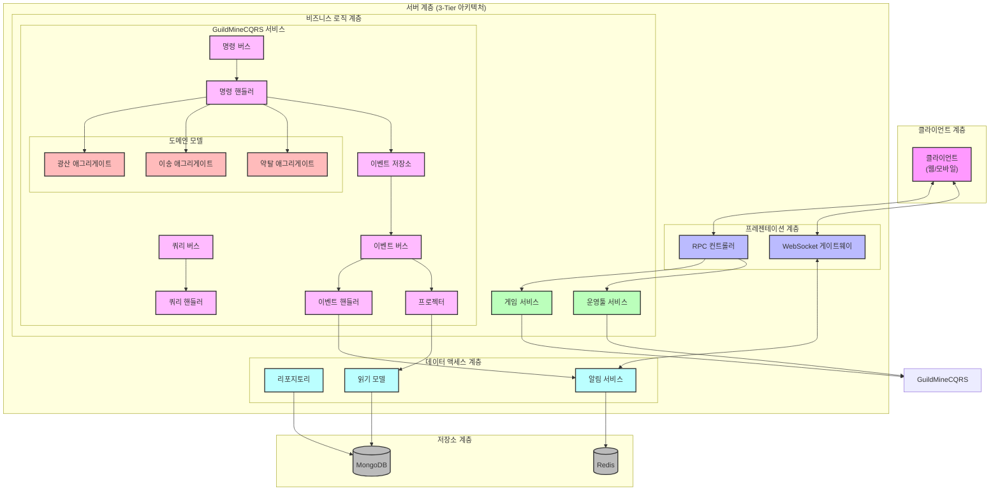
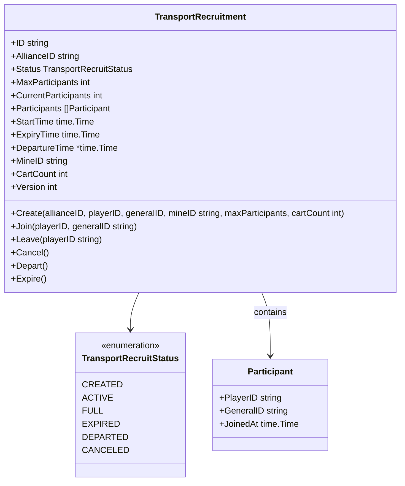
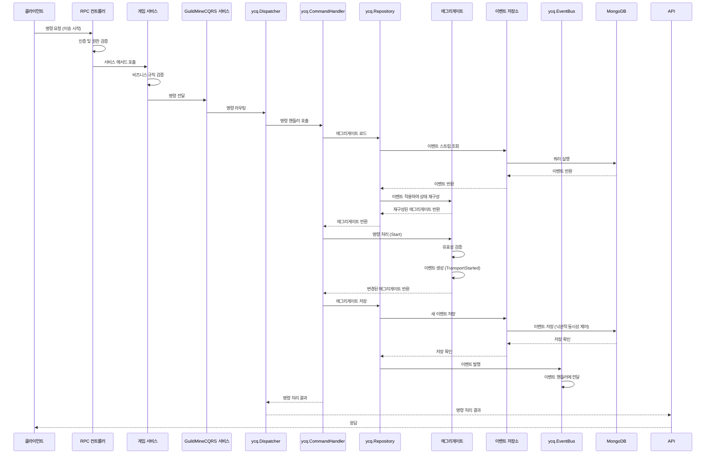
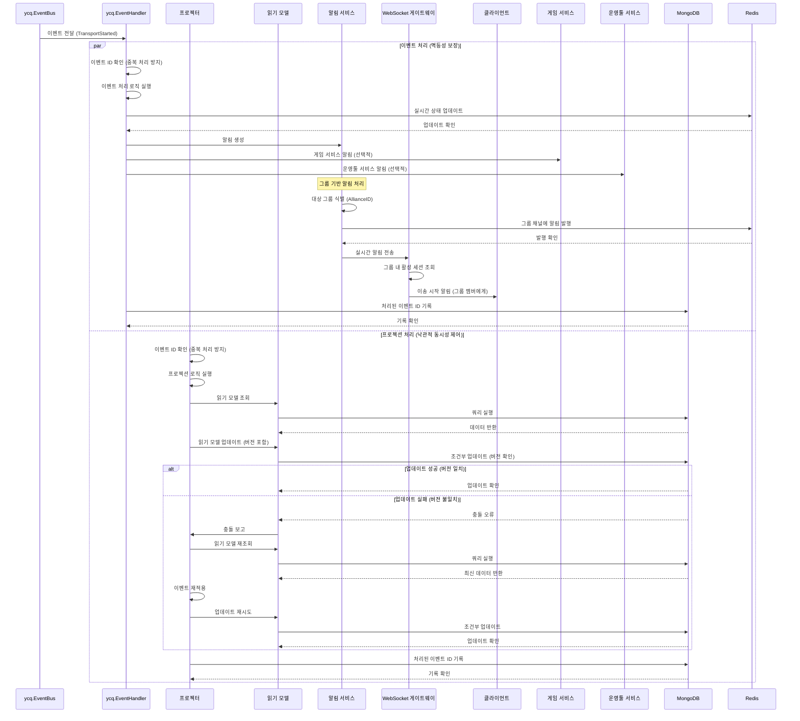
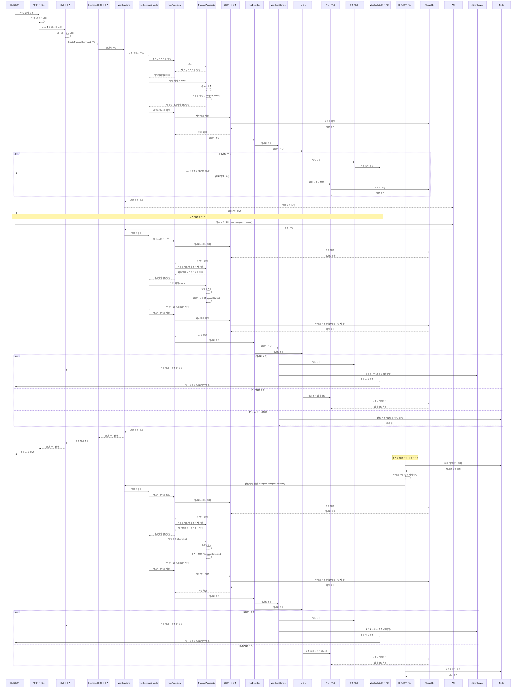
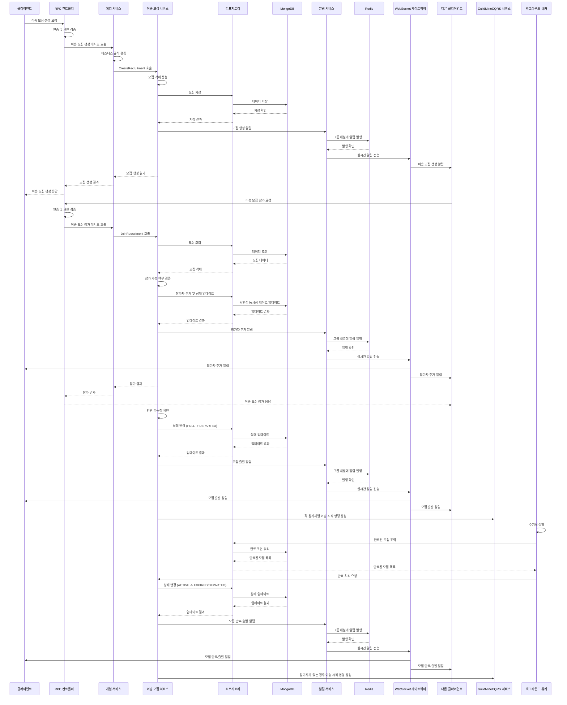
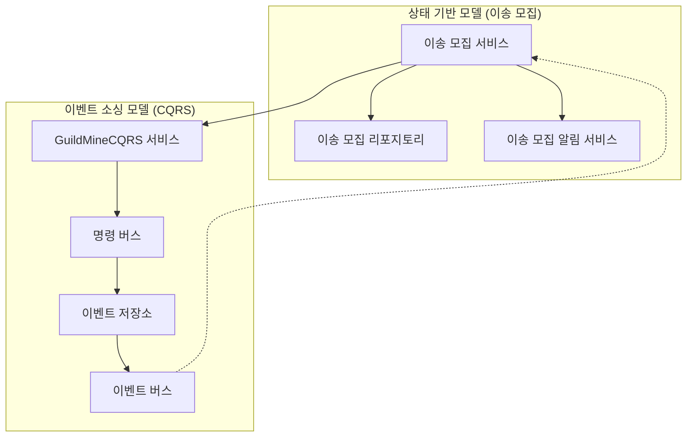

# 광산 이송 및 약탈 컨텐츠를 위한 CQRS/이벤트 소싱 시스템 설계

## 1. 개요

본 문서는 길드 광산 시스템의 이송과 약탈 컨텐츠에 대한 실시간성을 구현하기 위한 CQRS(Command Query Responsibility Segregation) 및 이벤트 소싱 아키텍처를 설명합니다. 이 설계는 MongoDB와 Redis를 저장소로 활용하고, WebSocket과 HTTP를 통신 레이어로 사용하는 Go 기반 시스템을 위해 작성되었습니다.

## 2. 시스템 아키텍처

### 2.1 전체 아키텍처



### 2.2 3-Tier 아키텍처와 CQRS 통합

이 설계는 전통적인 3-Tier 아키텍처(프레젠테이션, 비즈니스 로직, 데이터 액세스)와 CQRS 패턴을 통합한 형태입니다. GuildMineCQRS 서비스는 비즈니스 로직 계층에 위치하며, 게임 서버와 운영툴 서버 모두에서 재사용 가능한 독립적인 서비스로 구현됩니다.

1. **프레젠테이션 계층**
   - RPC 컨트롤러: 클라이언트 요청을 처리하고 적절한 서비스로 라우팅
   - WebSocket 게이트웨이: 실시간 양방향 통신 제공

2. **비즈니스 로직 계층**
   - 게임 서비스: 게임 서버의 비즈니스 로직 처리
   - 운영툴 서비스: 관리자 도구의 비즈니스 로직 처리
   - GuildMineCQRS 서비스: 금광 이송 및 약탈 관련 명령/쿼리 처리

3. **데이터 액세스 계층**
   - 리포지토리: 데이터 영속성 처리
   - 읽기 모델: 최적화된 쿼리 모델
   - 알림 서비스: 실시간 이벤트 알림

### 2.3 CQRS 핵심 컴포넌트

1. **명령 측(Command Side)**
   - 명령 버스: 명령을 적절한 핸들러로 라우팅
   - 명령 핸들러: 비즈니스 규칙 적용 및 상태 변경
   - 애그리게이트: 도메인 모델의 일관성 경계
   - 이벤트 저장소: 상태 변경 이벤트 저장

2. **쿼리 측(Query Side)**
   - 쿼리 버스: 쿼리를 적절한 핸들러로 라우팅
   - 쿼리 핸들러: 읽기 모델에서 데이터 조회
   - 읽기 모델: 조회 최적화된 데이터 구조
   - 프로젝터: 이벤트를 읽기 모델로 변환

3. **이벤트 처리(Event Processing)**
   - 이벤트 버스: 이벤트 발행 및 구독 관리
   - 이벤트 핸들러: 이벤트에 대한 부수 효과 처리
   - 알림 서비스: 실시간 알림 및 동기화

## 3. 도메인 모델

### 3.1 이송 도메인 모델 (go.cqrs 기반)


### 3.2 이송 모집 도메인 모델 (상태 기반)

이송 모집은 이벤트 소싱 대신 상태 기반 모델을 사용하여 실시간 참가자 동기화와 상태 변경을 효율적으로 처리합니다.



### 3.3 약탈 도메인 모델 (go.cqrs 기반)


### 3.3 이벤트 및 커맨드 모델 (go.cqrs 기반)


### 3.4 이벤트 및 커맨드 구현 예시

```go
// 이벤트 구현 예시
type TransportCreatedEvent struct {
    ID                  string    `json:"id"`
    AllianceID          string    `json:"alliance_id"`
    PlayerID            string    `json:"player_id"`
    MineID              string    `json:"mine_id"`
    GeneralID           string    `json:"general_id"`
    GoldAmount          int       `json:"gold_amount"`
    CreatedAt           time.Time `json:"created_at"`
    Version             int       `json:"version"`
}

func (e *TransportCreatedEvent) AggregateID() string   { return e.ID }
func (e *TransportCreatedEvent) AggregateType() string { return "Transport" }
func (e *TransportCreatedEvent) EventType() string     { return "TransportCreated" }
func (e *TransportCreatedEvent) Version() int          { return e.Version }

// 커맨드 구현 예시
type CreateTransportCommand struct {
    ID                  string `json:"id"`
    AllianceID          string `json:"alliance_id"`
    PlayerID            string `json:"player_id"`
    MineID              string `json:"mine_id"`
    GeneralID           string `json:"general_id"`
    GoldAmount          int    `json:"gold_amount"`
}

func (c *CreateTransportCommand) AggregateID() string   { return c.ID }
func (c *CreateTransportCommand) AggregateType() string { return "Transport" }
func (c *CreateTransportCommand) CommandType() string   { return "CreateTransport" }
```

## 4. 이벤트 소싱 및 CQRS 구현

### 4.1 go.cqrs 기반 명령 처리 흐름



### 4.2 go.cqrs 기반 이벤트 처리 및 프로젝션



## 5. 구현 계획

### 5.1 단계별 구현 계획

1. **기반 구조 구축** (1주)
   - 3-Tier 아키텍처 내 CQRS 서비스 설계
   - CQRS 프레임워크 설정
   - 이벤트 저장소 구현
   - 명령/쿼리 버스 구현
   - 이벤트 버스 구현

2. **도메인 모델 구현** (1주)
   - 광산 애그리게이트 구현
   - 이송 애그리게이트 구현
   - 약탈 애그리게이트 구현
   - 장수 관리 기능 구현

3. **GuildMineCQRS 서비스 구현** (2주)
   - 서비스 인터페이스 정의
   - 명령 핸들러 구현
   - 쿼리 핸들러 구현
   - 이벤트 핸들러 구현
   - 유효성 검증 및 비즈니스 규칙 구현

4. **게임 서비스 통합** (1주)
   - 게임 서비스 내 GuildMineCQRS 서비스 통합
   - 비즈니스 로직 연동
   - 권한 검증 및 유효성 검사 구현
   - 서비스 간 통신 최적화

5. **운영툴 서비스 통합** (1주)
   - 운영툴 서비스 내 GuildMineCQRS 서비스 통합
   - 관리자 기능 구현
   - 모니터링 및 로깅 기능 구현
   - 데이터 분석 기능 구현

6. **RPC 컨트롤러 및 클라이언트 통합** (1주)
   - RPC 컨트롤러 구현
   - WebSocket 게이트웨이 구현
   - 클라이언트 라이브러리 구현
   - 인증 및 권한 관리 통합

7. **테스트 및 최적화** (1주)
   - 단위 테스트 작성
   - 통합 테스트 작성
   - 성능 테스트 및 최적화
   - 부하 테스트 및 확장성 검증

## 6. 주요 시나리오 시퀀스 다이어그램

### 6.1 go.cqrs 기반 이송 프로세스 시퀀스 다이어그램



### 6.2 상태 기반 이송 모집 프로세스 시퀀스 다이어그램



### 6.3 go.cqrs 기반 약탈 프로세스 시퀀스 다이어그램

```mermaid
sequenceDiagram
    participant Client as 공격자 클라이언트
    participant DefClient as 방어자 클라이언트
    participant RPCController as RPC 컨트롤러
    participant GameService as 게임 서비스
    participant AdminService as 운영툴 서비스
    participant GuildMineCQRS as GuildMineCQRS 서비스
    participant Dispatcher as ycq.Dispatcher
    participant RaidHandler as 약탈 커맨드 핸들러
    participant DefenseHandler as 방어 커맨드 핸들러
    participant Repository as ycq.Repository
    participant RaidAggregate as RaidAggregate
    participant DefenseAggregate as DefenseAggregate
    participant TransportAggregate as TransportAggregate
    participant EventStore as 이벤트 저장소
    participant EventBus as ycq.EventBus
    participant EventHandler as ycq.EventHandler
    participant Projector as 프로젝터
    participant ReadModel as 읽기 모델
    participant Notifier as 알림 서비스
    participant WSGateway as WebSocket 게이트웨이
    participant Worker as 백그라운드 워커

    %% 1. 약탈 시작
    Client->>RPCController: 약탈 요청
    RPCController->>RPCController: 인증 및 권한 검증
    RPCController->>GameService: 약탈 메서드 호출
    GameService->>GameService: 비즈니스 규칙 검증
    GameService->>GuildMineCQRS: CreateRaidCommand 전달
    GuildMineCQRS->>Dispatcher: 명령 라우팅
    Dispatcher->>RaidHandler: 명령 라우팅

    RaidHandler->>ReadModel: 이송 중인 대상 조회
    ReadModel->>MongoDB: 쿼리 실행
    MongoDB-->>ReadModel: 이송 정보 반환
    ReadModel-->>RaidHandler: 이송 정보 반환

    RaidHandler->>Repository: 새 약탈 애그리게이트 생성
    Repository->>RaidAggregate: 생성
    RaidAggregate-->>Repository: 새 애그리게이트 반환
    Repository-->>RaidHandler: 애그리게이트 반환

    RaidHandler->>RaidAggregate: 명령 처리 (Create)
    RaidAggregate->>RaidAggregate: 유효성 검증
    RaidAggregate->>RaidAggregate: 이벤트 생성 (RaidCreated)
    RaidAggregate-->>RaidHandler: 변경된 애그리게이트 반환

    RaidHandler->>Repository: 애그리게이트 저장
    Repository->>EventStore: 새 이벤트 저장
    EventStore->>MongoDB: 이벤트 저장
    MongoDB-->>EventStore: 저장 확인
    EventStore-->>Repository: 저장 확인

    Repository->>EventBus: 이벤트 발행
    EventBus->>EventHandler: 이벤트 전달
    EventBus->>Projector: 이벤트 전달

    par 이벤트 처리
        EventHandler->>Notifier: 알림 생성
        EventHandler->>GameService: 게임 서비스 알림 (선택적)
        EventHandler->>AdminService: 운영툴 서비스 알림 (선택적)
        Notifier->>Notifier: 대상 그룹 식별 (공격자/방어자 연합)
        Notifier->>WSGateway: 약탈 시작 알림
        WSGateway->>Client: 실시간 알림 (공격자 연합)
        WSGateway->>DefClient: 약탈 경고 알림 (방어자 연합)
    and 프로젝션 처리
        Projector->>ReadModel: 약탈 데이터 생성
        ReadModel->>MongoDB: 데이터 저장
        MongoDB-->>ReadModel: 저장 확인
    and 완료 시간 스케줄링
        EventHandler->>Redis: 약탈 완료 예정 시간으로 작업 등록
        Redis-->>EventHandler: 등록 확인
    end

    RaidHandler-->>Dispatcher: 명령 처리 결과
    Dispatcher-->>GuildMineCQRS: 명령 처리 결과
    GuildMineCQRS-->>GameService: 명령 처리 결과
    GameService-->>RPCController: 명령 처리 결과
    RPCController-->>Client: 약탈 시작 응답

    %% 2. 방어 시작
    DefClient->>RPCController: 방어 요청
    RPCController->>RPCController: 인증 및 권한 검증
    RPCController->>GameService: 방어 메서드 호출
    GameService->>GameService: 비즈니스 규칙 검증
    GameService->>GuildMineCQRS: CreateDefenseCommand 전달
    GuildMineCQRS->>Dispatcher: 명령 라우팅
    Dispatcher->>DefenseHandler: 명령 라우팅

    DefenseHandler->>ReadModel: 약탈 정보 조회
    ReadModel->>MongoDB: 쿼리 실행
    MongoDB-->>ReadModel: 약탈 정보 반환
    ReadModel-->>DefenseHandler: 약탈 정보 반환

    DefenseHandler->>Repository: 새 방어 애그리게이트 생성
    Repository->>DefenseAggregate: 생성
    DefenseAggregate-->>Repository: 새 애그리게이트 반환
    Repository-->>DefenseHandler: 애그리게이트 반환

    DefenseHandler->>DefenseAggregate: 명령 처리 (Create)
    DefenseAggregate->>DefenseAggregate: 유효성 검증
    DefenseAggregate->>DefenseAggregate: 이벤트 생성 (DefenseCreated)
    DefenseAggregate-->>DefenseHandler: 변경된 애그리게이트 반환

    DefenseHandler->>Repository: 애그리게이트 저장
    Repository->>EventStore: 새 이벤트 저장
    EventStore->>MongoDB: 이벤트 저장
    MongoDB-->>EventStore: 저장 확인
    EventStore-->>Repository: 저장 확인

    Repository->>EventBus: 이벤트 발행
    EventBus->>EventHandler: 이벤트 전달
    EventBus->>Projector: 이벤트 전달

    par 이벤트 처리
        EventHandler->>Notifier: 알림 생성
        EventHandler->>GameService: 게임 서비스 알림 (선택적)
        EventHandler->>AdminService: 운영툴 서비스 알림 (선택적)
        Notifier->>Notifier: 대상 그룹 식별 (공격자/방어자 연합)
        Notifier->>WSGateway: 방어 시작 알림
        WSGateway->>DefClient: 실시간 알림 (방어자 연합)
        WSGateway->>Client: 방어 발생 알림 (공격자 연합)
    and 프로젝션 처리
        Projector->>ReadModel: 방어 데이터 생성
        ReadModel->>MongoDB: 데이터 저장
        MongoDB-->>ReadModel: 저장 확인
    end

    DefenseHandler-->>Dispatcher: 명령 처리 결과
    Dispatcher-->>GuildMineCQRS: 명령 처리 결과
    GuildMineCQRS-->>GameService: 명령 처리 결과
    GameService-->>RPCController: 명령 처리 결과
    RPCController-->>DefClient: 방어 시작 응답

    %% 3. 약탈 결과 처리 (백그라운드 처리)
    Note over Worker: 주기적 실행 (모든 서버 노드)
    Worker->>Redis: 약탈 완료 예정 작업 조회
    Redis-->>Worker: 처리할 작업 목록

    Worker->>Worker: 이벤트 ID로 중복 처리 확인
    Worker->>ReadModel: 약탈 및 방어 정보 조회
    ReadModel->>MongoDB: 쿼리 실행
    MongoDB-->>ReadModel: 데이터 반환
    ReadModel-->>Worker: 약탈 및 방어 정보 반환

    Worker->>Worker: 약탈 결과 계산 (방어 성공/실패)

    alt 방어 성공
        Worker->>Dispatcher: 약탈 실패 명령 생성 (RaidFailCommand)
        Dispatcher->>RaidHandler: 명령 라우팅

        RaidHandler->>Repository: 약탈 애그리게이트 로드
        Repository->>EventStore: 이벤트 스트림 조회
        EventStore->>MongoDB: 쿼리 실행
        MongoDB-->>EventStore: 이벤트 반환
        EventStore-->>Repository: 이벤트 반환

        Repository->>RaidAggregate: 이벤트 적용하여 상태 재구성
        RaidAggregate-->>Repository: 재구성된 애그리게이트 반환
        Repository-->>RaidHandler: 애그리게이트 반환

        RaidHandler->>RaidAggregate: 명령 처리 (Fail)
        RaidAggregate->>RaidAggregate: 유효성 검증
        RaidAggregate->>RaidAggregate: 이벤트 생성 (RaidFailed)
        RaidAggregate-->>RaidHandler: 변경된 애그리게이트 반환

        RaidHandler->>Repository: 애그리게이트 저장
        Repository->>EventStore: 새 이벤트 저장
        EventStore->>MongoDB: 이벤트 저장 (낙관적 동시성 제어)
        MongoDB-->>EventStore: 저장 확인
        EventStore-->>Repository: 저장 확인

        Repository->>EventBus: 이벤트 발행

        Worker->>Dispatcher: 방어 성공 명령 생성 (DefenseSucceedCommand)
        Dispatcher->>DefenseHandler: 명령 라우팅

        DefenseHandler->>Repository: 방어 애그리게이트 로드
        Repository->>EventStore: 이벤트 스트림 조회
        EventStore->>MongoDB: 쿼리 실행
        MongoDB-->>EventStore: 이벤트 반환
        EventStore-->>Repository: 이벤트 반환

        Repository->>DefenseAggregate: 이벤트 적용하여 상태 재구성
        DefenseAggregate-->>Repository: 재구성된 애그리게이트 반환
        Repository-->>DefenseHandler: 애그리게이트 반환

        DefenseHandler->>DefenseAggregate: 명령 처리 (Succeed)
        DefenseAggregate->>DefenseAggregate: 유효성 검증
        DefenseAggregate->>DefenseAggregate: 이벤트 생성 (DefenseSucceeded)
        DefenseAggregate-->>DefenseHandler: 변경된 애그리게이트 반환

        DefenseHandler->>Repository: 애그리게이트 저장
        Repository->>EventStore: 새 이벤트 저장
        EventStore->>MongoDB: 이벤트 저장 (낙관적 동시성 제어)
        MongoDB-->>EventStore: 저장 확인
        EventStore-->>Repository: 저장 확인

        Repository->>EventBus: 이벤트 발행

        EventBus->>EventHandler: 이벤트 전달
        EventBus->>Projector: 이벤트 전달

        par 이벤트 처리
            EventHandler->>Notifier: 알림 생성
            Notifier->>Notifier: 대상 그룹 식별 (공격자/방어자 연합)
            Notifier->>WSGateway: 약탈 실패/방어 성공 알림
            WSGateway->>Client: 약탈 실패 알림 (공격자 연합)
            WSGateway->>DefClient: 방어 성공 알림 (방어자 연합)
        and 프로젝션 처리
            Projector->>ReadModel: 약탈/방어 결과 업데이트
            ReadModel->>MongoDB: 데이터 업데이트
            MongoDB-->>ReadModel: 업데이트 확인
        end

    else 약탈 성공
        Worker->>Dispatcher: 약탈 성공 명령 생성 (RaidSucceedCommand)
        Dispatcher->>RaidHandler: 명령 라우팅

        RaidHandler->>Repository: 약탈 애그리게이트 로드
        Repository->>EventStore: 이벤트 스트림 조회
        EventStore->>MongoDB: 쿼리 실행
        MongoDB-->>EventStore: 이벤트 반환
        EventStore-->>Repository: 이벤트 반환

        Repository->>RaidAggregate: 이벤트 적용하여 상태 재구성
        RaidAggregate-->>Repository: 재구성된 애그리게이트 반환
        Repository-->>RaidHandler: 애그리게이트 반환

        RaidHandler->>RaidAggregate: 명령 처리 (Succeed)
        RaidAggregate->>RaidAggregate: 유효성 검증
        RaidAggregate->>RaidAggregate: 이벤트 생성 (RaidSucceeded)
        RaidAggregate-->>RaidHandler: 변경된 애그리게이트 반환

        RaidHandler->>Repository: 애그리게이트 저장
        Repository->>EventStore: 새 이벤트 저장
        EventStore->>MongoDB: 이벤트 저장 (낙관적 동시성 제어)
        MongoDB-->>EventStore: 저장 확인
        EventStore-->>Repository: 저장 확인

        Repository->>EventBus: 이벤트 발행

        Worker->>Dispatcher: 이송 약탈 명령 생성 (RaidTransportCommand)
        Dispatcher->>CommandHandler: 명령 라우팅

        CommandHandler->>Repository: 이송 애그리게이트 로드
        Repository->>EventStore: 이벤트 스트림 조회
        EventStore->>MongoDB: 쿼리 실행
        MongoDB-->>EventStore: 이벤트 반환
        EventStore-->>Repository: 이벤트 반환

        Repository->>TransportAggregate: 이벤트 적용하여 상태 재구성
        TransportAggregate-->>Repository: 재구성된 애그리게이트 반환
        Repository-->>CommandHandler: 애그리게이트 반환

        CommandHandler->>TransportAggregate: 명령 처리 (Raid)
        TransportAggregate->>TransportAggregate: 유효성 검증
        TransportAggregate->>TransportAggregate: 이벤트 생성 (TransportRaided)
        TransportAggregate-->>CommandHandler: 변경된 애그리게이트 반환

        CommandHandler->>Repository: 애그리게이트 저장
        Repository->>EventStore: 새 이벤트 저장
        EventStore->>MongoDB: 이벤트 저장 (낙관적 동시성 제어)
        MongoDB-->>EventStore: 저장 확인
        EventStore-->>Repository: 저장 확인

        Repository->>EventBus: 이벤트 발행

        EventBus->>EventHandler: 이벤트 전달
        EventBus->>Projector: 이벤트 전달

        par 이벤트 처리
            EventHandler->>Notifier: 알림 생성
            Notifier->>Notifier: 대상 그룹 식별 (공격자/방어자 연합)
            Notifier->>WSGateway: 약탈 성공/이송 실패 알림
            WSGateway->>Client: 약탈 성공 알림 (공격자 연합)
            WSGateway->>DefClient: 이송 실패 알림 (방어자 연합)
        and 프로젝션 처리
            Projector->>ReadModel: 약탈/이송 결과 업데이트
            ReadModel->>MongoDB: 데이터 업데이트
            MongoDB-->>ReadModel: 업데이트 확인
        end
    end

    Worker->>Redis: 처리된 작업 제거
    Redis-->>Worker: 제거 확인
```



## 7. 기술적 구현 상세

### 7.1 jetbasrawi/go.cqrs 라이브러리 활용

본 시스템은 [jetbasrawi/go.cqrs](https://github.com/jetbasrawi/go.cqrs) 라이브러리를 기반으로 구현됩니다. 이 라이브러리는 CQRS 패턴의 핵심 컴포넌트들을 제공하며, 우리의 분산 환경 요구사항에 맞게 확장하여 사용할 수 있습니다.

```go
import (
    "github.com/jetbasrawi/go.cqrs"
    "github.com/jetbasrawi/go.geteventstore"
)

// 주요 컴포넌트 초기화 예시
func setupCQRSComponents() {
    // 이벤트 팩토리 생성
    eventFactory := ycq.NewEventFactory()

    // 커맨드 핸들러 생성
    commandDispatcher := ycq.NewInMemoryDispatcher()

    // 이벤트 버스 생성
    eventBus := ycq.NewInMemoryEventBus()

    // 스트림 네이머 설정 (BoundedContext + AggregateID 형식)
    streamNamer := ycq.NewDelegateStreamNamer(func(aggregateType, aggregateID string) string {
        return fmt.Sprintf("%s-%s", aggregateType, aggregateID)
    })

    // 레포지토리 설정
    repository := setupRepository(eventFactory, eventBus, streamNamer)

    // 애그리게이트 팩토리 설정
    aggregateFactory := setupAggregateFactory()

    // 커맨드 핸들러 등록
    registerCommandHandlers(commandDispatcher, repository, aggregateFactory)

    // 이벤트 핸들러 등록
    registerEventHandlers(eventBus)
}
```

### 7.2 MongoDB 기반 이벤트 저장소 구현

go.cqrs 라이브러리는 GetEventStore를 기본 저장소로 사용하지만, 우리는 MongoDB를 이벤트 저장소로 활용하기 위해 인터페이스를 구현합니다.

```go
// MongoDB 이벤트 저장소 구현
type MongoEventStore struct {
    client     *mongo.Client
    database   string
    collection string
}

// ycq.EventStore 인터페이스 구현
func (store *MongoEventStore) SaveEvents(streamID string, expectedVersion int, events []ycq.Event) error {
    // 낙관적 동시성 제어를 위한 버전 확인
    currentVersion, err := store.GetStreamVersion(streamID)
    if err != nil {
        return err
    }

    if currentVersion != expectedVersion {
        return ycq.NewConcurrencyError(streamID, expectedVersion, currentVersion)
    }

    // 이벤트 저장 로직
    session := store.client.StartSession()
    defer session.EndSession(context.Background())

    err = session.StartTransaction()
    if err != nil {
        return err
    }

    coll := store.client.Database(store.database).Collection(store.collection)

    for i, event := range events {
        eventData := bson.M{
            "streamID":      streamID,
            "eventType":     event.EventType(),
            "version":       expectedVersion + i + 1,
            "timestamp":     time.Now(),
            "aggregateID":   event.AggregateID(),
            "aggregateType": event.AggregateType(),
            "eventData":     event,
        }

        _, err = coll.InsertOne(context.Background(), eventData)
        if err != nil {
            session.AbortTransaction(context.Background())
            return err
        }
    }

    return session.CommitTransaction(context.Background())
}

func (store *MongoEventStore) GetEvents(streamID string, fromVersion int) ([]ycq.Event, error) {
    // 특정 버전 이후의 이벤트 조회
    coll := store.client.Database(store.database).Collection(store.collection)

    filter := bson.M{
        "streamID": streamID,
        "version":  bson.M{"$gt": fromVersion},
    }

    sort := bson.M{"version": 1}

    cursor, err := coll.Find(context.Background(), filter, options.Find().SetSort(sort))
    if err != nil {
        return nil, err
    }
    defer cursor.Close(context.Background())

    var events []ycq.Event
    for cursor.Next(context.Background()) {
        var result bson.M
        if err := cursor.Decode(&result); err != nil {
            return nil, err
        }

        event, ok := result["eventData"].(ycq.Event)
        if !ok {
            return nil, errors.New("failed to cast to Event")
        }

        events = append(events, event)
    }

    return events, nil
}
```

### 7.3 Redis 기반 이벤트 버스 구현

분산 환경에서의 이벤트 전파를 위해 Redis Streams를 활용한 이벤트 버스를 구현합니다.

```go
// Redis 기반 이벤트 버스 구현
type RedisEventBus struct {
    client      *redis.Client
    streamName  string
    consumerID  string
    handlers    map[string]map[string]func(ycq.Event) error
    handlersMu  sync.RWMutex
}

// 이벤트 발행
func (bus *RedisEventBus) PublishEvent(event ycq.Event) error {
    // 이벤트를 JSON으로 직렬화
    eventData, err := json.Marshal(event)
    if err != nil {
        return err
    }

    // Redis Streams에 이벤트 추가
    values := map[string]interface{}{
        "eventType":     event.EventType(),
        "aggregateID":   event.AggregateID(),
        "aggregateType": event.AggregateType(),
        "eventData":     string(eventData),
        "timestamp":     time.Now().UnixNano(),
    }

    // 그룹 채널에도 발행 (연합/길드 ID 기반)
    groupID := extractGroupID(event)
    if groupID != "" {
        groupStreamName := fmt.Sprintf("group:%s", groupID)
        if err := bus.client.XAdd(context.Background(), &redis.XAddArgs{
            Stream: groupStreamName,
            Values: values,
        }).Err(); err != nil {
            return err
        }
    }

    // 글로벌 이벤트 스트림에 발행
    return bus.client.XAdd(context.Background(), &redis.XAddArgs{
        Stream: bus.streamName,
        Values: values,
    }).Err()
}

// 이벤트 구독
func (bus *RedisEventBus) AddHandler(handler ycq.EventHandler, eventType string) error {
    bus.handlersMu.Lock()
    defer bus.handlersMu.Unlock()

    handlerID := uuid.New().String()

    if _, ok := bus.handlers[eventType]; !ok {
        bus.handlers[eventType] = make(map[string]func(ycq.Event) error)
    }

    bus.handlers[eventType][handlerID] = handler.HandleEvent

    return nil
}

// 이벤트 처리 워커 시작
func (bus *RedisEventBus) StartEventProcessing() {
    go bus.processEvents()
}

// 이벤트 처리 루프
func (bus *RedisEventBus) processEvents() {
    for {
        // Redis Streams에서 새 이벤트 읽기
        entries, err := bus.client.XRead(context.Background(), &redis.XReadArgs{
            Streams: []string{bus.streamName, "0"},
            Count:   10,
            Block:   time.Second * 1,
        }).Result()

        if err != nil && err != redis.Nil {
            log.Printf("Error reading from stream: %v", err)
            time.Sleep(time.Second)
            continue
        }

        // 이벤트 처리
        for _, entry := range entries {
            for _, message := range entry.Messages {
                eventType := message.Values["eventType"].(string)
                eventData := message.Values["eventData"].(string)

                // 이벤트 역직렬화 및 처리
                event, err := deserializeEvent(eventType, eventData)
                if err != nil {
                    log.Printf("Error deserializing event: %v", err)
                    continue
                }

                // 등록된 핸들러로 이벤트 전달
                bus.handlersMu.RLock()
                handlers, ok := bus.handlers[eventType]
                bus.handlersMu.RUnlock()

                if ok {
                    for _, handler := range handlers {
                        if err := handler(event); err != nil {
                            log.Printf("Error handling event: %v", err)
                        }
                    }
                }

                // 처리된 메시지 확인
                bus.client.XAck(context.Background(), bus.streamName, bus.consumerID, message.ID)
            }
        }
    }
}
```

### 7.4 이송 모집 서비스 구현

이송 모집 기능은 이벤트 소싱 대신 상태 기반 모델을 사용하여 구현합니다. 이는 실시간 참가자 동기화와 같은 빈번한 상태 변경에 더 효율적입니다.

#### 7.4.1 이송 모집 리포지토리

```go
// TransportRecruitmentRepository 인터페이스
type TransportRecruitmentRepository interface {
    Create(ctx context.Context, recruitment *TransportRecruitment) error
    FindByID(ctx context.Context, id string) (*TransportRecruitment, error)
    FindActiveByAllianceID(ctx context.Context, allianceID string) ([]*TransportRecruitment, error)
    Update(ctx context.Context, recruitment *TransportRecruitment) error
    Delete(ctx context.Context, id string) error
}

// MongoDB 구현체
type MongoTransportRecruitmentRepository struct {
    collection *mongo.Collection
}

func NewMongoTransportRecruitmentRepository(db *mongo.Database) *MongoTransportRecruitmentRepository {
    collection := db.Collection("transport_recruitments")

    // 인덱스 생성
    indexModels := []mongo.IndexModel{
        {
            Keys: bson.D{{"allianceId", 1}, {"status", 1}},
            Options: options.Index().SetBackground(true),
        },
        {
            Keys: bson.D{{"status", 1}, {"expiryTime", 1}},
            Options: options.Index().SetBackground(true),
        },
    }

    _, err := collection.Indexes().CreateMany(context.Background(), indexModels)
    if err != nil {
        log.Printf("Failed to create indexes: %v", err)
    }

    return &MongoTransportRecruitmentRepository{
        collection: collection,
    }
}

// 낙관적 동시성 제어를 사용한 업데이트
func (r *MongoTransportRecruitmentRepository) Update(ctx context.Context, recruitment *TransportRecruitment) error {
    currentVersion := recruitment.Version
    recruitment.Version++

    result, err := r.collection.UpdateOne(
        ctx,
        bson.M{
            "_id": recruitment.ID,
            "version": currentVersion,
        },
        bson.M{
            "$set": recruitment,
        },
    )

    if err != nil {
        return err
    }

    if result.MatchedCount == 0 {
        return errors.New("concurrent modification detected")
    }

    return nil
}
```

#### 7.4.2 이송 모집 서비스

```go
// TransportRecruitmentService 인터페이스
type TransportRecruitmentService interface {
    CreateRecruitment(ctx context.Context, allianceID, playerID, generalID, mineID string, maxParticipants, cartCount int, expiryDuration time.Duration) (*TransportRecruitment, error)
    JoinRecruitment(ctx context.Context, recruitmentID, playerID, generalID string) error
    LeaveRecruitment(ctx context.Context, recruitmentID, playerID string) error
    GetRecruitmentStatus(ctx context.Context, recruitmentID string) (*TransportRecruitment, error)
    GetActiveRecruitments(ctx context.Context, allianceID string) ([]*TransportRecruitment, error)
    CancelRecruitment(ctx context.Context, recruitmentID, playerID string) error
}

// 서비스 구현체
type TransportRecruitmentServiceImpl struct {
    repository TransportRecruitmentRepository
    notifier   TransportRecruitmentNotifier
    guildMineCQRS GuildMineCQRSService
    maxRetries int
}

// 모집 참가 메서드 구현 (낙관적 동시성 제어)
func (s *TransportRecruitmentServiceImpl) JoinRecruitment(ctx context.Context, recruitmentID, playerID, generalID string) error {
    for i := 0; i < s.maxRetries; i++ {
        recruitment, err := s.repository.FindByID(ctx, recruitmentID)
        if err != nil {
            return err
        }

        // 상태 검증
        if recruitment.Status != RecruitmentActive {
            return errors.New("recruitment is not active")
        }

        // 인원 검증
        if recruitment.CurrentParticipants >= recruitment.MaxParticipants {
            return errors.New("recruitment is already full")
        }

        // 중복 참가 검증
        for _, p := range recruitment.Participants {
            if p.PlayerID == playerID {
                return errors.New("player already joined")
            }
        }

        // 참가자 추가
        newParticipant := Participant{
            PlayerID:  playerID,
            GeneralID: generalID,
            JoinedAt:  time.Now(),
        }
        recruitment.Participants = append(recruitment.Participants, newParticipant)
        recruitment.CurrentParticipants++

        // 인원 가득 찼는지 확인
        if recruitment.CurrentParticipants >= recruitment.MaxParticipants {
            recruitment.Status = RecruitmentFull
        }

        // 저장 시도
        err = s.repository.Update(ctx, recruitment)
        if err == nil {
            // 알림 발송
            s.notifier.NotifyParticipantJoined(ctx, TransportRecruitmentEvent{
                RecruitmentID:      recruitment.ID,
                AllianceID:         recruitment.AllianceID,
                EventType:          "PARTICIPANT_JOINED",
                Status:             recruitment.Status,
                CurrentParticipants: recruitment.CurrentParticipants,
                MaxParticipants:    recruitment.MaxParticipants,
                LastParticipant:    &newParticipant,
                Timestamp:          time.Now(),
            })

            // 인원이 가득 찼으면 출발 처리
            if recruitment.Status == RecruitmentFull {
                go s.processDeparture(context.Background(), recruitment)
            }

            return nil
        }

        // 충돌 발생 시 재시도
        if i == s.maxRetries-1 {
            return errors.New("failed to join recruitment after retries")
        }
    }

    return errors.New("unexpected error")
}
```

#### 7.4.3 실시간 알림 시스템

```go
// TransportRecruitmentNotifier 인터페이스
type TransportRecruitmentNotifier interface {
    NotifyStatusChange(ctx context.Context, event TransportRecruitmentEvent) error
    NotifyParticipantJoined(ctx context.Context, event TransportRecruitmentEvent) error
    NotifyParticipantLeft(ctx context.Context, event TransportRecruitmentEvent) error
    NotifyRecruitmentDeparted(ctx context.Context, event TransportRecruitmentEvent) error
}

// Redis 기반 구현체
type RedisTransportRecruitmentNotifier struct {
    redisClient *redis.Client
}

// 상태 변경 알림 구현
func (n *RedisTransportRecruitmentNotifier) NotifyStatusChange(ctx context.Context, event TransportRecruitmentEvent) error {
    // 그룹 채널에 이벤트 발행
    groupChannel := fmt.Sprintf("alliance:%s:recruitment", event.AllianceID)
    eventData, err := json.Marshal(event)
    if err != nil {
        return err
    }

    return n.redisClient.Publish(ctx, groupChannel, eventData).Err()
}
```

#### 7.4.4 WebSocket 게이트웨이

```go
// TransportRecruitmentWSHandler 구조체
type TransportRecruitmentWSHandler struct {
    redisClient *redis.Client
    sessions    map[string]*websocket.Conn
    sessionsMu  sync.RWMutex
    stopCh      chan struct{}
}

// Redis 구독 처리
func (h *TransportRecruitmentWSHandler) subscribeToRedis() {
    pubsub := h.redisClient.PSubscribe(context.Background(), "alliance:*:recruitment")
    defer pubsub.Close()

    for {
        select {
        case <-h.stopCh:
            return
        default:
            msg, err := pubsub.ReceiveMessage(context.Background())
            if err != nil {
                log.Printf("Error receiving message: %v", err)
                time.Sleep(time.Second)
                continue
            }

            // 채널 패턴에서 alliance ID 추출
            pattern := "alliance:(.*):recruitment"
            re := regexp.MustCompile(pattern)
            matches := re.FindStringSubmatch(msg.Channel)
            if len(matches) < 2 {
                continue
            }
            allianceID := matches[1]

            // 해당 alliance의 모든 세션에 메시지 전송
            h.sessionsMu.RLock()
            for sessionID, conn := range h.sessions {
                if strings.HasPrefix(sessionID, allianceID+":") {
                    if err := conn.WriteMessage(websocket.TextMessage, []byte(msg.Payload)); err != nil {
                        log.Printf("Error writing to websocket: %v", err)
                    }
                }
            }
            h.sessionsMu.RUnlock()
        }
    }
}
```

### 7.5 프로젝터 구현

이벤트를 처리하여 읽기 모델을 업데이트하는 프로젝터를 구현합니다.

```go
// 프로젝터 인터페이스
type Projector interface {
    HandleEvent(event ycq.Event) error
    Rebuild() error
}

// 이송 프로젝터 구현
type TransportProjector struct {
    readModel *TransportReadModel
    store     *mongo.Collection
}

func (p *TransportProjector) HandleEvent(event ycq.Event) error {
    switch e := event.(type) {
    case *TransportCreatedEvent:
        return p.handleTransportCreated(e)
    case *TransportStartedEvent:
        return p.handleTransportStarted(e)
    case *TransportCompletedEvent:
        return p.handleTransportCompleted(e)
    case *TransportRaidedEvent:
        return p.handleTransportRaided(e)
    }
    return nil
}

func (p *TransportProjector) handleTransportCreated(event *TransportCreatedEvent) error {
    transport := &TransportReadModel{
        ID:                  event.AggregateID(),
        AllianceID:          event.AllianceID,
        PlayerID:            event.PlayerID,
        MineID:              event.MineID,
        GeneralID:           event.GeneralID,
        GoldAmount:          event.GoldAmount,
        Status:              "PREPARING",
        StartTime:           nil,
        EstimatedArrivalTime: nil,
        CreatedAt:           time.Now(),
        UpdatedAt:           time.Now(),
        Version:             1,
    }

    _, err := p.store.InsertOne(context.Background(), transport)
    return err
}

// 약탈 프로젝터 구현
type RaidProjector struct {
    readModel *RaidReadModel
    store     *mongo.Collection
}

// 멱등성을 보장하는 이벤트 처리
func (p *RaidProjector) HandleEvent(event ycq.Event) error {
    // 이벤트 ID를 통한 중복 처리 방지
    eventID := event.AggregateID() + "-" + strconv.FormatInt(event.Version(), 10)

    // 이미 처리된 이벤트인지 확인
    var processed ProcessedEvent
    err := p.store.FindOne(context.Background(), bson.M{"eventID": eventID}).Decode(&processed)
    if err == nil {
        // 이미 처리된 이벤트
        return nil
    } else if err != mongo.ErrNoDocuments {
        return err
    }

    // 이벤트 타입에 따른 처리
    var handlerErr error
    switch e := event.(type) {
    case *RaidCreatedEvent:
        handlerErr = p.handleRaidCreated(e)
    case *RaidStartedEvent:
        handlerErr = p.handleRaidStarted(e)
    case *RaidSucceededEvent:
        handlerErr = p.handleRaidSucceeded(e)
    case *RaidFailedEvent:
        handlerErr = p.handleRaidFailed(e)
    }

    if handlerErr != nil {
        return handlerErr
    }

    // 처리된 이벤트 기록
    _, err = p.store.InsertOne(context.Background(), ProcessedEvent{
        EventID:   eventID,
        Timestamp: time.Now(),
    })

    return err
}
```

## 8. 확장성 및 성능 고려사항

### 8.1 확장성 전략

1. **수평적 확장**
   - 각 서비스를 독립적으로 확장 가능
   - Redis Streams를 통한 이벤트 분산 처리

2. **읽기 모델 최적화**
   - 목적별 특화된 읽기 모델 구현
   - 캐싱 전략을 통한 읽기 성능 향상

### 8.2 이벤트 소싱과 상태 기반 모델의 통합

이송 모집 기능은 상태 기반 모델을 사용하고, 이송 실행은 이벤트 소싱 기반 CQRS를 사용합니다. 이 두 모델을 효과적으로 통합하는 방법을 설명합니다.

#### 8.2.1 상태 기반 모델과 이벤트 소싱 모델의 경계



#### 8.2.2 통합 전략

1. **명확한 경계 정의**
   - 이송 모집: 참가자 관리, 실시간 상태 동기화, 만료 처리 (상태 기반)
   - 이송 실행: 이송 시작, 진행, 완료, 약탈, 방어 (이벤트 소싱)

2. **단방향 의존성**
   - 이송 모집 서비스는 GuildMineCQRS 서비스에 의존
   - GuildMineCQRS 서비스는 이송 모집 서비스에 직접 의존하지 않음

3. **통합 지점**
   - 이송 모집이 완료되면 각 참가자에 대해 이송 시작 명령 생성
   - 이송 모집 서비스가 GuildMineCQRS 서비스의 StartTransport 메서드 호출

```go
// 이송 모집 출발 처리 시 CQRS 시스템과 통합
func (s *TransportRecruitmentServiceImpl) processDeparture(ctx context.Context, recruitment *TransportRecruitment) error {
    // 출발 처리 로직...

    // 각 참가자별로 이송 시작 명령 생성
    for _, participant := range recruitment.Participants {
        cmd := StartTransportCommand{
            GuildID:    recruitment.AllianceID,
            PlayerID:   participant.PlayerID,
            GeneralID:  participant.GeneralID,
            MineID:     recruitment.MineID,
            CartCount:  recruitment.CartCount / recruitment.CurrentParticipants, // 수레 균등 분배
            StartedAt:  *recruitment.DepartureTime,
        }

        // CQRS 서비스 호출
        err := s.guildMineCQRS.StartTransport(ctx, cmd)
        if err != nil {
            // 오류 로깅 (실패해도 계속 진행)
            log.Printf("Failed to start transport for player %s: %v", participant.PlayerID, err)
        }
    }

    return nil
}
```

#### 8.2.3 이벤트 구독 (선택적)

이벤트 소싱 시스템의 이벤트를 구독하여 이송 모집 상태를 업데이트할 수도 있습니다.

```go
// 이벤트 구독 처리
func (s *TransportRecruitmentServiceImpl) SubscribeToTransportEvents(ctx context.Context) {
    subscription := s.eventBus.Subscribe("TransportEvents")
    defer subscription.Close()

    for {
        select {
        case <-ctx.Done():
            return
        case event := <-subscription.Events():
            switch e := event.(type) {
            case *TransportCompletedEvent:
                // 완료된 이송과 관련된 모집 정보 업데이트
                s.updateRecruitmentStatus(ctx, e.GuildID, e.TransportID)
            case *TransportRaidedEvent:
                // 약탈된 이송과 관련된 모집 정보 업데이트
                s.updateRecruitmentStatus(ctx, e.GuildID, e.TransportID)
            }
        }
    }
}
```

### 8.3 성능 최적화

1. **이벤트 배치 처리**
   - 이벤트 처리 및 프로젝션 배치화
   - 비동기 처리를 통한 응답 시간 최소화

2. **실시간 업데이트 최적화**
   - WebSocket 연결 풀링
   - 선택적 이벤트 구독을 통한 네트워크 트래픽 최소화

## 9. 분산 환경에서의 실시간성 구현 전략

### 9.1 분산 환경에서의 시간 기반 이벤트 처리

1. **멱등성이 보장되는 이벤트 처리**
   - 각 이벤트에 고유 ID 부여로 중복 처리 방지
   - 이벤트 처리 상태 추적을 통한 멱등성 보장
   - 이벤트 처리 결과 캐싱으로 재처리 시 일관성 유지

2. **최소한의 스케줄링 접근법**
   - 중앙 스케줄러 의존성 최소화
   - 각 서버 노드가 독립적으로 처리할 수 있는 설계
   - 이벤트 기반 완료 감지 메커니즘 구현


### 9.2 그룹 기반 실시간 알림 시스템

1. **그룹 구독 메커니즘**
   - 연합/길드 ID 기반 이벤트 구독 채널 구성
   - 사용자가 속한 그룹의 채널 자동 구독
   - 권한 기반 이벤트 필터링

2. **분산 환경에서의 WebSocket 관리**
   - 서버 노드 간 세션 정보 공유
   - Redis Pub/Sub을 활용한 크로스 노드 메시지 전달
   - 연결 장애 시 자동 재연결 및 이벤트 재동기화


### 9.3 낙관적 동시성 제어 구현

1. **버전 기반 낙관적 동시성 제어**
   - 모든 엔티티에 버전 필드 포함
   - 업데이트 시 버전 검증 및 증가
   - 충돌 발생 시 재시도 로직 구현

2. **분산 환경에서의 일관성 보장**
   - 명령 처리 시 항상 최신 상태 조회
   - 이벤트 순서 보장을 위한 타임스탬프 및 버전 활용
   - 읽기 모델 업데이트 시 낙관적 락 적용


### 9.4 클라이언트 실시간 동기화

1. **낙관적 UI 업데이트**
   - 클라이언트에서 명령 실행 즉시 UI 업데이트
   - 서버 확인 후 필요시 롤백
   - 버전 불일치 시 자동 재동기화

2. **이벤트 기반 상태 동기화**
   - 클라이언트는 서버 이벤트 스트림 구독
   - 상태 변경 이벤트 수신 시 로컬 상태 업데이트
   - 연결 복구 시 마지막 이벤트 ID 기준 재동기화

## 10. 설계 평가 및 검토

### 10.1 분산 환경을 고려한 설계 선택 이유

본 CQRS 및 이벤트 소싱 아키텍처를 선택한 주요 이유는 다음과 같습니다:

1. **복잡한 도메인 로직 분리**
   - 광산 이송과 약탈 컨텐츠는 여러 엔티티 간의 복잡한 상호작용을 포함
   - 명령과 쿼리를 분리함으로써 각 책임에 집중된 코드 구조 가능
   - 도메인 로직의 복잡성이 증가해도 시스템 유지보수성 확보

2. **분산 환경에서의 실시간 요구사항 충족**
   - 이송 및 약탈 컨텐츠는 실시간 상호작용과 그룹 알림이 필수적
   - 이벤트 기반 아키텍처는 분산 시스템 간 실시간 업데이트에 최적화됨
   - WebSocket과 Redis Pub/Sub을 활용한 효율적인 크로스 노드 통신 구현
   - 그룹 기반 알림 시스템으로 연합/길드 멤버 간 상태 변화 공유

3. **분산 시스템의 확장성 및 성능 요구사항**
   - 게임 서비스는 사용자 증가에 따른 수평적 확장성이 중요
   - 읽기 작업과 쓰기 작업의 비율이 불균형(읽기가 더 많음)
   - CQRS 패턴은 읽기와 쓰기 모델을 독립적으로 확장 가능
   - 서버 노드 간 부하 분산 및 장애 대응 용이

4. **멱등성 보장 및 최소한의 스케줄링**
   - 분산 환경에서 중앙 스케줄러 의존성 최소화
   - 이벤트 ID와 버전 기반의 멱등성 보장 메커니즘
   - 각 서버 노드가 독립적으로 이벤트 처리 가능한 설계
   - 낙관적 동시성 제어를 통한 충돌 해결 및 일관성 유지

5. **감사 및 상태 추적 필요성**
   - 게임 내 자원 이동과 관련된 모든 활동은 감사 추적이 필요
   - 이벤트 소싱은 모든 상태 변경을 이벤트로 기록하여 완벽한 감사 이력 제공
   - 문제 발생 시 상태 재구성 및 디버깅 용이
   - 분산 환경에서의 장애 복구 및 데이터 일관성 검증 지원

6. **기술 스택 활용**
   - MongoDB는 문서 기반 저장소로 이벤트 데이터와 읽기 모델 저장에 적합
   - MongoDB의 FindOneAndUpdate 연산은 낙관적 동시성 제어에 이상적
   - Redis는 분산 환경에서의 Pub/Sub 및 그룹 기반 메시징에 최적화됨
   - Go 언어는 동시성 처리와 분산 시스템 구현에 효과적

### 10.2 각 설계 요소의 장단점

#### 10.2.1 CQRS 패턴

**장점:**
- 읽기와 쓰기 모델의 독립적 확장 가능
- 각 모델을 해당 작업에 최적화 가능
- 복잡한 도메인 로직을 명령 처리에 집중시킬 수 있음

**단점:**
- 시스템 복잡성 증가
- 일관성 관리가 어려울 수 있음
- 개발자 학습 곡선이 높음

**잠재적 문제점:**
- 읽기 모델과 쓰기 모델 간의 일시적 불일치 발생 가능
- 이벤트 처리 지연 시 사용자 경험 저하
- 트랜잭션 관리의 복잡성

#### 10.2.2 이벤트 소싱

**장점:**
- 모든 상태 변경의 완벽한 감사 추적
- 시스템 상태 재구성 가능
- 이벤트 기반 통합 용이

**단점:**
- 이벤트 스키마 변경 관리의 어려움
- 이벤트 저장소 크기가 지속적으로 증가
- 복잡한 쿼리 처리의 어려움

**잠재적 문제점:**
- 이벤트 버전 관리 및 마이그레이션 복잡성
- 대량의 이벤트 처리 시 성능 저하 가능성
- 이벤트 재생 시간이 길어질 수 있음

#### 10.2.3 Redis 기반 이벤트 버스

**장점:**
- 고성능 메시징 및 실시간 처리
- 내장된 Pub/Sub 및 Streams 기능
- 시간 기반 작업 스케줄링에 적합한 Sorted Set

**단점:**
- 메모리 기반으로 영구 저장에 제한
- 복잡한 메시지 라우팅 기능 제한적
- 클러스터 구성 시 복잡성 증가

**잠재적 문제점:**
- Redis 서버 장애 시 메시지 손실 가능성
- 메모리 부족 시 성능 저하 또는 장애
- 대규모 메시지 처리 시 네트워크 병목 현상

#### 10.2.4 MongoDB 기반 이벤트 저장소

**장점:**
- 스키마 유연성으로 이벤트 데이터 저장에 적합
- 수평적 확장 용이
- 문서 기반 쿼리로 이벤트 조회 편리

**단점:**
- 트랜잭션 지원이 제한적 (버전에 따라 다름)
- 조인 연산이 효율적이지 않음
- 인덱스 관리 복잡성

**잠재적 문제점:**
- 대량의 이벤트 저장 시 인덱스 크기 증가
- 복잡한 집계 쿼리의 성능 이슈
- 샤딩 구성 시 관리 복잡성

### 10.3 분산 환경에서의 잠재적 문제점 및 해결 방안

#### 10.3.1 분산 환경에서의 일관성 문제

**문제:**
- 이벤트 처리 지연으로 인한 읽기 모델과 쓰기 모델 간 불일치
- 동시 명령 처리 시 충돌 가능성
- 서버 노드 간 상태 동기화 지연

**해결 방안:**
- 낙관적 동시성 제어 구현 (버전 필드 활용)
- MongoDB의 FindOneAndUpdate 연산을 활용한 원자적 업데이트
- 이벤트에 타임스탬프와 버전 정보 포함으로 순서 보장
- 클라이언트에 일시적 불일치 가능성 안내 및 UI 대응
- 중요 작업에 대한 이벤트 처리 완료 확인 메커니즘

#### 10.3.2 분산 환경에서의 성능 및 확장성 문제

**문제:**
- 이벤트 수 증가에 따른 저장소 크기 및 처리 시간 증가
- 동시 사용자 증가 시 시스템 부하 증가
- 서버 노드 간 부하 불균형
- 그룹 알림 전송 시 메시지 폭증 가능성

**해결 방안:**
- 이벤트 스냅샷 구현으로 재생 시간 단축
- 읽기 모델 샤딩 및 다중 레벨 캐싱 전략 구현
- 이벤트 처리 워커 수평적 확장 및 부하 분산
- 그룹별 메시지 배치 처리 및 우선순위 큐 구현
- MongoDB 인덱스 최적화 및 읽기 선호 복제본 활용

#### 10.3.3 분산 환경에서의 장애 복구 문제

**문제:**
- 서비스 장애 시 이벤트 손실 가능성
- 복구 후 일관성 보장 어려움
- 일부 서버 노드 장애 시 부분적 기능 손실
- 네트워크 파티션 발생 시 데이터 불일치

**해결 방안:**
- 이벤트 저장소 복제 및 백업 전략 구현
- 멱등성 보장 이벤트 처리기 구현 (중복 처리 방지)
- 장애 감지 및 자동 복구 메커니즘
- 이벤트 재처리 및 보정 프로세스 구현
- 서버 노드 간 상태 동기화 메커니즘
- 장애 노드 자동 감지 및 요청 리라우팅

#### 10.3.4 분산 환경에서의 운영 복잡성

**문제:**
- 분산 시스템 디버깅 및 모니터링 어려움
- 이벤트 스키마 변경 관리 복잡성
- 서버 노드 간 설정 및 코드 버전 불일치 가능성
- 그룹 기반 알림 시스템의 구독 관리 복잡성

**해결 방안:**
- 통합 로깅 및 분산 추적 시스템 구축 (예: OpenTelemetry)
- 이벤트 버전 관리 및 마이그레이션 전략 수립
- 개발 및 운영 가이드라인 문서화
- 자동화된 테스트 및 배포 파이프라인 구축
- 중앙화된 설정 관리 시스템 도입
- 그룹 구독 정보의 분산 캐싱 및 동기화 메커니즘

### 10.4 종합 평가

본 CQRS 및 이벤트 소싱 아키텍처는 분산 서버 환경에서 광산 이송과 약탈 컨텐츠의 실시간성을 효과적으로 구현할 수 있는 강력한 접근 방식입니다. 이 설계는 다음과 같은 주요 이점을 제공합니다:

1. **분산 환경에서의 명령과 쿼리 분리를 통한 최적화**
   - 각 모델을 해당 작업에 최적화하여 성능 향상
   - 복잡한 도메인 로직을 명확하게 분리하여 유지보수성 향상
   - 서버 노드별 독립적인 확장 및 최적화 가능

2. **낙관적 동시성 제어를 통한 데이터 일관성**
   - MongoDB의 FindOneAndUpdate 연산을 활용한 원자적 업데이트
   - 버전 필드를 통한 충돌 감지 및 해결
   - 분산 환경에서도 데이터 일관성 보장

3. **멱등성이 보장되는 이벤트 처리**
   - 고유 이벤트 ID와 처리 상태 추적을 통한 중복 처리 방지
   - 서버 노드 장애 및 복구 시에도 안정적인 이벤트 처리
   - 최소한의 중앙 스케줄링으로 분산 시스템 복잡성 감소

4. **그룹 기반 실시간 알림 및 동기화**
   - 연합/길드 단위의 효율적인 이벤트 구독 및 알림
   - Redis Pub/Sub을 활용한 크로스 노드 메시지 전달
   - 사용자 경험 향상을 위한 즉각적인 그룹 피드백

5. **분산 시스템의 독립적 확장성**
   - 각 컴포넌트와 서버 노드를 독립적으로 확장 가능
   - 부하 증가에 따른 유연한 대응
   - 특정 노드 장애 시에도 서비스 연속성 보장

6. **이벤트 소싱을 통한 상태 변경 추적 및 감사**
   - 모든 게임 내 활동에 대한 완벽한 감사 추적
   - 문제 발생 시 상태 재구성 및 디버깅 용이
   - 분산 환경에서의 데이터 불일치 감지 및 해결 지원

그러나 이러한 이점을 최대한 활용하기 위해서는 앞서 언급한 분산 환경에서의 잠재적 문제점들에 대한 적절한 대응 전략이 필요합니다. 특히 서버 노드 간 일관성 관리, 그룹 알림 시스템의 확장성, 장애 복구 전략은 시스템 구현 시 중점적으로 고려해야 할 사항입니다.

결론적으로, 본 설계는 분산 서버 환경에서 게임의 복잡한 비즈니스 요구사항을 충족하면서도 확장성과 유지보수성을 갖춘 견고한 아키텍처를 제공합니다. 멱등성 보장과 낙관적 동시성 제어를 통해 분산 시스템의 안정성을 확보하고, 그룹 기반 알림 시스템을 통해 실시간 상호작용을 효과적으로 지원합니다. 초기 구현 복잡성과 운영 부담이 증가할 수 있지만, 장기적으로는 시스템의 유연성과 안정성을 크게 향상시킬 것으로 평가됩니다.

## 11. 결론

본 문서에서는 길드 금광 이송 시스템을 CQRS 패턴과 이벤트 소싱을 활용하여 설계하는 방법을 제시하였습니다. 또한 이송 모집 기능을 위한 상태 기반 모델과 그 통합 방안도 함께 제시하였습니다. 이 설계는 분산 서버 환경에서 광산 이송과 약탈 컨텐츠의 실시간성을 효과적으로 구현할 수 있는 방법을 제공합니다. MongoDB와 Redis를 활용한 이 설계는 확장성과 성능을 모두 고려하면서 복잡한 게임 로직을 명확하게 분리하여 관리할 수 있게 합니다.

이 아키텍처는 분산 시스템의 특성을 고려하여 설계되었으며, 다음과 같은 핵심 요구사항을 효과적으로 충족합니다:

1. **멱등성 보장**: 각 이벤트에 고유 ID를 부여하고 처리 상태를 추적함으로써, 분산 환경에서도 중복 처리 없이 안정적인 이벤트 처리가 가능합니다.

2. **최소한의 스케줄링**: 중앙 스케줄러 의존성을 최소화하고, 각 서버 노드가 독립적으로 이벤트를 처리할 수 있는 설계를 통해 시스템 복잡성을 감소시켰습니다.

3. **그룹 기반 알림**: 연합/길드 ID 기반의 이벤트 구독 채널을 구성하여, 그룹에 속한 모든 사용자가 상태 변화 알림을 효율적으로 받을 수 있습니다.

4. **낙관적 동시성 제어**: 모든 엔티티에 버전 필드를 포함하고 MongoDB의 FindOneAndUpdate 연산을 활용하여, 분산 환경에서도 데이터 일관성을 보장합니다.

5. **모델 다양성**: 각 도메인 특성에 맞는 모델링 접근 방식을 적용하였습니다.
   - 이송 실행: 이벤트 소싱 기반 CQRS (감사 추적, 상태 재구성 중요)
   - 이송 모집: 상태 기반 모델 (실시간 동기화, 빈번한 상태 변경 중요)

이 설계는 복잡한 도메인 로직과 실시간 상호작용이 필요한 게임 시스템에 적합하며, 특히 여러 플레이어가 동시에 상호작용하는 길드 기반 컨텐츠에 효과적입니다. 또한 3-Tier 아키텍처 내에서 CQRS 서비스를 독립적으로 구현함으로써 게임 서버와 운영툴 서버 모두에서 재사용 가능한 구조를 제공합니다.

이송 모집 기능은 매치 룸과 유사한 실시간 참가자 동기화가 필요한 기능으로, 상태 기반 모델을 사용하여 효율적으로 구현하였습니다. 이는 이벤트 소싱 기반 CQRS와 함께 사용되어 각 도메인의 특성에 맞는 최적의 모델링 접근 방식을 적용한 사례입니다.

이 설계는 분산 환경에서 발생할 수 있는 다양한 문제점들(일관성 문제, 성능 및 확장성 문제, 장애 복구 문제, 운영 복잡성)에 대한 해결 방안을 함께 제시함으로써, 안정적이고 유지보수 가능한 시스템을 구축할 수 있는 기반을 제공합니다.

구현 시에는 본 문서에서 제시한 설계 원칙과 패턴을 따르되, 실제 서비스 환경과 요구사항에 맞게 적절히 조정하여 적용하는 것이 중요합니다. 특히 분산 환경에서의 테스트와 모니터링 전략을 철저히 수립하여, 시스템의 안정성과 성능을 지속적으로 검증하고 개선해 나가야 합니다.
